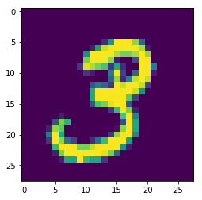

# MNIST数据集图片分类
- 作为我git的开始篇章，一周一更，希望自己说到做到，记录下我自己的学习历程
- 2019年5月21日

# 1.导入MNIST图片数据集


```python
import tensorflow as tf
from tensorflow.examples.tutorials.mnist import input_data
# 利用TensorFlow自动下载MNIST
mnist = input_data.read_data_sets('F:/learnpy/LearnTensorflow/Mnist_clf/MNIST_data/',one_hot=True)
```

    E:\Anaconda\lib\site-packages\h5py\__init__.py:36: FutureWarning: Conversion of the second argument of issubdtype from `float` to `np.floating` is deprecated. In future, it will be treated as `np.float64 == np.dtype(float).type`.
      from ._conv import register_converters as _register_converters
    

    WARNING:tensorflow:From <ipython-input-2-40549fa82c8a>:4: read_data_sets (from tensorflow.contrib.learn.python.learn.datasets.mnist) is deprecated and will be removed in a future version.
    Instructions for updating:
    Please use alternatives such as official/mnist/dataset.py from tensorflow/models.
    WARNING:tensorflow:From E:\Anaconda\lib\site-packages\tensorflow\contrib\learn\python\learn\datasets\mnist.py:260: maybe_download (from tensorflow.contrib.learn.python.learn.datasets.base) is deprecated and will be removed in a future version.
    Instructions for updating:
    Please write your own downloading logic.
    WARNING:tensorflow:From E:\Anaconda\lib\site-packages\tensorflow\contrib\learn\python\learn\datasets\mnist.py:262: extract_images (from tensorflow.contrib.learn.python.learn.datasets.mnist) is deprecated and will be removed in a future version.
    Instructions for updating:
    Please use tf.data to implement this functionality.
    Extracting F:/learnpy/LearnTensorflow/Mnist_clf/MNIST_data/train-images-idx3-ubyte.gz
    WARNING:tensorflow:From E:\Anaconda\lib\site-packages\tensorflow\contrib\learn\python\learn\datasets\mnist.py:267: extract_labels (from tensorflow.contrib.learn.python.learn.datasets.mnist) is deprecated and will be removed in a future version.
    Instructions for updating:
    Please use tf.data to implement this functionality.
    Extracting F:/learnpy/LearnTensorflow/Mnist_clf/MNIST_data/train-labels-idx1-ubyte.gz
    WARNING:tensorflow:From E:\Anaconda\lib\site-packages\tensorflow\contrib\learn\python\learn\datasets\mnist.py:110: dense_to_one_hot (from tensorflow.contrib.learn.python.learn.datasets.mnist) is deprecated and will be removed in a future version.
    Instructions for updating:
    Please use tf.one_hot on tensors.
    Extracting F:/learnpy/LearnTensorflow/Mnist_clf/MNIST_data/t10k-images-idx3-ubyte.gz
    Extracting F:/learnpy/LearnTensorflow/Mnist_clf/MNIST_data/t10k-labels-idx1-ubyte.gz
    WARNING:tensorflow:From E:\Anaconda\lib\site-packages\tensorflow\contrib\learn\python\learn\datasets\mnist.py:290: DataSet.__init__ (from tensorflow.contrib.learn.python.learn.datasets.mnist) is deprecated and will be removed in a future version.
    Instructions for updating:
    Please use alternatives such as official/mnist/dataset.py from tensorflow/models.
    


```python
print('输入数据：',mnist.train.images)
print('数据shape：',mnist.train.images.shape)
```

    输入数据： [[0. 0. 0. ... 0. 0. 0.]
     [0. 0. 0. ... 0. 0. 0.]
     [0. 0. 0. ... 0. 0. 0.]
     ...
     [0. 0. 0. ... 0. 0. 0.]
     [0. 0. 0. ... 0. 0. 0.]
     [0. 0. 0. ... 0. 0. 0.]]
    数据shape： (55000, 784)
    

- MNIST数据集中的图片是28*28 Pixel，每一幅图片在one-hot编码后成为1*784的数据


```python
import pylab
im = mnist.train.images[1]
im = im.reshape(-1,28)
pylab.imshow(im)
pylab.show()
```





# 2.分析图片特点、定义变量

- 输入图片是55000*784的矩阵，所以要创建一个[None,784]的占位符x和一个[None,10]的占位符y，然后利用feed机制将图片和label输入进去
- None表示张量的第一个维度可以是任意长度的，也就是说可以输入任意数量的图片


```python
tf.reset_default_graph()
# 定义占位符
x = tf.placeholder(tf.float32,[None,784])
y = tf.placeholder(tf.float32,[None,10])  
```

## 2.1模型构建

### 定义学习参数
- 模型的权重值W，和模型的偏置量b，因为是可修改的所以要用Variable来定义


```python
W = tf.Variable(tf.random_normal([784,10]))
b = tf.Variable(tf.zeros([10]))
```

### 定义输出节点
- x是一个二维张量


```python
pred = tf.nn.softmax(tf.matmul(x,W)+b)
```

### 定义反向传播结构
- （1）将生成的pred与样本标签y进行交叉熵的运算,然后取平均值
- （2）将结果作为误差值，通过梯度下降的优化方法进行W和b的更新


```python
# 损失函数
cost = tf.reduce_mean(-tf.reduce_sum(y*tf.log(pred),reduction_indices=1))
# 定义参数
learning_rate = 0.01
# 使用梯度下降优化器
optimizer = tf.train.GradientDescentOptimizer(learning_rate).minimize(cost)
```

##  2.2训练模型并输出中间状态参数 
- training_epochs = 25 表示要把整个训练样本集迭代25次
- batch_size = 500 表示在训练过程中一次取500条数据进行训练
- display_step = 1 表示每一次就把具体的中间状态显示出来


```python
training_epochs = 25
batch_size = 500
display_step = 5
saver = tf.train.Saver()
model_path = 'log/521model.ckpt'
# 启动Session
with tf.Session() as sess:
    sess.run(tf.global_variables_initializer()) # 统一初始化operation
    # 通过循环开始训练
    for epoch in range(training_epochs):
        avg_cost = 0.
        total_batch = int(mnist.train.num_examples/batch_size)
        # 循环所有数据集
        for i in range(total_batch):
            batch_xs,batch_ys = mnist.train.next_batch(batch_size)
            # 运行优化器
            _,c = sess.run([optimizer,cost],feed_dict={x:batch_xs,y:batch_ys})
            # 计算平均loss值
            avg_cost += c / total_batch
            # 显示详细信息
            if (epoch + 1) % display_step == 0:   # 数据量的总数是55000，选取500的batch_size那么遍历一次数据集total_batch就会是110
                print('Epoch:','%04d'%(epoch+1),'cost=','{:.9f}'.format(avg_cost))
    print('Training Finished')
    
    # 测试 model
    correct_prediction = tf.equal(tf.argmax(pred,1),tf.argmax(y,1))
    # 计算准确率
    accuracy = tf.reduce_mean(tf.cast(correct_prediction,tf.float32))
    print('Accracy:',accuracy.eval({x:mnist.test.images,y:mnist.test.labels}))
    
    # 保存模型
    save_path = saver.save(sess,model_path)
    print('Model saved in file:%s'% save_path)
                
```

    Epoch: 0005 cost= 0.056413256
    Epoch: 0005 cost= 0.108510663
    Epoch: 0005 cost= 0.161317804
    Epoch: 0005 cost= 0.217023113
    Epoch: 0005 cost= 0.268697808
    Epoch: 0005 cost= 0.323178439
    Epoch: 0005 cost= 0.377003119
    Epoch: 0005 cost= 0.429657403
    Epoch: 0005 cost= 0.483142541
    Epoch: 0005 cost= 0.535700668
    Epoch: 0005 cost= 0.590302831
    Epoch: 0005 cost= 0.644586268
    Epoch: 0005 cost= 0.699359889
    Epoch: 0005 cost= 0.751665722
    Epoch: 0005 cost= 0.803001482
    Epoch: 0005 cost= 0.853960276
    Epoch: 0005 cost= 0.905032995
    Epoch: 0005 cost= 0.956523340
    Epoch: 0005 cost= 1.012127907
    Epoch: 0005 cost= 1.063811627
    Epoch: 0005 cost= 1.115534280
    Epoch: 0005 cost= 1.165168095
    Epoch: 0005 cost= 1.218247418
    Epoch: 0005 cost= 1.269826312
    Epoch: 0005 cost= 1.320388742
    Epoch: 0005 cost= 1.365361465
    Epoch: 0005 cost= 1.416217579
    Epoch: 0005 cost= 1.468465827
    Epoch: 0005 cost= 1.518720323
    Epoch: 0005 cost= 1.573312248
    Epoch: 0005 cost= 1.626142823
    Epoch: 0005 cost= 1.676371210
    Epoch: 0005 cost= 1.727629189
    Epoch: 0005 cost= 1.777555262
    Epoch: 0005 cost= 1.825520520
    Epoch: 0005 cost= 1.877811770
    Epoch: 0005 cost= 1.923646949
    Epoch: 0005 cost= 1.974341666
    Epoch: 0005 cost= 2.026512675
    Epoch: 0005 cost= 2.080686010
    Epoch: 0005 cost= 2.129102265
    Epoch: 0005 cost= 2.180870438
    Epoch: 0005 cost= 2.232979215
    Epoch: 0005 cost= 2.285653322
    Epoch: 0005 cost= 2.337208978
    Epoch: 0005 cost= 2.386287876
    Epoch: 0005 cost= 2.435571098
    Epoch: 0005 cost= 2.486189066
    Epoch: 0005 cost= 2.538908443
    Epoch: 0005 cost= 2.592359369
    Epoch: 0005 cost= 2.643714020
    Epoch: 0005 cost= 2.689199855
    Epoch: 0005 cost= 2.736247448
    Epoch: 0005 cost= 2.784998469
    Epoch: 0005 cost= 2.832708289
    Epoch: 0005 cost= 2.881773996
    Epoch: 0005 cost= 2.932677299
    Epoch: 0005 cost= 2.978190405
    Epoch: 0005 cost= 3.029519406
    Epoch: 0005 cost= 3.082304465
    Epoch: 0005 cost= 3.134519131
    Epoch: 0005 cost= 3.185669535
    Epoch: 0005 cost= 3.236865442
    Epoch: 0005 cost= 3.283869106
    Epoch: 0005 cost= 3.335809898
    Epoch: 0005 cost= 3.385858362
    Epoch: 0005 cost= 3.436960923
    Epoch: 0005 cost= 3.488040486
    Epoch: 0005 cost= 3.536413505
    Epoch: 0005 cost= 3.586892731
    Epoch: 0005 cost= 3.639255628
    Epoch: 0005 cost= 3.691445117
    Epoch: 0005 cost= 3.741590838
    Epoch: 0005 cost= 3.790125851
    Epoch: 0005 cost= 3.838810908
    Epoch: 0005 cost= 3.886914019
    Epoch: 0005 cost= 3.935661398
    Epoch: 0005 cost= 3.983182162
    Epoch: 0005 cost= 4.031015361
    Epoch: 0005 cost= 4.081517137
    Epoch: 0005 cost= 4.129854237
    Epoch: 0005 cost= 4.175852554
    Epoch: 0005 cost= 4.225504394
    Epoch: 0005 cost= 4.273071666
    Epoch: 0005 cost= 4.321166563
    Epoch: 0005 cost= 4.369969377
    Epoch: 0005 cost= 4.418424277
    Epoch: 0005 cost= 4.466205571
    Epoch: 0005 cost= 4.515382017
    Epoch: 0005 cost= 4.560780811
    Epoch: 0005 cost= 4.609277261
    Epoch: 0005 cost= 4.656379327
    Epoch: 0005 cost= 4.705903313
    Epoch: 0005 cost= 4.752219460
    Epoch: 0005 cost= 4.796049872
    Epoch: 0005 cost= 4.841270338
    Epoch: 0005 cost= 4.884815641
    Epoch: 0005 cost= 4.936011145
    Epoch: 0005 cost= 4.983900586
    Epoch: 0005 cost= 5.029762389
    Epoch: 0005 cost= 5.076513134
    Epoch: 0005 cost= 5.122388094
    Epoch: 0005 cost= 5.167876751
    Epoch: 0005 cost= 5.210964836
    Epoch: 0005 cost= 5.259520943
    Epoch: 0005 cost= 5.305800962
    Epoch: 0005 cost= 5.353548249
    Epoch: 0005 cost= 5.402898429
    Epoch: 0005 cost= 5.447091185
    Epoch: 0005 cost= 5.495051796
    Epoch: 0010 cost= 0.030792965
    Epoch: 0010 cost= 0.064443237
    Epoch: 0010 cost= 0.096651684
    Epoch: 0010 cost= 0.131128851
    Epoch: 0010 cost= 0.164647432
    Epoch: 0010 cost= 0.194735416
    Epoch: 0010 cost= 0.227420722
    Epoch: 0010 cost= 0.257512377
    Epoch: 0010 cost= 0.287894368
    Epoch: 0010 cost= 0.319795502
    Epoch: 0010 cost= 0.351354779
    Epoch: 0010 cost= 0.381766207
    Epoch: 0010 cost= 0.416417638
    Epoch: 0010 cost= 0.450159597
    Epoch: 0010 cost= 0.479613774
    Epoch: 0010 cost= 0.507897358
    Epoch: 0010 cost= 0.537916862
    Epoch: 0010 cost= 0.570136861
    Epoch: 0010 cost= 0.600982612
    Epoch: 0010 cost= 0.630841693
    Epoch: 0010 cost= 0.662136548
    Epoch: 0010 cost= 0.693125968
    Epoch: 0010 cost= 0.723363029
    Epoch: 0010 cost= 0.757029596
    Epoch: 0010 cost= 0.788313463
    Epoch: 0010 cost= 0.818570982
    Epoch: 0010 cost= 0.849222183
    Epoch: 0010 cost= 0.879694412
    Epoch: 0010 cost= 0.910862500
    Epoch: 0010 cost= 0.941879717
    Epoch: 0010 cost= 0.977361425
    Epoch: 0010 cost= 1.010531202
    Epoch: 0010 cost= 1.040533827
    Epoch: 0010 cost= 1.072802082
    Epoch: 0010 cost= 1.106686451
    Epoch: 0010 cost= 1.137333603
    Epoch: 0010 cost= 1.169425037
    Epoch: 0010 cost= 1.198544713
    Epoch: 0010 cost= 1.230287920
    Epoch: 0010 cost= 1.258877618
    Epoch: 0010 cost= 1.290097241
    Epoch: 0010 cost= 1.324379357
    Epoch: 0010 cost= 1.355769400
    Epoch: 0010 cost= 1.389067869
    Epoch: 0010 cost= 1.420911895
    Epoch: 0010 cost= 1.449514506
    Epoch: 0010 cost= 1.482189640
    Epoch: 0010 cost= 1.514699583
    Epoch: 0010 cost= 1.547857066
    Epoch: 0010 cost= 1.579827109
    Epoch: 0010 cost= 1.611495545
    Epoch: 0010 cost= 1.645081353
    Epoch: 0010 cost= 1.675166197
    Epoch: 0010 cost= 1.704876991
    Epoch: 0010 cost= 1.735475341
    Epoch: 0010 cost= 1.767284445
    Epoch: 0010 cost= 1.799849749
    Epoch: 0010 cost= 1.832209702
    Epoch: 0010 cost= 1.863503281
    Epoch: 0010 cost= 1.894183456
    Epoch: 0010 cost= 1.924541881
    Epoch: 0010 cost= 1.952338026
    Epoch: 0010 cost= 1.984011123
    Epoch: 0010 cost= 2.013950198
    Epoch: 0010 cost= 2.043665435
    Epoch: 0010 cost= 2.073288092
    Epoch: 0010 cost= 2.102336927
    Epoch: 0010 cost= 2.131375306
    Epoch: 0010 cost= 2.162088693
    Epoch: 0010 cost= 2.193283575
    Epoch: 0010 cost= 2.221502759
    Epoch: 0010 cost= 2.253176917
    Epoch: 0010 cost= 2.281966779
    Epoch: 0010 cost= 2.313056989
    Epoch: 0010 cost= 2.340114115
    Epoch: 0010 cost= 2.369862318
    Epoch: 0010 cost= 2.398411811
    Epoch: 0010 cost= 2.429597787
    Epoch: 0010 cost= 2.458638755
    Epoch: 0010 cost= 2.490184190
    Epoch: 0010 cost= 2.521491324
    Epoch: 0010 cost= 2.550415978
    Epoch: 0010 cost= 2.581088003
    Epoch: 0010 cost= 2.609698632
    Epoch: 0010 cost= 2.638545791
    Epoch: 0010 cost= 2.669887905
    Epoch: 0010 cost= 2.697241623
    Epoch: 0010 cost= 2.724812321
    Epoch: 0010 cost= 2.755322690
    Epoch: 0010 cost= 2.785553869
    Epoch: 0010 cost= 2.816114989
    Epoch: 0010 cost= 2.847005387
    Epoch: 0010 cost= 2.873563149
    Epoch: 0010 cost= 2.907066193
    Epoch: 0010 cost= 2.933349685
    Epoch: 0010 cost= 2.961046670
    Epoch: 0010 cost= 2.991765577
    Epoch: 0010 cost= 3.020716711
    Epoch: 0010 cost= 3.052370993
    Epoch: 0010 cost= 3.081327486
    Epoch: 0010 cost= 3.112931377
    Epoch: 0010 cost= 3.143764403
    Epoch: 0010 cost= 3.173697899
    Epoch: 0010 cost= 3.201171439
    Epoch: 0010 cost= 3.231029823
    Epoch: 0010 cost= 3.261394895
    Epoch: 0010 cost= 3.292875465
    Epoch: 0010 cost= 3.319842586
    Epoch: 0010 cost= 3.350331213
    Epoch: 0010 cost= 3.380394129
    Epoch: 0015 cost= 0.026348747
    Epoch: 0015 cost= 0.049576506
    Epoch: 0015 cost= 0.073354376
    Epoch: 0015 cost= 0.099213414
    Epoch: 0015 cost= 0.122292254
    Epoch: 0015 cost= 0.145626894
    Epoch: 0015 cost= 0.169695774
    Epoch: 0015 cost= 0.196305169
    Epoch: 0015 cost= 0.219431368
    Epoch: 0015 cost= 0.242345897
    Epoch: 0015 cost= 0.265458807
    Epoch: 0015 cost= 0.290512258
    Epoch: 0015 cost= 0.315194297
    Epoch: 0015 cost= 0.337400770
    Epoch: 0015 cost= 0.362089836
    Epoch: 0015 cost= 0.381592100
    Epoch: 0015 cost= 0.405973664
    Epoch: 0015 cost= 0.428342312
    Epoch: 0015 cost= 0.451238116
    Epoch: 0015 cost= 0.479272550
    Epoch: 0015 cost= 0.500369451
    Epoch: 0015 cost= 0.524814413
    Epoch: 0015 cost= 0.547256272
    Epoch: 0015 cost= 0.572372929
    Epoch: 0015 cost= 0.595232853
    Epoch: 0015 cost= 0.616913795
    Epoch: 0015 cost= 0.642521685
    Epoch: 0015 cost= 0.667565346
    Epoch: 0015 cost= 0.690817582
    Epoch: 0015 cost= 0.711806308
    Epoch: 0015 cost= 0.734999394
    Epoch: 0015 cost= 0.760617945
    Epoch: 0015 cost= 0.783509614
    Epoch: 0015 cost= 0.803786852
    Epoch: 0015 cost= 0.828955369
    Epoch: 0015 cost= 0.857376237
    Epoch: 0015 cost= 0.881264086
    Epoch: 0015 cost= 0.904721854
    Epoch: 0015 cost= 0.927132418
    Epoch: 0015 cost= 0.949990875
    Epoch: 0015 cost= 0.973684545
    Epoch: 0015 cost= 0.997560896
    Epoch: 0015 cost= 1.020193464
    Epoch: 0015 cost= 1.047096294
    Epoch: 0015 cost= 1.068850825
    Epoch: 0015 cost= 1.092070801
    Epoch: 0015 cost= 1.115230471
    Epoch: 0015 cost= 1.138206538
    Epoch: 0015 cost= 1.162369006
    Epoch: 0015 cost= 1.187218367
    Epoch: 0015 cost= 1.211083989
    Epoch: 0015 cost= 1.232816891
    Epoch: 0015 cost= 1.254524339
    Epoch: 0015 cost= 1.278121575
    Epoch: 0015 cost= 1.300306188
    Epoch: 0015 cost= 1.322592057
    Epoch: 0015 cost= 1.346881927
    Epoch: 0015 cost= 1.373689238
    Epoch: 0015 cost= 1.399908397
    Epoch: 0015 cost= 1.421208033
    Epoch: 0015 cost= 1.443601095
    Epoch: 0015 cost= 1.468048083
    Epoch: 0015 cost= 1.490355275
    Epoch: 0015 cost= 1.511781690
    Epoch: 0015 cost= 1.535386645
    Epoch: 0015 cost= 1.559803239
    Epoch: 0015 cost= 1.584048468
    Epoch: 0015 cost= 1.604194964
    Epoch: 0015 cost= 1.627348146
    Epoch: 0015 cost= 1.653579506
    Epoch: 0015 cost= 1.677662145
    Epoch: 0015 cost= 1.700759524
    Epoch: 0015 cost= 1.725042150
    Epoch: 0015 cost= 1.750406354
    Epoch: 0015 cost= 1.772922869
    Epoch: 0015 cost= 1.792758135
    Epoch: 0015 cost= 1.816523927
    Epoch: 0015 cost= 1.838517484
    Epoch: 0015 cost= 1.859130270
    Epoch: 0015 cost= 1.879967195
    Epoch: 0015 cost= 1.902371229
    Epoch: 0015 cost= 1.924488295
    Epoch: 0015 cost= 1.946516048
    Epoch: 0015 cost= 1.968688596
    Epoch: 0015 cost= 1.990768482
    Epoch: 0015 cost= 2.013434241
    Epoch: 0015 cost= 2.037429365
    Epoch: 0015 cost= 2.062109882
    Epoch: 0015 cost= 2.084041416
    Epoch: 0015 cost= 2.104476747
    Epoch: 0015 cost= 2.127684337
    Epoch: 0015 cost= 2.151974479
    Epoch: 0015 cost= 2.174514508
    Epoch: 0015 cost= 2.195602233
    Epoch: 0015 cost= 2.220041288
    Epoch: 0015 cost= 2.242335510
    Epoch: 0015 cost= 2.262966904
    Epoch: 0015 cost= 2.287837928
    Epoch: 0015 cost= 2.311425486
    Epoch: 0015 cost= 2.331666361
    Epoch: 0015 cost= 2.355706776
    Epoch: 0015 cost= 2.377830815
    Epoch: 0015 cost= 2.401096093
    Epoch: 0015 cost= 2.424400106
    Epoch: 0015 cost= 2.444103243
    Epoch: 0015 cost= 2.465227439
    Epoch: 0015 cost= 2.486040369
    Epoch: 0015 cost= 2.510856509
    Epoch: 0015 cost= 2.531130505
    Epoch: 0015 cost= 2.553464926
    Epoch: 0020 cost= 0.018634848
    Epoch: 0020 cost= 0.037692983
    Epoch: 0020 cost= 0.056987901
    Epoch: 0020 cost= 0.077801024
    Epoch: 0020 cost= 0.097386284
    Epoch: 0020 cost= 0.118845654
    Epoch: 0020 cost= 0.136647279
    Epoch: 0020 cost= 0.156206851
    Epoch: 0020 cost= 0.178344148
    Epoch: 0020 cost= 0.198109631
    Epoch: 0020 cost= 0.217022282
    Epoch: 0020 cost= 0.236227924
    Epoch: 0020 cost= 0.253549522
    Epoch: 0020 cost= 0.272487268
    Epoch: 0020 cost= 0.293950155
    Epoch: 0020 cost= 0.312109592
    Epoch: 0020 cost= 0.330735980
    Epoch: 0020 cost= 0.350817238
    Epoch: 0020 cost= 0.370670444
    Epoch: 0020 cost= 0.389989402
    Epoch: 0020 cost= 0.409764999
    Epoch: 0020 cost= 0.429676836
    Epoch: 0020 cost= 0.450038346
    Epoch: 0020 cost= 0.470819653
    Epoch: 0020 cost= 0.491582682
    Epoch: 0020 cost= 0.509938192
    Epoch: 0020 cost= 0.530353917
    Epoch: 0020 cost= 0.551419579
    Epoch: 0020 cost= 0.568413215
    Epoch: 0020 cost= 0.587509976
    Epoch: 0020 cost= 0.605105696
    Epoch: 0020 cost= 0.624548542
    Epoch: 0020 cost= 0.644514716
    Epoch: 0020 cost= 0.665713860
    Epoch: 0020 cost= 0.685267640
    Epoch: 0020 cost= 0.705601216
    Epoch: 0020 cost= 0.725302832
    Epoch: 0020 cost= 0.744534177
    Epoch: 0020 cost= 0.761872602
    Epoch: 0020 cost= 0.783887724
    Epoch: 0020 cost= 0.805014240
    Epoch: 0020 cost= 0.824270311
    Epoch: 0020 cost= 0.840686451
    Epoch: 0020 cost= 0.858891071
    Epoch: 0020 cost= 0.879176105
    Epoch: 0020 cost= 0.897188208
    Epoch: 0020 cost= 0.916478699
    Epoch: 0020 cost= 0.934786227
    Epoch: 0020 cost= 0.953280969
    Epoch: 0020 cost= 0.971913559
    Epoch: 0020 cost= 0.991887576
    Epoch: 0020 cost= 1.012654784
    Epoch: 0020 cost= 1.031651033
    Epoch: 0020 cost= 1.052247860
    Epoch: 0020 cost= 1.072839531
    Epoch: 0020 cost= 1.091425711
    Epoch: 0020 cost= 1.111171402
    Epoch: 0020 cost= 1.130438796
    Epoch: 0020 cost= 1.151617954
    Epoch: 0020 cost= 1.170861877
    Epoch: 0020 cost= 1.189305815
    Epoch: 0020 cost= 1.208169569
    Epoch: 0020 cost= 1.228972335
    Epoch: 0020 cost= 1.246141837
    Epoch: 0020 cost= 1.266139024
    Epoch: 0020 cost= 1.284721071
    Epoch: 0020 cost= 1.306306210
    Epoch: 0020 cost= 1.326307644
    Epoch: 0020 cost= 1.345506059
    Epoch: 0020 cost= 1.366834027
    Epoch: 0020 cost= 1.386111140
    Epoch: 0020 cost= 1.406325780
    Epoch: 0020 cost= 1.424809159
    Epoch: 0020 cost= 1.448019968
    Epoch: 0020 cost= 1.470229749
    Epoch: 0020 cost= 1.487383781
    Epoch: 0020 cost= 1.506065883
    Epoch: 0020 cost= 1.524998421
    Epoch: 0020 cost= 1.543169463
    Epoch: 0020 cost= 1.560652676
    Epoch: 0020 cost= 1.579767858
    Epoch: 0020 cost= 1.597038492
    Epoch: 0020 cost= 1.616626577
    Epoch: 0020 cost= 1.634292012
    Epoch: 0020 cost= 1.654808884
    Epoch: 0020 cost= 1.672841056
    Epoch: 0020 cost= 1.690490321
    Epoch: 0020 cost= 1.709497481
    Epoch: 0020 cost= 1.730108709
    Epoch: 0020 cost= 1.747108212
    Epoch: 0020 cost= 1.766689142
    Epoch: 0020 cost= 1.785134550
    Epoch: 0020 cost= 1.805674193
    Epoch: 0020 cost= 1.824867847
    Epoch: 0020 cost= 1.844938640
    Epoch: 0020 cost= 1.863388484
    Epoch: 0020 cost= 1.883307056
    Epoch: 0020 cost= 1.900640065
    Epoch: 0020 cost= 1.920560863
    Epoch: 0020 cost= 1.941588946
    Epoch: 0020 cost= 1.960450075
    Epoch: 0020 cost= 1.977849097
    Epoch: 0020 cost= 1.996458789
    Epoch: 0020 cost= 2.014408821
    Epoch: 0020 cost= 2.035132776
    Epoch: 0020 cost= 2.054808852
    Epoch: 0020 cost= 2.071764928
    Epoch: 0020 cost= 2.091378064
    Epoch: 0020 cost= 2.110522581
    Epoch: 0020 cost= 2.131306740
    Epoch: 0025 cost= 0.019489635
    Epoch: 0025 cost= 0.035984587
    Epoch: 0025 cost= 0.055203801
    Epoch: 0025 cost= 0.070776312
    Epoch: 0025 cost= 0.089481814
    Epoch: 0025 cost= 0.107246633
    Epoch: 0025 cost= 0.122384246
    Epoch: 0025 cost= 0.141702655
    Epoch: 0025 cost= 0.161289955
    Epoch: 0025 cost= 0.175980758
    Epoch: 0025 cost= 0.191248209
    Epoch: 0025 cost= 0.206480028
    Epoch: 0025 cost= 0.224875949
    Epoch: 0025 cost= 0.243968309
    Epoch: 0025 cost= 0.261334103
    Epoch: 0025 cost= 0.277556261
    Epoch: 0025 cost= 0.295474907
    Epoch: 0025 cost= 0.313313846
    Epoch: 0025 cost= 0.329263075
    Epoch: 0025 cost= 0.348340952
    Epoch: 0025 cost= 0.366909728
    Epoch: 0025 cost= 0.384757602
    Epoch: 0025 cost= 0.402178452
    Epoch: 0025 cost= 0.419432996
    Epoch: 0025 cost= 0.438431354
    Epoch: 0025 cost= 0.451747337
    Epoch: 0025 cost= 0.467966186
    Epoch: 0025 cost= 0.486350965
    Epoch: 0025 cost= 0.501223940
    Epoch: 0025 cost= 0.518408573
    Epoch: 0025 cost= 0.534780915
    Epoch: 0025 cost= 0.551972181
    Epoch: 0025 cost= 0.569144397
    Epoch: 0025 cost= 0.585465711
    Epoch: 0025 cost= 0.601229703
    Epoch: 0025 cost= 0.616464477
    Epoch: 0025 cost= 0.633458327
    Epoch: 0025 cost= 0.651275415
    Epoch: 0025 cost= 0.668068718
    Epoch: 0025 cost= 0.686537572
    Epoch: 0025 cost= 0.704716444
    Epoch: 0025 cost= 0.721158575
    Epoch: 0025 cost= 0.736784465
    Epoch: 0025 cost= 0.753695528
    Epoch: 0025 cost= 0.771261802
    Epoch: 0025 cost= 0.787924802
    Epoch: 0025 cost= 0.803504012
    Epoch: 0025 cost= 0.822180432
    Epoch: 0025 cost= 0.836713806
    Epoch: 0025 cost= 0.853881509
    Epoch: 0025 cost= 0.868689213
    Epoch: 0025 cost= 0.883852157
    Epoch: 0025 cost= 0.901017586
    Epoch: 0025 cost= 0.916651301
    Epoch: 0025 cost= 0.935780510
    Epoch: 0025 cost= 0.953558898
    Epoch: 0025 cost= 0.973100537
    Epoch: 0025 cost= 0.988147104
    Epoch: 0025 cost= 1.003351284
    Epoch: 0025 cost= 1.020212994
    Epoch: 0025 cost= 1.035739220
    Epoch: 0025 cost= 1.054509852
    Epoch: 0025 cost= 1.071520951
    Epoch: 0025 cost= 1.088304534
    Epoch: 0025 cost= 1.104384614
    Epoch: 0025 cost= 1.124189025
    Epoch: 0025 cost= 1.143905840
    Epoch: 0025 cost= 1.162632796
    Epoch: 0025 cost= 1.177416860
    Epoch: 0025 cost= 1.196131247
    Epoch: 0025 cost= 1.214105277
    Epoch: 0025 cost= 1.230477866
    Epoch: 0025 cost= 1.247743610
    Epoch: 0025 cost= 1.264085360
    Epoch: 0025 cost= 1.278711100
    Epoch: 0025 cost= 1.295489528
    Epoch: 0025 cost= 1.311243021
    Epoch: 0025 cost= 1.326934741
    Epoch: 0025 cost= 1.343245378
    Epoch: 0025 cost= 1.360149944
    Epoch: 0025 cost= 1.377405086
    Epoch: 0025 cost= 1.396994229
    Epoch: 0025 cost= 1.413861799
    Epoch: 0025 cost= 1.428973601
    Epoch: 0025 cost= 1.445286072
    Epoch: 0025 cost= 1.464556926
    Epoch: 0025 cost= 1.480187931
    Epoch: 0025 cost= 1.497749834
    Epoch: 0025 cost= 1.515189407
    Epoch: 0025 cost= 1.531556820
    Epoch: 0025 cost= 1.549106298
    Epoch: 0025 cost= 1.565083982
    Epoch: 0025 cost= 1.582497023
    Epoch: 0025 cost= 1.599937224
    Epoch: 0025 cost= 1.613657774
    Epoch: 0025 cost= 1.630352855
    Epoch: 0025 cost= 1.648964160
    Epoch: 0025 cost= 1.667829863
    Epoch: 0025 cost= 1.683559568
    Epoch: 0025 cost= 1.703263821
    Epoch: 0025 cost= 1.720062787
    Epoch: 0025 cost= 1.736868461
    Epoch: 0025 cost= 1.754598590
    Epoch: 0025 cost= 1.771342065
    Epoch: 0025 cost= 1.791938912
    Epoch: 0025 cost= 1.809011210
    Epoch: 0025 cost= 1.824182147
    Epoch: 0025 cost= 1.841250582
    Epoch: 0025 cost= 1.859438671
    Epoch: 0025 cost= 1.874877405
    Training Finished
    Accracy: 0.6771
    Model saved in file:log/521model.ckpt
    
