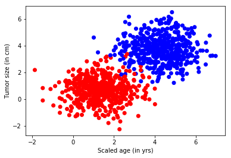
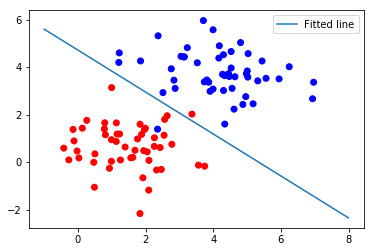
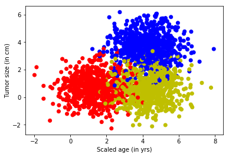
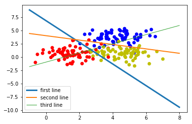
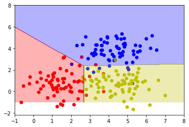
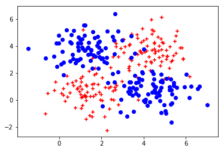
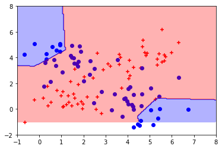
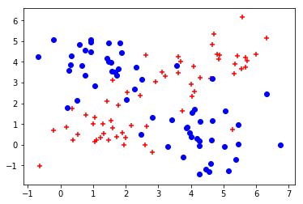
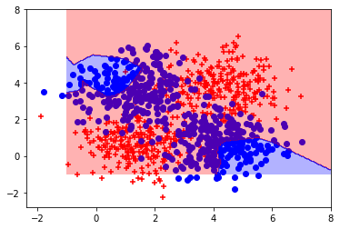
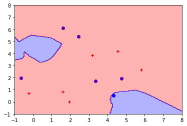

## （一）线性问题与非线性问题
### 1.实例：线性logistic回归处理二分类问题
- 用线性单分逻辑回归分析肿瘤是良性的还是恶性的，样本特征包括病人的年龄和肿瘤大小，标签是良性和恶性

#### （1）生成样本集
- 二维数组“病人的年纪、肿瘤的大小”
- generate 为生成模拟样本的函数，按照指定均值和方差生成固定样本


```python
import tensorflow as tf
import matplotlib.pyplot as plt
import numpy as np
from sklearn.utils import shuffle
%matplotlib inline

#模拟数据点   
def generate(sample_size, mean, cov, diff,regression):   
    num_classes = 2 #len(diff)
    samples_per_class = int(sample_size/2)

    X0 = np.random.multivariate_normal(mean, cov, samples_per_class)
    Y0 = np.zeros(samples_per_class)
    
    for ci, d in enumerate(diff):
        X1 = np.random.multivariate_normal(mean+d, cov, samples_per_class)
        Y1 = (ci+1)*np.ones(samples_per_class)
    
        X0 = np.concatenate((X0,X1))
        Y0 = np.concatenate((Y0,Y1))
        
    if regression==False: #one-hot  0 into the vector "1 0
        class_ind = [Y==class_number for class_number in range(num_classes)]
        Y = np.asarray(np.hstack(class_ind), dtype=np.float32)
    X, Y = shuffle(X0, Y0)
    
    return X,Y    

input_dim = 2                    
np.random.seed(10)
num_classes =2
mean = np.random.randn(num_classes)
cov = np.eye(num_classes) 
X, Y = generate(1000, mean, cov, [3.0],True)
colors = ['r' if l == 0 else 'b' for l in Y[:]]
plt.scatter(X[:,0], X[:,1], c=colors)
plt.xlabel("Scaled age (in yrs)")
plt.ylabel("Tumor size (in cm)")
plt.show()
lab_dim = 1
```





#### (2)构建网络结构——定义输入输出占位符，w,b的权重
- 使用sigmoid激活函数
- loss使用交叉熵，里面加入一个平方差函数，用来评估模型错误率
- 使用AdamOptimizer优化器


```python
input_features = tf.placeholder(tf.float32,[None,input_dim])
input_labels = tf.placeholder(tf.float32,[None,lab_dim])
# 定义学习参数
W = tf.Variable(tf.random_normal([input_dim,lab_dim],name='weight'))
b = tf.Variable(tf.zeros([lab_dim]),name='bias')

output = tf.nn.sigmoid(tf.matmul(input_features,W) + b)
cross_entropy = -(input_labels * tf.log(output) + (1 - input_labels) * tf.log(1 - output))
ser = tf.square(input_labels - output)
loss = tf.reduce_mean(cross_entropy)
err = tf.reduce_mean(ser)
optimizer = tf.train.AdamOptimizer(0.04)
train = optimizer.minimize(loss)
```

#### (3)设置参数进行训练和可视化
- 整个数据集迭代50次，每次的minibatch选25条
- 可视化中模型生成的结果是：z = x1w1 + x2w2 + b,为了刻画在x，y坐标中的直线，令公式中的z为0，转化为如下直线方程：
    - y = -x*(w1/w2) - b/w2


```python
maxEpochs = 50
minibatchSize = 25
# 启动Session
with tf.Session() as sess:
    sess.run(tf.global_variables_initializer())
    # 向模型输入数据
    for epoch in range(maxEpochs):
        sumerr = 0
        for i in range(np.int(len(Y)/minibatchSize)):
            x1 = X[i*minibatchSize:(i+1)*minibatchSize]
            y1 = np.reshape(Y[i*minibatchSize:(i+1)*minibatchSize],[-1,1])
            _,lossval,outputval,errval = sess.run([train,loss,output,err],feed_dict={input_features:x1,input_labels:y1})
            sumerr = sumerr + errval
        print('Epoch:','%04d'%(epoch+1),'cost=','{:.9f}'.format(lossval),'err=',sumerr/np.int(len(Y))/minibatchSize)
    train_X,train_Y = generate(100,mean,cov,[3.0],True)
    colors = ['r' if l == 0 else 'b' for l in train_Y[:]]
    plt.scatter(train_X[:,0],train_X[:,1],c=colors)
    x = np.linspace(-1,8,200)
    y = -x * (sess.run(W)[0]/sess.run(W)[1]) - sess.run(b)/sess.run(W)[1]
    plt.plot(x,y,label = 'Fitted line')
    plt.legend()
    plt.show()
```

    Epoch: 0001 cost= 0.545349956 err= 0.0005056727010011674
    Epoch: 0002 cost= 0.245186925 err= 0.00023011412262916565
    Epoch: 0003 cost= 0.156825393 err= 9.725593194365502e-05
    Epoch: 0004 cost= 0.124442369 err= 6.0889308974146845e-05
    Epoch: 0005 cost= 0.106172055 err= 4.78150712326169e-05
    Epoch: 0006 cost= 0.093689792 err= 4.0866414476186037e-05
    Epoch: 0007 cost= 0.084405191 err= 3.6402720231562854e-05
    Epoch: 0008 cost= 0.077159159 err= 3.325663539581001e-05
    Epoch: 0009 cost= 0.071321771 err= 3.091837300918997e-05
    Epoch: 0010 cost= 0.066507824 err= 2.911830764263868e-05
    Epoch: 0011 cost= 0.062463637 err= 2.769609661772847e-05
    Epoch: 0012 cost= 0.059013672 err= 2.6549129472114144e-05
    Epoch: 0013 cost= 0.056032162 err= 2.5608385228551925e-05
    Epoch: 0014 cost= 0.053426661 err= 2.4825673205778003e-05
    Epoch: 0015 cost= 0.051127687 err= 2.4166430570185184e-05
    Epoch: 0016 cost= 0.049081814 err= 2.360523807350546e-05
    Epoch: 0017 cost= 0.047247592 err= 2.3123023028019814e-05
    Epoch: 0018 cost= 0.045592207 err= 2.270523671992123e-05
    Epoch: 0019 cost= 0.044089392 err= 2.234062558505684e-05
    Epoch: 0020 cost= 0.042717848 err= 2.2020315940026195e-05
    Epoch: 0021 cost= 0.041460108 err= 2.1737266187556086e-05
    Epoch: 0022 cost= 0.040301882 err= 2.1485812802566214e-05
    Epoch: 0023 cost= 0.039230943 err= 2.1261355108581482e-05
    Epoch: 0024 cost= 0.038237303 err= 2.1060110235121102e-05
    Epoch: 0025 cost= 0.037312333 err= 2.0878941043047237e-05
    Epoch: 0026 cost= 0.036448792 err= 2.0715261031873526e-05
    Epoch: 0027 cost= 0.035640340 err= 2.0566883691353724e-05
    Epoch: 0028 cost= 0.034881588 err= 2.0431949198246002e-05
    Epoch: 0029 cost= 0.034167770 err= 2.0308878999203444e-05
    Epoch: 0030 cost= 0.033494715 err= 2.0196336887893268e-05
    Epoch: 0031 cost= 0.032859039 err= 2.0093148742453198e-05
    Epoch: 0032 cost= 0.032257356 err= 1.9998348011868073e-05
    Epoch: 0033 cost= 0.031686772 err= 1.9911026179324838e-05
    Epoch: 0034 cost= 0.031145077 err= 1.983044438005891e-05
    Epoch: 0035 cost= 0.030629706 err= 1.9755929654929786e-05
    Epoch: 0036 cost= 0.030138835 err= 1.968690201814752e-05
    Epoch: 0037 cost= 0.029670760 err= 1.9622848024591802e-05
    Epoch: 0038 cost= 0.029223759 err= 1.956330934423022e-05
    Epoch: 0039 cost= 0.028796282 err= 1.9507868836517446e-05
    Epoch: 0040 cost= 0.028387077 err= 1.9456184412701985e-05
    Epoch: 0041 cost= 0.027994968 err= 1.940791685890872e-05
    Epoch: 0042 cost= 0.027618876 err= 1.936278364941245e-05
    Epoch: 0043 cost= 0.027257700 err= 1.9320518461463507e-05
    Epoch: 0044 cost= 0.026910661 err= 1.9280890934169293e-05
    Epoch: 0045 cost= 0.026576798 err= 1.924369562941138e-05
    Epoch: 0046 cost= 0.026255412 err= 1.92087309496128e-05
    Epoch: 0047 cost= 0.025945799 err= 1.9175836302456447e-05
    Epoch: 0048 cost= 0.025647201 err= 1.9144842851674185e-05
    Epoch: 0049 cost= 0.025359072 err= 1.9115598676144147e-05
    Epoch: 0050 cost= 0.025080951 err= 1.908800192322815e-05
    





#### 结论：上图所示情况表示数据是线性可分的

### 2.实例：线性logistic回归处理多分类问题
- 通过softmax分类的方法计算神经网络输出

#### （1）生成样本集


```python
import tensorflow as tf
import numpy as np
import matplotlib.pyplot as plt

from sklearn.utils import shuffle
from matplotlib.colors import colorConverter, ListedColormap 
%matplotlib inline
    
# 对于上面的fit可以这么扩展变成动态的
from sklearn.preprocessing import OneHotEncoder
def onehot(y,start,end):
    ohe = OneHotEncoder()
    a = np.linspace(start,end-1,end-start)
    b =np.reshape(a,[-1,1]).astype(np.int32)
    ohe.fit(b)
    c=ohe.transform(y).toarray()  
    return c     
#
    
def generate(sample_size, num_classes, diff,regression=False):
    np.random.seed(10)
    mean = np.random.randn(2)
    cov = np.eye(2)  
    
    #len(diff)
    samples_per_class = int(sample_size/num_classes)

    X0 = np.random.multivariate_normal(mean, cov, samples_per_class)
    Y0 = np.zeros(samples_per_class)
    
    for ci, d in enumerate(diff):
        X1 = np.random.multivariate_normal(mean+d, cov, samples_per_class)
        Y1 = (ci+1)*np.ones(samples_per_class)
    
        X0 = np.concatenate((X0,X1))
        Y0 = np.concatenate((Y0,Y1))
        #print(X0, Y0)
    
  
    if regression==False: #one-hot  0 into the vector "1 0
        Y0 = np.reshape(Y0,[-1,1])        
        #print(Y0.astype(np.int32))
        Y0 = onehot(Y0.astype(np.int32),0,num_classes)
        #print(Y0)
    X, Y = shuffle(X0, Y0)
    #print(X, Y)
    return X,Y    

 
# Ensure we always get the same amount of randomness
np.random.seed(10)

input_dim = 2
num_classes =3 
X, Y = generate(2000,num_classes,  [[3.0],[3.0,0]],False)
aa = [np.argmax(l) for l in Y]
colors =['r' if l == 0 else 'b' if l==1 else 'y' for l in aa[:]]

plt.scatter(X[:,0], X[:,1], c=colors)
plt.xlabel("Scaled age (in yrs)")
plt.ylabel("Tumor size (in cm)")
plt.show()

lab_dim = num_classes
```

    E:\Anaconda\lib\site-packages\sklearn\preprocessing\_encoders.py:363: FutureWarning: The handling of integer data will change in version 0.22. Currently, the categories are determined based on the range [0, max(values)], while in the future they will be determined based on the unique values.
    If you want the future behaviour and silence this warning, you can specify "categories='auto'".
    In case you used a LabelEncoder before this OneHotEncoder to convert the categories to integers, then you can now use the OneHotEncoder directly.
      warnings.warn(msg, FutureWarning)
    





#### （2）构建网络结构
- 使用softmax分类，loss仍然使用交叉熵，错误率的评估换成one-hot编码中不相同的个数，优化器使用Adam


```python
lab_dim = num_classes
# 定义占位符
input_features = tf.placeholder(tf.float32,[None,input_dim])
input_lables = tf.placeholder(tf.float32,[None,lab_dim])
# 定义学习参数
W = tf.Variable(tf.random_normal([input_dim,lab_dim]),name='weight')
b = tf.Variable(tf.zeros([lab_dim],name='bias'))
output = tf.matmul(input_features,W) + b

z = tf.nn.softmax(output)
a1 = tf.argmax(tf.nn.softmax(output),axis=1)
b1 = tf.argmax(input_lables,axis=1)
err = tf.count_nonzero(a1-b1)
cross_entropy = tf.nn.softmax_cross_entropy_with_logits(labels=input_lables,logits=output)
loss = tf.reduce_mean(cross_entropy)
optimizer = tf.train.AdamOptimizer(0.04)
train = optimizer.minimize(loss)
```

#### (3)设置参数进行训练
- 数据集迭代50次，每次minibatch取25条


```python
maxEpochs = 50
minibatchSize = 25

with tf.Session() as sess:
    sess.run(tf.global_variables_initializer())
    for epoch in range(maxEpochs):
        sumerr = 0
        for i in range(np.int(len(Y)/minibatchSize)):
            x1 = X[i*minibatchSize:(i+1)*minibatchSize,:]
            y1 = Y[i*minibatchSize:(i+1)*minibatchSize,:]
            
            _,lossval,outputval,errval = sess.run([train,loss,output,err],feed_dict={input_features:x1,input_lables:y1})
            sumerr = sumerr + (errval/minibatchSize)
            print('Epoch:','%04d'%(epoch+1),'cost=','{:.9f}'.format(lossval),'err=',sumerr/np.int(len(Y))/minibatchSize)
    train_X, train_Y = generate(200,num_classes,  [[3.0],[3.0,0]],False)
    aa = [np.argmax(l) for l in train_Y]        
    colors =['r' if l == 0 else 'b' if l==1 else 'y' for l in aa[:]]
    plt.scatter(train_X[:,0], train_X[:,1], c=colors)
    
    x = np.linspace(-1,8,200) 

    y=-x*(sess.run(W)[0][0]/sess.run(W)[1][0])-sess.run(b)[0]/sess.run(W)[1][0]
    plt.plot(x,y, label='first line',lw=3)

    y=-x*(sess.run(W)[0][1]/sess.run(W)[1][1])-sess.run(b)[1]/sess.run(W)[1][1]
    plt.plot(x,y, label='second line',lw=2)

    y=-x*(sess.run(W)[0][2]/sess.run(W)[1][2])-sess.run(b)[2]/sess.run(W)[1][2]
    plt.plot(x,y, label='third line',lw=1)
    
    plt.legend()
    plt.show() 
    print(sess.run(W),sess.run(b))
    

    train_X, train_Y = generate(200,num_classes,  [[3.0],[3.0,0]],False)
    aa = [np.argmax(l) for l in train_Y]        
    colors =['r' if l == 0 else 'b' if l==1 else 'y' for l in aa[:]]
    plt.scatter(train_X[:,0], train_X[:,1], c=colors)    
    
    nb_of_xs = 200
    xs1 = np.linspace(-1, 8, num=nb_of_xs)
    xs2 = np.linspace(-1, 8, num=nb_of_xs)
    xx, yy = np.meshgrid(xs1, xs2) # create the grid
    # Initialize and fill the classification plane
    classification_plane = np.zeros((nb_of_xs, nb_of_xs))
    for i in range(nb_of_xs):
        for j in range(nb_of_xs):
            #classification_plane[i,j] = nn_predict(xx[i,j], yy[i,j])
            classification_plane[i,j] = sess.run(a1, feed_dict={input_features: [[ xx[i,j], yy[i,j] ]]} )
    
    
    # Create a color map to show the classification colors of each grid point
    cmap = ListedColormap([
            colorConverter.to_rgba('r', alpha=0.30),
            colorConverter.to_rgba('b', alpha=0.30),
            colorConverter.to_rgba('y', alpha=0.30)])
    # Plot the classification plane with decision boundary and input samples
    plt.contourf(xx, yy, classification_plane, cmap=cmap)
    plt.show()    
            
        
```

    Epoch: 0001 cost= 1.309700012 err= 1.1211211211211213e-05
    Epoch: 0001 cost= 0.961092293 err= 2.002002002002002e-05
    Epoch: 0001 cost= 0.995440722 err= 2.9629629629629627e-05
    Epoch: 0001 cost= 0.850565732 err= 3.7637637637637636e-05
    Epoch: 0001 cost= 0.855918050 err= 4.484484484484484e-05
    Epoch: 0001 cost= 1.016691327 err= 5.525525525525525e-05
    Epoch: 0001 cost= 0.455547094 err= 6.0860860860860864e-05
    Epoch: 0001 cost= 0.520367503 err= 6.726726726726727e-05
    Epoch: 0001 cost= 0.621867418 err= 7.047047047047046e-05
    Epoch: 0001 cost= 0.748378932 err= 7.687687687687687e-05
    Epoch: 0001 cost= 0.506513774 err= 8.088088088088088e-05
    Epoch: 0001 cost= 0.764507055 err= 8.80880880880881e-05
    Epoch: 0001 cost= 0.893141866 err= 9.44944944944945e-05
    Epoch: 0001 cost= 0.650064230 err= 9.929929929929932e-05
    Epoch: 0001 cost= 0.602383256 err= 0.00010570570570570572
    Epoch: 0001 cost= 0.552126408 err= 0.00010970970970970973
    Epoch: 0001 cost= 0.854468584 err= 0.00011771771771771775
    Epoch: 0001 cost= 0.575202465 err= 0.00012172172172172176
    Epoch: 0001 cost= 0.458400309 err= 0.00012412412412412415
    Epoch: 0001 cost= 0.580247581 err= 0.00012732732732732738
    Epoch: 0001 cost= 0.757524014 err= 0.00013453453453453457
    Epoch: 0001 cost= 0.471049070 err= 0.0001385385385385386
    Epoch: 0001 cost= 0.639742553 err= 0.0001457457457457458
    Epoch: 0001 cost= 0.586831152 err= 0.00015135135135135142
    Epoch: 0001 cost= 0.484274358 err= 0.00015695695695695702
    Epoch: 0001 cost= 0.601064324 err= 0.00016256256256256263
    Epoch: 0001 cost= 0.364632785 err= 0.0001657657657657658
    Epoch: 0001 cost= 0.580036461 err= 0.00017217217217217222
    Epoch: 0001 cost= 0.473970532 err= 0.0001777777777777778
    Epoch: 0001 cost= 0.557242453 err= 0.00018258258258258266
    Epoch: 0001 cost= 0.343987375 err= 0.000184984984984985
    Epoch: 0001 cost= 0.491175503 err= 0.00018818818818818823
    Epoch: 0001 cost= 0.591997504 err= 0.00019139139139139145
    Epoch: 0001 cost= 0.521452188 err= 0.00019619619619619624
    Epoch: 0001 cost= 0.408726335 err= 0.00019939939939939946
    Epoch: 0001 cost= 0.591317415 err= 0.00020420420420420426
    Epoch: 0001 cost= 0.726406455 err= 0.00021141141141141145
    Epoch: 0001 cost= 0.376668274 err= 0.00021461461461461467
    Epoch: 0001 cost= 0.490232110 err= 0.00021781781781781784
    Epoch: 0001 cost= 0.361917049 err= 0.00021941941941941946
    Epoch: 0001 cost= 0.451338947 err= 0.00022182182182182183
    Epoch: 0001 cost= 0.518704653 err= 0.00022582582582582583
    Epoch: 0001 cost= 0.376960456 err= 0.00022662662662662665
    Epoch: 0001 cost= 0.602509558 err= 0.00023063063063063062
    Epoch: 0001 cost= 0.407424569 err= 0.000233033033033033
    Epoch: 0001 cost= 0.368946612 err= 0.00023543543543543541
    Epoch: 0001 cost= 0.553480506 err= 0.00023943943943943938
    Epoch: 0001 cost= 0.510179579 err= 0.0002426426426426426
    Epoch: 0001 cost= 0.363850594 err= 0.0002458458458458458
    Epoch: 0001 cost= 0.443970948 err= 0.000249049049049049
    Epoch: 0001 cost= 0.378791511 err= 0.0002506506506506506
    Epoch: 0001 cost= 0.262892067 err= 0.0002506506506506506
    Epoch: 0001 cost= 0.336538851 err= 0.0002522522522522522
    Epoch: 0001 cost= 0.499723583 err= 0.000257057057057057
    Epoch: 0001 cost= 0.348648489 err= 0.00025945945945945944
    Epoch: 0001 cost= 0.335287184 err= 0.000261061061061061
    Epoch: 0001 cost= 0.261951208 err= 0.00026266266266266263
    Epoch: 0001 cost= 0.546181917 err= 0.000269069069069069
    Epoch: 0001 cost= 0.506545961 err= 0.0002738738738738738
    Epoch: 0001 cost= 0.442536175 err= 0.000277077077077077
    Epoch: 0001 cost= 0.422709912 err= 0.000281081081081081
    Epoch: 0001 cost= 0.319544882 err= 0.0002834834834834834
    Epoch: 0001 cost= 0.531243145 err= 0.00028828828828828825
    Epoch: 0001 cost= 0.416309804 err= 0.0002922922922922922
    Epoch: 0001 cost= 0.448472828 err= 0.0002962962962962962
    Epoch: 0001 cost= 0.236781955 err= 0.000297097097097097
    Epoch: 0001 cost= 0.245177045 err= 0.0002978978978978978
    Epoch: 0001 cost= 0.483911872 err= 0.000301101101101101
    Epoch: 0001 cost= 0.341703266 err= 0.0003035035035035034
    Epoch: 0001 cost= 0.299136102 err= 0.0003059059059059057
    Epoch: 0001 cost= 0.357670814 err= 0.0003083083083083081
    Epoch: 0001 cost= 0.465650558 err= 0.00031071071071071056
    Epoch: 0001 cost= 0.500520289 err= 0.0003147147147147145
    Epoch: 0001 cost= 0.533640802 err= 0.0003179179179179177
    Epoch: 0001 cost= 0.330406010 err= 0.00031951951951951935
    Epoch: 0001 cost= 0.446494460 err= 0.0003235235235235233
    Epoch: 0001 cost= 0.274581075 err= 0.0003251251251251249
    Epoch: 0001 cost= 0.395156682 err= 0.0003267267267267265
    Epoch: 0001 cost= 0.382544696 err= 0.00032832832832832803
    Epoch: 0002 cost= 0.418214679 err= 2.402402402402402e-06
    Epoch: 0002 cost= 0.337856442 err= 4.804804804804804e-06
    Epoch: 0002 cost= 0.422638178 err= 8.00800800800801e-06
    Epoch: 0002 cost= 0.422340095 err= 1.0410410410410411e-05
    Epoch: 0002 cost= 0.328425258 err= 1.4414414414414414e-05
    Epoch: 0002 cost= 0.615097821 err= 2.002002002002002e-05
    Epoch: 0002 cost= 0.242855266 err= 2.002002002002002e-05
    Epoch: 0002 cost= 0.257686496 err= 2.0820820820820822e-05
    Epoch: 0002 cost= 0.304395318 err= 2.2422422422422426e-05
    Epoch: 0002 cost= 0.391822517 err= 2.482482482482483e-05
    Epoch: 0002 cost= 0.249423161 err= 2.642642642642643e-05
    Epoch: 0002 cost= 0.519030273 err= 3.0430430430430436e-05
    Epoch: 0002 cost= 0.479382545 err= 3.443443443443444e-05
    Epoch: 0002 cost= 0.325762391 err= 3.6836836836836844e-05
    Epoch: 0002 cost= 0.341328591 err= 3.923923923923925e-05
    Epoch: 0002 cost= 0.317212969 err= 4.084084084084085e-05
    Epoch: 0002 cost= 0.483038664 err= 4.484484484484486e-05
    Epoch: 0002 cost= 0.198187351 err= 4.484484484484486e-05
    Epoch: 0002 cost= 0.216011301 err= 4.484484484484486e-05
    Epoch: 0002 cost= 0.274582028 err= 4.5645645645645665e-05
    Epoch: 0002 cost= 0.449315220 err= 4.804804804804806e-05
    Epoch: 0002 cost= 0.346681833 err= 5.045045045045047e-05
    Epoch: 0002 cost= 0.526858866 err= 5.605605605605607e-05
    Epoch: 0002 cost= 0.324882656 err= 5.7657657657657676e-05
    Epoch: 0002 cost= 0.211858228 err= 5.845845845845848e-05
    Epoch: 0002 cost= 0.389729649 err= 6.086086086086088e-05
    Epoch: 0002 cost= 0.209164813 err= 6.166166166166168e-05
    Epoch: 0002 cost= 0.328385711 err= 6.406406406406409e-05
    Epoch: 0002 cost= 0.363777757 err= 6.64664664664665e-05
    Epoch: 0002 cost= 0.390857041 err= 6.966966966966969e-05
    Epoch: 0002 cost= 0.255277514 err= 7.127127127127129e-05
    Epoch: 0002 cost= 0.283437371 err= 7.28728728728729e-05
    Epoch: 0002 cost= 0.390582174 err= 7.52752752752753e-05
    Epoch: 0002 cost= 0.258785814 err= 7.607607607607611e-05
    Epoch: 0002 cost= 0.281142205 err= 7.847847847847851e-05
    Epoch: 0002 cost= 0.356360972 err= 8.08808808808809e-05
    Epoch: 0002 cost= 0.572632730 err= 8.728728728728734e-05
    Epoch: 0002 cost= 0.217357025 err= 8.888888888888895e-05
    Epoch: 0002 cost= 0.393736333 err= 9.209209209209214e-05
    Epoch: 0002 cost= 0.160872847 err= 9.289289289289294e-05
    Epoch: 0002 cost= 0.333705187 err= 9.609609609609614e-05
    Epoch: 0002 cost= 0.337626606 err= 9.929929929929936e-05
    Epoch: 0002 cost= 0.244111061 err= 0.00010010010010010015
    Epoch: 0002 cost= 0.428960562 err= 0.00010330330330330337
    Epoch: 0002 cost= 0.259668201 err= 0.00010490490490490497
    Epoch: 0002 cost= 0.220688939 err= 0.00010570570570570576
    Epoch: 0002 cost= 0.429906696 err= 0.00010890890890890897
    Epoch: 0002 cost= 0.363504112 err= 0.00011131131131131138
    Epoch: 0002 cost= 0.236634120 err= 0.00011211211211211217
    Epoch: 0002 cost= 0.299671590 err= 0.00011451451451451458
    Epoch: 0002 cost= 0.257326365 err= 0.00011611611611611618
    Epoch: 0002 cost= 0.162747234 err= 0.00011611611611611618
    Epoch: 0002 cost= 0.229909301 err= 0.00011771771771771779
    Epoch: 0002 cost= 0.374915093 err= 0.00012012012012012019
    Epoch: 0002 cost= 0.236155182 err= 0.0001217217217217218
    Epoch: 0002 cost= 0.236576095 err= 0.0001233233233233234
    Epoch: 0002 cost= 0.199317530 err= 0.0001233233233233234
    Epoch: 0002 cost= 0.444225669 err= 0.0001273273273273274
    Epoch: 0002 cost= 0.407946557 err= 0.00013133133133133142
    Epoch: 0002 cost= 0.360539466 err= 0.00013373373373373382
    Epoch: 0002 cost= 0.289784819 err= 0.00013613613613613622
    Epoch: 0002 cost= 0.268107176 err= 0.00013933933933933944
    Epoch: 0002 cost= 0.444625884 err= 0.00014494494494494503
    Epoch: 0002 cost= 0.343478888 err= 0.00014734734734734746
    Epoch: 0002 cost= 0.333591819 err= 0.00015055055055055065
    Epoch: 0002 cost= 0.175235614 err= 0.00015135135135135145
    Epoch: 0002 cost= 0.172479585 err= 0.00015135135135135145
    Epoch: 0002 cost= 0.450716734 err= 0.00015455455455455465
    Epoch: 0002 cost= 0.218864903 err= 0.00015615615615615624
    Epoch: 0002 cost= 0.208693787 err= 0.00015775775775775787
    Epoch: 0002 cost= 0.276269376 err= 0.00016016016016016027
    Epoch: 0002 cost= 0.414656132 err= 0.00016256256256256266
    Epoch: 0002 cost= 0.427668959 err= 0.00016656656656656666
    Epoch: 0002 cost= 0.450504601 err= 0.00016976976976976982
    Epoch: 0002 cost= 0.274677366 err= 0.00017137137137137145
    Epoch: 0002 cost= 0.360208362 err= 0.00017457457457457467
    Epoch: 0002 cost= 0.232275918 err= 0.00017617617617617627
    Epoch: 0002 cost= 0.301931292 err= 0.0001777777777777779
    Epoch: 0002 cost= 0.333634198 err= 0.00017937937937937947
    Epoch: 0003 cost= 0.337411702 err= 3.203203203203203e-06
    Epoch: 0003 cost= 0.270163149 err= 5.605605605605607e-06
    Epoch: 0003 cost= 0.354059249 err= 8.80880880880881e-06
    Epoch: 0003 cost= 0.372078240 err= 1.1211211211211213e-05
    Epoch: 0003 cost= 0.270348012 err= 1.5215215215215216e-05
    Epoch: 0003 cost= 0.597353697 err= 2.0820820820820822e-05
    Epoch: 0003 cost= 0.181069046 err= 2.0820820820820822e-05
    Epoch: 0003 cost= 0.190798908 err= 2.162162162162162e-05
    Epoch: 0003 cost= 0.251106948 err= 2.3223223223223225e-05
    Epoch: 0003 cost= 0.310436726 err= 2.482482482482483e-05
    Epoch: 0003 cost= 0.221365929 err= 2.642642642642643e-05
    Epoch: 0003 cost= 0.496945530 err= 3.123123123123124e-05
    Epoch: 0003 cost= 0.418391138 err= 3.3633633633633635e-05
    Epoch: 0003 cost= 0.282716453 err= 3.603603603603604e-05
    Epoch: 0003 cost= 0.263807416 err= 3.603603603603604e-05
    Epoch: 0003 cost= 0.273768514 err= 3.763763763763764e-05
    Epoch: 0003 cost= 0.422405392 err= 4.164164164164166e-05
    Epoch: 0003 cost= 0.132675394 err= 4.164164164164166e-05
    Epoch: 0003 cost= 0.160812229 err= 4.164164164164166e-05
    Epoch: 0003 cost= 0.215726390 err= 4.244244244244245e-05
    Epoch: 0003 cost= 0.402547479 err= 4.484484484484486e-05
    Epoch: 0003 cost= 0.320564419 err= 4.724724724724726e-05
    Epoch: 0003 cost= 0.500695586 err= 5.285285285285286e-05
    Epoch: 0003 cost= 0.268330365 err= 5.445445445445446e-05
    Epoch: 0003 cost= 0.159814820 err= 5.5255255255255265e-05
    Epoch: 0003 cost= 0.356391042 err= 5.845845845845848e-05
    Epoch: 0003 cost= 0.161339536 err= 5.9259259259259273e-05
    Epoch: 0003 cost= 0.278065979 err= 6.166166166166168e-05
    Epoch: 0003 cost= 0.330208629 err= 6.406406406406409e-05
    Epoch: 0003 cost= 0.352751553 err= 6.726726726726728e-05
    Epoch: 0003 cost= 0.227343976 err= 6.88688688688689e-05
    Epoch: 0003 cost= 0.228827685 err= 7.04704704704705e-05
    Epoch: 0003 cost= 0.341587186 err= 7.28728728728729e-05
    Epoch: 0003 cost= 0.193956017 err= 7.28728728728729e-05
    Epoch: 0003 cost= 0.240157813 err= 7.52752752752753e-05
    Epoch: 0003 cost= 0.296043754 err= 7.687687687687691e-05
    Epoch: 0003 cost= 0.530542850 err= 8.328328328328333e-05
    Epoch: 0003 cost= 0.184279054 err= 8.488488488488491e-05
    Epoch: 0003 cost= 0.386753589 err= 8.888888888888895e-05
    Epoch: 0003 cost= 0.114083946 err= 8.968968968968973e-05
    Epoch: 0003 cost= 0.310268581 err= 9.289289289289294e-05
    Epoch: 0003 cost= 0.282277286 err= 9.529529529529535e-05
    Epoch: 0003 cost= 0.208482668 err= 9.609609609609614e-05
    Epoch: 0003 cost= 0.394793123 err= 9.929929929929936e-05
    Epoch: 0003 cost= 0.213537827 err= 0.00010090090090090096
    Epoch: 0003 cost= 0.179328665 err= 0.00010170170170170176
    Epoch: 0003 cost= 0.380410880 err= 0.00010330330330330337
    Epoch: 0003 cost= 0.314966798 err= 0.00010570570570570576
    Epoch: 0003 cost= 0.197108448 err= 0.00010650650650650656
    Epoch: 0003 cost= 0.256044120 err= 0.00010810810810810816
    Epoch: 0003 cost= 0.216411889 err= 0.00010970970970970977
    Epoch: 0003 cost= 0.131483868 err= 0.00010970970970970977
    Epoch: 0003 cost= 0.198359266 err= 0.00011131131131131138
    Epoch: 0003 cost= 0.333944827 err= 0.00011371371371371378
    Epoch: 0003 cost= 0.197182849 err= 0.00011531531531531539
    Epoch: 0003 cost= 0.207952455 err= 0.00011691691691691699
    Epoch: 0003 cost= 0.170813978 err= 0.00011691691691691699
    Epoch: 0003 cost= 0.397653878 err= 0.000120920920920921
    Epoch: 0003 cost= 0.378458560 err= 0.0001233233233233234
    Epoch: 0003 cost= 0.333312035 err= 0.0001257257257257258
    Epoch: 0003 cost= 0.251184434 err= 0.0001281281281281282
    Epoch: 0003 cost= 0.247446194 err= 0.00013133133133133142
    Epoch: 0003 cost= 0.411614865 err= 0.00013693693693693704
    Epoch: 0003 cost= 0.323646367 err= 0.00013933933933933944
    Epoch: 0003 cost= 0.303635538 err= 0.00014254254254254264
    Epoch: 0003 cost= 0.152739272 err= 0.00014414414414414423
    Epoch: 0003 cost= 0.144727007 err= 0.00014414414414414423
    Epoch: 0003 cost= 0.445310146 err= 0.00014814814814814823
    Epoch: 0003 cost= 0.179012150 err= 0.00014974974974974985
    Epoch: 0003 cost= 0.179487780 err= 0.00015135135135135145
    Epoch: 0003 cost= 0.246466175 err= 0.00015295295295295305
    Epoch: 0003 cost= 0.406858891 err= 0.00015535535535535547
    Epoch: 0003 cost= 0.394749343 err= 0.00015935935935935944
    Epoch: 0003 cost= 0.424430013 err= 0.00016256256256256266
    Epoch: 0003 cost= 0.254117608 err= 0.00016416416416416426
    Epoch: 0003 cost= 0.328192979 err= 0.00016736736736736745
    Epoch: 0003 cost= 0.228477895 err= 0.00016896896896896905
    Epoch: 0003 cost= 0.264977902 err= 0.00017057057057057068
    Epoch: 0003 cost= 0.326894045 err= 0.00017217217217217228
    Epoch: 0004 cost= 0.305262148 err= 3.203203203203203e-06
    Epoch: 0004 cost= 0.243058279 err= 4.804804804804804e-06
    Epoch: 0004 cost= 0.321584821 err= 7.207207207207207e-06
    Epoch: 0004 cost= 0.354031593 err= 9.609609609609609e-06
    Epoch: 0004 cost= 0.249563828 err= 1.3613613613613612e-05
    Epoch: 0004 cost= 0.601772428 err= 1.9219219219219217e-05
    Epoch: 0004 cost= 0.154839650 err= 1.9219219219219217e-05
    Epoch: 0004 cost= 0.164098397 err= 2.002002002002002e-05
    Epoch: 0004 cost= 0.226296365 err= 2.162162162162162e-05
    Epoch: 0004 cost= 0.273859739 err= 2.2422422422422426e-05
    Epoch: 0004 cost= 0.215225041 err= 2.4024024024024028e-05
    Epoch: 0004 cost= 0.489105672 err= 2.8828828828828834e-05
    Epoch: 0004 cost= 0.392153561 err= 3.123123123123123e-05
    Epoch: 0004 cost= 0.265474349 err= 3.3633633633633635e-05
    Epoch: 0004 cost= 0.230309337 err= 3.3633633633633635e-05
    Epoch: 0004 cost= 0.256769538 err= 3.523523523523524e-05
    Epoch: 0004 cost= 0.396754652 err= 3.923923923923925e-05
    Epoch: 0004 cost= 0.106769696 err= 3.923923923923925e-05
    Epoch: 0004 cost= 0.136666968 err= 3.923923923923925e-05
    Epoch: 0004 cost= 0.191717535 err= 4.004004004004004e-05
    Epoch: 0004 cost= 0.383664995 err= 4.244244244244244e-05
    Epoch: 0004 cost= 0.311089367 err= 4.484484484484485e-05
    Epoch: 0004 cost= 0.489349276 err= 5.045045045045046e-05
    Epoch: 0004 cost= 0.243136391 err= 5.205205205205206e-05
    Epoch: 0004 cost= 0.139836371 err= 5.285285285285286e-05
    Epoch: 0004 cost= 0.344226867 err= 5.5255255255255265e-05
    Epoch: 0004 cost= 0.136903793 err= 5.5255255255255265e-05
    Epoch: 0004 cost= 0.253894418 err= 5.7657657657657676e-05
    Epoch: 0004 cost= 0.314888954 err= 6.006006006006008e-05
    Epoch: 0004 cost= 0.332860947 err= 6.326326326326327e-05
    Epoch: 0004 cost= 0.216754377 err= 6.486486486486489e-05
    Epoch: 0004 cost= 0.202174515 err= 6.64664664664665e-05
    Epoch: 0004 cost= 0.316638768 err= 6.88688688688689e-05
    Epoch: 0004 cost= 0.164405629 err= 6.88688688688689e-05
    Epoch: 0004 cost= 0.218433917 err= 7.04704704704705e-05
    Epoch: 0004 cost= 0.268993467 err= 7.20720720720721e-05
    Epoch: 0004 cost= 0.506794453 err= 7.847847847847851e-05
    Epoch: 0004 cost= 0.171281278 err= 8.008008008008009e-05
    Epoch: 0004 cost= 0.389778018 err= 8.40840840840841e-05
    Epoch: 0004 cost= 0.094106950 err= 8.48848848848849e-05
    Epoch: 0004 cost= 0.299292594 err= 8.648648648648651e-05
    Epoch: 0004 cost= 0.252604574 err= 8.88888888888889e-05
    Epoch: 0004 cost= 0.192330971 err= 8.968968968968972e-05
    Epoch: 0004 cost= 0.377931595 err= 9.209209209209212e-05
    Epoch: 0004 cost= 0.191916615 err= 9.369369369369373e-05
    Epoch: 0004 cost= 0.159961984 err= 9.449449449449453e-05
    Epoch: 0004 cost= 0.351437181 err= 9.609609609609612e-05
    Epoch: 0004 cost= 0.289085537 err= 9.849849849849853e-05
    Epoch: 0004 cost= 0.179949000 err= 9.929929929929933e-05
    Epoch: 0004 cost= 0.234748155 err= 0.00010090090090090094
    Epoch: 0004 cost= 0.194344953 err= 0.00010250250250250253
    Epoch: 0004 cost= 0.116161689 err= 0.00010250250250250253
    Epoch: 0004 cost= 0.184733912 err= 0.00010410410410410414
    Epoch: 0004 cost= 0.311980009 err= 0.00010650650650650654
    Epoch: 0004 cost= 0.177124992 err= 0.00010730730730730735
    Epoch: 0004 cost= 0.192582428 err= 0.00010890890890890896
    Epoch: 0004 cost= 0.155385777 err= 0.00010890890890890896
    Epoch: 0004 cost= 0.369065285 err= 0.00011291291291291297
    Epoch: 0004 cost= 0.367402047 err= 0.00011531531531531536
    Epoch: 0004 cost= 0.320025176 err= 0.00011851851851851856
    Epoch: 0004 cost= 0.230852082 err= 0.00012092092092092098
    Epoch: 0004 cost= 0.235012710 err= 0.00012252252252252258
    Epoch: 0004 cost= 0.389326811 err= 0.00012812812812812817
    Epoch: 0004 cost= 0.314978480 err= 0.0001305305305305306
    Epoch: 0004 cost= 0.290339440 err= 0.000132932932932933
    Epoch: 0004 cost= 0.141185135 err= 0.0001345345345345346
    Epoch: 0004 cost= 0.130008638 err= 0.0001345345345345346
    Epoch: 0004 cost= 0.445002317 err= 0.00013853853853853861
    Epoch: 0004 cost= 0.157987475 err= 0.0001401401401401402
    Epoch: 0004 cost= 0.163847715 err= 0.000140940940940941
    Epoch: 0004 cost= 0.230242029 err= 0.0001425425425425426
    Epoch: 0004 cost= 0.408684224 err= 0.00014574574574574583
    Epoch: 0004 cost= 0.372132659 err= 0.00014894894894894903
    Epoch: 0004 cost= 0.412056774 err= 0.00015215215215215222
    Epoch: 0004 cost= 0.242934927 err= 0.00015375375375375385
    Epoch: 0004 cost= 0.308738947 err= 0.00015695695695695704
    Epoch: 0004 cost= 0.232666701 err= 0.00015855855855855864
    Epoch: 0004 cost= 0.245390683 err= 0.00016016016016016024
    Epoch: 0004 cost= 0.330329061 err= 0.0001617617617617618
    Epoch: 0005 cost= 0.286870986 err= 3.203203203203203e-06
    Epoch: 0005 cost= 0.226760164 err= 4.804804804804804e-06
    Epoch: 0005 cost= 0.300204962 err= 6.406406406406406e-06
    Epoch: 0005 cost= 0.345028043 err= 8.808808808808808e-06
    Epoch: 0005 cost= 0.239963382 err= 1.2812812812812813e-05
    Epoch: 0005 cost= 0.610478163 err= 1.841841841841842e-05
    Epoch: 0005 cost= 0.140702233 err= 1.841841841841842e-05
    Epoch: 0005 cost= 0.150259718 err= 1.921921921921922e-05
    Epoch: 0005 cost= 0.211751387 err= 2.0820820820820822e-05
    Epoch: 0005 cost= 0.252526671 err= 2.162162162162162e-05
    Epoch: 0005 cost= 0.213350385 err= 2.3223223223223225e-05
    Epoch: 0005 cost= 0.484641463 err= 2.802802802802803e-05
    Epoch: 0005 cost= 0.376001865 err= 3.0430430430430432e-05
    Epoch: 0005 cost= 0.256676763 err= 3.2832832832832836e-05
    Epoch: 0005 cost= 0.211294860 err= 3.2832832832832836e-05
    Epoch: 0005 cost= 0.247473791 err= 3.443443443443444e-05
    Epoch: 0005 cost= 0.381856471 err= 3.843843843843844e-05
    Epoch: 0005 cost= 0.093173429 err= 3.843843843843844e-05
    Epoch: 0005 cost= 0.123169333 err= 3.843843843843844e-05
    Epoch: 0005 cost= 0.179027125 err= 3.923923923923925e-05
    Epoch: 0005 cost= 0.373104632 err= 4.1641641641641644e-05
    Epoch: 0005 cost= 0.307005763 err= 4.404404404404405e-05
    Epoch: 0005 cost= 0.482826591 err= 4.884884884884886e-05
    Epoch: 0005 cost= 0.228650853 err= 5.045045045045046e-05
    Epoch: 0005 cost= 0.130419850 err= 5.125125125125126e-05
    Epoch: 0005 cost= 0.338898808 err= 5.365365365365367e-05
    Epoch: 0005 cost= 0.121288672 err= 5.365365365365367e-05
    Epoch: 0005 cost= 0.238853276 err= 5.605605605605607e-05
    Epoch: 0005 cost= 0.306206018 err= 5.845845845845848e-05
    Epoch: 0005 cost= 0.320287317 err= 6.166166166166168e-05
    Epoch: 0005 cost= 0.212181136 err= 6.326326326326327e-05
    Epoch: 0005 cost= 0.185493693 err= 6.486486486486489e-05
    Epoch: 0005 cost= 0.300587624 err= 6.64664664664665e-05
    Epoch: 0005 cost= 0.147737727 err= 6.64664664664665e-05
    Epoch: 0005 cost= 0.204646036 err= 6.80680680680681e-05
    Epoch: 0005 cost= 0.254207373 err= 6.966966966966969e-05
    Epoch: 0005 cost= 0.489876926 err= 7.60760760760761e-05
    Epoch: 0005 cost= 0.164441571 err= 7.767767767767771e-05
    Epoch: 0005 cost= 0.395824075 err= 8.16816816816817e-05
    Epoch: 0005 cost= 0.083018780 err= 8.24824824824825e-05
    Epoch: 0005 cost= 0.292574227 err= 8.40840840840841e-05
    Epoch: 0005 cost= 0.233656973 err= 8.648648648648651e-05
    Epoch: 0005 cost= 0.183264509 err= 8.728728728728732e-05
    Epoch: 0005 cost= 0.367894083 err= 8.968968968968972e-05
    Epoch: 0005 cost= 0.179691657 err= 9.129129129129133e-05
    Epoch: 0005 cost= 0.148617074 err= 9.209209209209212e-05
    Epoch: 0005 cost= 0.332050145 err= 9.449449449449453e-05
    Epoch: 0005 cost= 0.272716910 err= 9.689689689689692e-05
    Epoch: 0005 cost= 0.171299994 err= 9.769769769769774e-05
    Epoch: 0005 cost= 0.222151265 err= 9.929929929929933e-05
    Epoch: 0005 cost= 0.179770470 err= 0.00010090090090090094
    Epoch: 0005 cost= 0.106929265 err= 0.00010090090090090094
    Epoch: 0005 cost= 0.177706242 err= 0.00010250250250250253
    Epoch: 0005 cost= 0.297739148 err= 0.00010490490490490495
    Epoch: 0005 cost= 0.164726213 err= 0.00010570570570570575
    Epoch: 0005 cost= 0.182178587 err= 0.00010730730730730735
    Epoch: 0005 cost= 0.145465329 err= 0.00010730730730730735
    Epoch: 0005 cost= 0.349106789 err= 0.00011131131131131136
    Epoch: 0005 cost= 0.363031626 err= 0.00011371371371371377
    Epoch: 0005 cost= 0.312316805 err= 0.00011691691691691698
    Epoch: 0005 cost= 0.218317792 err= 0.00011931931931931937
    Epoch: 0005 cost= 0.226244271 err= 0.00012092092092092098
    Epoch: 0005 cost= 0.372607797 err= 0.00012572572572572578
    Epoch: 0005 cost= 0.310668498 err= 0.00012812812812812817
    Epoch: 0005 cost= 0.283330321 err= 0.0001305305305305306
    Epoch: 0005 cost= 0.134006560 err= 0.0001321321321321322
    Epoch: 0005 cost= 0.120754525 err= 0.0001321321321321322
    Epoch: 0005 cost= 0.446117312 err= 0.0001361361361361362
    Epoch: 0005 cost= 0.144695297 err= 0.00013693693693693702
    Epoch: 0005 cost= 0.153903961 err= 0.00013773773773773781
    Epoch: 0005 cost= 0.219870269 err= 0.0001393393393393394
    Epoch: 0005 cost= 0.413511634 err= 0.0001425425425425426
    Epoch: 0005 cost= 0.355206847 err= 0.00014574574574574583
    Epoch: 0005 cost= 0.405567944 err= 0.00014894894894894903
    Epoch: 0005 cost= 0.235815048 err= 0.00015055055055055062
    Epoch: 0005 cost= 0.294935942 err= 0.00015375375375375385
    Epoch: 0005 cost= 0.238429502 err= 0.00015535535535535544
    Epoch: 0005 cost= 0.233172357 err= 0.00015695695695695704
    Epoch: 0005 cost= 0.336722255 err= 0.00015855855855855864
    Epoch: 0006 cost= 0.274613023 err= 2.402402402402402e-06
    Epoch: 0006 cost= 0.215344444 err= 4.004004004004005e-06
    Epoch: 0006 cost= 0.284392446 err= 5.605605605605607e-06
    Epoch: 0006 cost= 0.340121299 err= 8.00800800800801e-06
    Epoch: 0006 cost= 0.235062942 err= 1.2012012012012014e-05
    Epoch: 0006 cost= 0.620225668 err= 1.761761761761762e-05
    Epoch: 0006 cost= 0.131935179 err= 1.761761761761762e-05
    Epoch: 0006 cost= 0.142132819 err= 1.8418418418418422e-05
    Epoch: 0006 cost= 0.202200800 err= 2.0020020020020023e-05
    Epoch: 0006 cost= 0.238487870 err= 2.082082082082083e-05
    Epoch: 0006 cost= 0.212706134 err= 2.242242242242243e-05
    Epoch: 0006 cost= 0.481475860 err= 2.722722722722723e-05
    Epoch: 0006 cost= 0.364811778 err= 2.9629629629629637e-05
    Epoch: 0006 cost= 0.251725316 err= 3.2032032032032044e-05
    Epoch: 0006 cost= 0.199006498 err= 3.2032032032032044e-05
    Epoch: 0006 cost= 0.241333500 err= 3.363363363363364e-05
    Epoch: 0006 cost= 0.372155011 err= 3.763763763763765e-05
    Epoch: 0006 cost= 0.085016273 err= 3.763763763763765e-05
    Epoch: 0006 cost= 0.114554003 err= 3.763763763763765e-05
    Epoch: 0006 cost= 0.171372816 err= 3.843843843843845e-05
    Epoch: 0006 cost= 0.366348296 err= 4.084084084084085e-05
    Epoch: 0006 cost= 0.305494696 err= 4.3243243243243255e-05
    Epoch: 0006 cost= 0.478585660 err= 4.8048048048048055e-05
    Epoch: 0006 cost= 0.219335377 err= 4.964964964964966e-05
    Epoch: 0006 cost= 0.125689059 err= 5.045045045045046e-05
    Epoch: 0006 cost= 0.336770415 err= 5.285285285285286e-05
    Epoch: 0006 cost= 0.110069275 err= 5.285285285285286e-05
    Epoch: 0006 cost= 0.228306472 err= 5.5255255255255265e-05
    Epoch: 0006 cost= 0.300643057 err= 5.7657657657657676e-05
    Epoch: 0006 cost= 0.311803043 err= 6.086086086086088e-05
    Epoch: 0006 cost= 0.210163683 err= 6.246246246246249e-05
    Epoch: 0006 cost= 0.173666760 err= 6.326326326326327e-05
    Epoch: 0006 cost= 0.289130181 err= 6.486486486486489e-05
    Epoch: 0006 cost= 0.137248501 err= 6.486486486486489e-05
    Epoch: 0006 cost= 0.195200637 err= 6.64664664664665e-05
    Epoch: 0006 cost= 0.245413497 err= 6.80680680680681e-05
    Epoch: 0006 cost= 0.476804703 err= 7.36736736736737e-05
    Epoch: 0006 cost= 0.160165936 err= 7.52752752752753e-05
    Epoch: 0006 cost= 0.403184175 err= 7.927927927927932e-05
    Epoch: 0006 cost= 0.075932428 err= 8.008008008008012e-05
    Epoch: 0006 cost= 0.287955374 err= 8.08808808808809e-05
    Epoch: 0006 cost= 0.220454514 err= 8.328328328328333e-05
    Epoch: 0006 cost= 0.177622378 err= 8.408408408408413e-05
    Epoch: 0006 cost= 0.361655086 err= 8.648648648648652e-05
    Epoch: 0006 cost= 0.171941340 err= 8.808808808808813e-05
    Epoch: 0006 cost= 0.141070783 err= 8.888888888888895e-05
    Epoch: 0006 cost= 0.318259686 err= 9.049049049049053e-05
    Epoch: 0006 cost= 0.261442810 err= 9.289289289289294e-05
    Epoch: 0006 cost= 0.166587695 err= 9.369369369369374e-05
    Epoch: 0006 cost= 0.213876605 err= 9.529529529529535e-05
    Epoch: 0006 cost= 0.169199660 err= 9.689689689689695e-05
    Epoch: 0006 cost= 0.100795954 err= 9.689689689689695e-05
    Epoch: 0006 cost= 0.173750520 err= 9.849849849849855e-05
    Epoch: 0006 cost= 0.287637144 err= 0.00010090090090090096
    Epoch: 0006 cost= 0.156293422 err= 0.00010170170170170176
    Epoch: 0006 cost= 0.174338117 err= 0.00010330330330330337
    Epoch: 0006 cost= 0.138406053 err= 0.00010330330330330337
    Epoch: 0006 cost= 0.334190100 err= 0.00010730730730730738
    Epoch: 0006 cost= 0.361617625 err= 0.00010970970970970977
    Epoch: 0006 cost= 0.307434767 err= 0.00011291291291291298
    Epoch: 0006 cost= 0.209949031 err= 0.00011531531531531539
    Epoch: 0006 cost= 0.219583109 err= 0.00011691691691691699
    Epoch: 0006 cost= 0.359465837 err= 0.000120920920920921
    Epoch: 0006 cost= 0.308519453 err= 0.0001233233233233234
    Epoch: 0006 cost= 0.279363841 err= 0.0001257257257257258
    Epoch: 0006 cost= 0.129029408 err= 0.0001273273273273274
    Epoch: 0006 cost= 0.114370413 err= 0.0001273273273273274
    Epoch: 0006 cost= 0.447755158 err= 0.00013133133133133142
    Epoch: 0006 cost= 0.135466740 err= 0.00013133133133133142
    Epoch: 0006 cost= 0.147041410 err= 0.00013213213213213222
    Epoch: 0006 cost= 0.212740406 err= 0.00013373373373373382
    Epoch: 0006 cost= 0.419382095 err= 0.00013693693693693704
    Epoch: 0006 cost= 0.342052758 err= 0.00014014014014014024
    Epoch: 0006 cost= 0.402177989 err= 0.00014334334334334343
    Epoch: 0006 cost= 0.230912328 err= 0.00014494494494494503
    Epoch: 0006 cost= 0.284480155 err= 0.00014814814814814823
    Epoch: 0006 cost= 0.244128317 err= 0.00014974974974974985
    Epoch: 0006 cost= 0.224783376 err= 0.00015135135135135145
    Epoch: 0006 cost= 0.343800277 err= 0.00015295295295295305
    Epoch: 0007 cost= 0.265834719 err= 1.6016016016016016e-06
    Epoch: 0007 cost= 0.206697807 err= 3.203203203203203e-06
    Epoch: 0007 cost= 0.272056192 err= 4.804804804804804e-06
    Epoch: 0007 cost= 0.337448776 err= 7.207207207207207e-06
    Epoch: 0007 cost= 0.232552797 err= 1.0410410410410411e-05
    Epoch: 0007 cost= 0.630007505 err= 1.601601601601602e-05
    Epoch: 0007 cost= 0.125986367 err= 1.601601601601602e-05
    Epoch: 0007 cost= 0.137009934 err= 1.6816816816816817e-05
    Epoch: 0007 cost= 0.195535958 err= 1.761761761761762e-05
    Epoch: 0007 cost= 0.228640422 err= 1.761761761761762e-05
    Epoch: 0007 cost= 0.212531134 err= 1.921921921921922e-05
    Epoch: 0007 cost= 0.479025722 err= 2.4024024024024028e-05
    Epoch: 0007 cost= 0.356635094 err= 2.642642642642643e-05
    Epoch: 0007 cost= 0.248846874 err= 2.8828828828828838e-05
    Epoch: 0007 cost= 0.190410897 err= 2.8828828828828838e-05
    Epoch: 0007 cost= 0.236845568 err= 3.043043043043044e-05
    Epoch: 0007 cost= 0.365404934 err= 3.443443443443444e-05
    Epoch: 0007 cost= 0.079725169 err= 3.443443443443444e-05
    Epoch: 0007 cost= 0.108604871 err= 3.443443443443444e-05
    Epoch: 0007 cost= 0.166396394 err= 3.6036036036036045e-05
    Epoch: 0007 cost= 0.361756295 err= 3.843843843843845e-05
    Epoch: 0007 cost= 0.305402994 err= 4.084084084084085e-05
    Epoch: 0007 cost= 0.475647151 err= 4.564564564564565e-05
    Epoch: 0007 cost= 0.212977082 err= 4.724724724724725e-05
    Epoch: 0007 cost= 0.123375595 err= 4.8048048048048055e-05
    Epoch: 0007 cost= 0.336374044 err= 5.045045045045046e-05
    Epoch: 0007 cost= 0.101451613 err= 5.045045045045046e-05
    Epoch: 0007 cost= 0.220387861 err= 5.285285285285286e-05
    Epoch: 0007 cost= 0.296766043 err= 5.5255255255255265e-05
    Epoch: 0007 cost= 0.305894464 err= 5.845845845845848e-05
    Epoch: 0007 cost= 0.209360346 err= 6.006006006006008e-05
    Epoch: 0007 cost= 0.164708957 err= 6.086086086086088e-05
    Epoch: 0007 cost= 0.280522704 err= 6.246246246246249e-05
    Epoch: 0007 cost= 0.130168378 err= 6.246246246246249e-05
    Epoch: 0007 cost= 0.188429534 err= 6.406406406406409e-05
    Epoch: 0007 cost= 0.240003943 err= 6.566566566566568e-05
    Epoch: 0007 cost= 0.466359138 err= 7.127127127127129e-05
    Epoch: 0007 cost= 0.157201350 err= 7.28728728728729e-05
    Epoch: 0007 cost= 0.411058694 err= 7.687687687687691e-05
    Epoch: 0007 cost= 0.070993178 err= 7.767767767767771e-05
    Epoch: 0007 cost= 0.284597754 err= 7.847847847847851e-05
    Epoch: 0007 cost= 0.210759863 err= 8.008008008008012e-05
    Epoch: 0007 cost= 0.173891485 err= 8.08808808808809e-05
    Epoch: 0007 cost= 0.357819706 err= 8.328328328328333e-05
    Epoch: 0007 cost= 0.166609749 err= 8.488488488488491e-05
    Epoch: 0007 cost= 0.135631710 err= 8.568568568568572e-05
    Epoch: 0007 cost= 0.308065325 err= 8.728728728728734e-05
    Epoch: 0007 cost= 0.253257304 err= 8.968968968968973e-05
    Epoch: 0007 cost= 0.163908392 err= 9.049049049049053e-05
    Epoch: 0007 cost= 0.208071277 err= 9.129129129129134e-05
    Epoch: 0007 cost= 0.161139891 err= 9.289289289289294e-05
    Epoch: 0007 cost= 0.096517161 err= 9.289289289289294e-05
    Epoch: 0007 cost= 0.171430677 err= 9.369369369369374e-05
    Epoch: 0007 cost= 0.280091643 err= 9.609609609609614e-05
    Epoch: 0007 cost= 0.150233492 err= 9.689689689689695e-05
    Epoch: 0007 cost= 0.168083891 err= 9.849849849849855e-05
    Epoch: 0007 cost= 0.133062407 err= 9.849849849849855e-05
    Epoch: 0007 cost= 0.322536975 err= 0.00010250250250250256
    Epoch: 0007 cost= 0.361652523 err= 0.00010490490490490497
    Epoch: 0007 cost= 0.304184198 err= 0.00010810810810810816
    Epoch: 0007 cost= 0.204057634 err= 0.00011051051051051057
    Epoch: 0007 cost= 0.214345202 err= 0.00011211211211211217
    Epoch: 0007 cost= 0.348863602 err= 0.00011611611611611618
    Epoch: 0007 cost= 0.307571054 err= 0.00011851851851851859
    Epoch: 0007 cost= 0.277075976 err= 0.000120920920920921
    Epoch: 0007 cost= 0.125340596 err= 0.00012252252252252258
    Epoch: 0007 cost= 0.109709606 err= 0.00012252252252252258
    Epoch: 0007 cost= 0.449598581 err= 0.0001265265265265266
    Epoch: 0007 cost= 0.128677323 err= 0.0001265265265265266
    Epoch: 0007 cost= 0.142081544 err= 0.0001273273273273274
    Epoch: 0007 cost= 0.207648799 err= 0.00012892892892892903
    Epoch: 0007 cost= 0.425519437 err= 0.00013213213213213222
    Epoch: 0007 cost= 0.331573069 err= 0.00013533533533533542
    Epoch: 0007 cost= 0.400588065 err= 0.00013853853853853861
    Epoch: 0007 cost= 0.227369845 err= 0.00014014014014014024
    Epoch: 0007 cost= 0.276267648 err= 0.00014334334334334343
    Epoch: 0007 cost= 0.249342769 err= 0.00014494494494494503
    Epoch: 0007 cost= 0.218656495 err= 0.00014654654654654663
    Epoch: 0007 cost= 0.350752264 err= 0.00014814814814814823
    Epoch: 0008 cost= 0.259298861 err= 1.6016016016016016e-06
    Epoch: 0008 cost= 0.199842274 err= 3.203203203203203e-06
    Epoch: 0008 cost= 0.262139410 err= 4.804804804804804e-06
    Epoch: 0008 cost= 0.336113155 err= 7.207207207207207e-06
    Epoch: 0008 cost= 0.231385782 err= 9.609609609609609e-06
    Epoch: 0008 cost= 0.639430523 err= 1.5215215215215216e-05
    Epoch: 0008 cost= 0.121679135 err= 1.5215215215215216e-05
    Epoch: 0008 cost= 0.133628011 err= 1.601601601601602e-05
    Epoch: 0008 cost= 0.190693811 err= 1.6816816816816817e-05
    Epoch: 0008 cost= 0.221464977 err= 1.6816816816816817e-05
    Epoch: 0008 cost= 0.212574705 err= 1.841841841841842e-05
    Epoch: 0008 cost= 0.477060705 err= 2.3223223223223225e-05
    Epoch: 0008 cost= 0.350490659 err= 2.562562562562563e-05
    Epoch: 0008 cost= 0.247195229 err= 2.8028028028028036e-05
    Epoch: 0008 cost= 0.184073314 err= 2.8828828828828838e-05
    Epoch: 0008 cost= 0.233365625 err= 3.043043043043044e-05
    Epoch: 0008 cost= 0.360496074 err= 3.443443443443444e-05
    Epoch: 0008 cost= 0.076102674 err= 3.443443443443444e-05
    Epoch: 0008 cost= 0.104269579 err= 3.443443443443444e-05
    Epoch: 0008 cost= 0.163007542 err= 3.6036036036036045e-05
    Epoch: 0008 cost= 0.358541369 err= 3.843843843843845e-05
    Epoch: 0008 cost= 0.306128144 err= 4.084084084084085e-05
    Epoch: 0008 cost= 0.473548710 err= 4.564564564564565e-05
    Epoch: 0008 cost= 0.208474919 err= 4.724724724724725e-05
    Epoch: 0008 cost= 0.122420035 err= 4.8048048048048055e-05
    Epoch: 0008 cost= 0.336971045 err= 5.045045045045046e-05
    Epoch: 0008 cost= 0.094555825 err= 5.045045045045046e-05
    Epoch: 0008 cost= 0.214170650 err= 5.205205205205206e-05
    Epoch: 0008 cost= 0.293884367 err= 5.445445445445446e-05
    Epoch: 0008 cost= 0.301705867 err= 5.7657657657657676e-05
    Epoch: 0008 cost= 0.209173858 err= 5.9259259259259273e-05
    Epoch: 0008 cost= 0.157658488 err= 6.006006006006008e-05
    Epoch: 0008 cost= 0.273855686 err= 6.166166166166168e-05
    Epoch: 0008 cost= 0.125144079 err= 6.166166166166168e-05
    Epoch: 0008 cost= 0.183421254 err= 6.326326326326327e-05
    Epoch: 0008 cost= 0.236659706 err= 6.486486486486489e-05
    Epoch: 0008 cost= 0.457865685 err= 7.04704704704705e-05
    Epoch: 0008 cost= 0.155009523 err= 7.127127127127129e-05
    Epoch: 0008 cost= 0.418994874 err= 7.52752752752753e-05
    Epoch: 0008 cost= 0.067347229 err= 7.607607607607611e-05
    Epoch: 0008 cost= 0.282080621 err= 7.767767767767771e-05
    Epoch: 0008 cost= 0.203383312 err= 7.927927927927932e-05
    Epoch: 0008 cost= 0.171320319 err= 8.008008008008012e-05
    Epoch: 0008 cost= 0.355591387 err= 8.248248248248252e-05
    Epoch: 0008 cost= 0.162701532 err= 8.408408408408413e-05
    Epoch: 0008 cost= 0.131499738 err= 8.488488488488491e-05
    Epoch: 0008 cost= 0.300302088 err= 8.648648648648652e-05
    Epoch: 0008 cost= 0.247086376 err= 8.888888888888895e-05
    Epoch: 0008 cost= 0.162357748 err= 8.968968968968973e-05
    Epoch: 0008 cost= 0.203807414 err= 9.049049049049053e-05
    Epoch: 0008 cost= 0.154795304 err= 9.129129129129134e-05
    Epoch: 0008 cost= 0.093448013 err= 9.209209209209214e-05
    Epoch: 0008 cost= 0.170061037 err= 9.289289289289294e-05
    Epoch: 0008 cost= 0.274264097 err= 9.529529529529535e-05
    Epoch: 0008 cost= 0.145727813 err= 9.609609609609614e-05
    Epoch: 0008 cost= 0.162923828 err= 9.769769769769775e-05
    Epoch: 0008 cost= 0.128852174 err= 9.769769769769775e-05
    Epoch: 0008 cost= 0.313136637 err= 0.00010090090090090096
    Epoch: 0008 cost= 0.362427980 err= 0.00010410410410410415
    Epoch: 0008 cost= 0.301951230 err= 0.00010730730730730738
    Epoch: 0008 cost= 0.199740902 err= 0.00010890890890890897
    Epoch: 0008 cost= 0.210152909 err= 0.00011051051051051057
    Epoch: 0008 cost= 0.340166003 err= 0.00011451451451451458
    Epoch: 0008 cost= 0.307329029 err= 0.00011691691691691699
    Epoch: 0008 cost= 0.275785953 err= 0.0001193193193193194
    Epoch: 0008 cost= 0.122487687 err= 0.000120920920920921
    Epoch: 0008 cost= 0.106176503 err= 0.000120920920920921
    Epoch: 0008 cost= 0.451500177 err= 0.000124924924924925
    Epoch: 0008 cost= 0.123478509 err= 0.000124924924924925
    Epoch: 0008 cost= 0.138392895 err= 0.0001257257257257258
    Epoch: 0008 cost= 0.203930080 err= 0.0001273273273273274
    Epoch: 0008 cost= 0.431561023 err= 0.0001305305305305306
    Epoch: 0008 cost= 0.323058903 err= 0.00013373373373373382
    Epoch: 0008 cost= 0.400099784 err= 0.00013693693693693704
    Epoch: 0008 cost= 0.224719480 err= 0.00013853853853853861
    Epoch: 0008 cost= 0.269656062 err= 0.00014174174174174184
    Epoch: 0008 cost= 0.254002124 err= 0.00014334334334334343
    Epoch: 0008 cost= 0.213987261 err= 0.00014494494494494503
    Epoch: 0008 cost= 0.357285202 err= 0.00014654654654654663
    Epoch: 0009 cost= 0.254312426 err= 1.6016016016016016e-06
    Epoch: 0009 cost= 0.194245607 err= 3.203203203203203e-06
    Epoch: 0009 cost= 0.254009753 err= 4.804804804804804e-06
    Epoch: 0009 cost= 0.335619897 err= 7.207207207207207e-06
    Epoch: 0009 cost= 0.231013224 err= 9.609609609609609e-06
    Epoch: 0009 cost= 0.648325503 err= 1.5215215215215216e-05
    Epoch: 0009 cost= 0.118402816 err= 1.5215215215215216e-05
    Epoch: 0009 cost= 0.131320670 err= 1.601601601601602e-05
    Epoch: 0009 cost= 0.187066153 err= 1.6816816816816817e-05
    Epoch: 0009 cost= 0.216101855 err= 1.6816816816816817e-05
    Epoch: 0009 cost= 0.212733731 err= 1.841841841841842e-05
    Epoch: 0009 cost= 0.475458503 err= 2.3223223223223225e-05
    Epoch: 0009 cost= 0.345794648 err= 2.562562562562563e-05
    Epoch: 0009 cost= 0.246311799 err= 2.8028028028028036e-05
    Epoch: 0009 cost= 0.179225639 err= 2.8828828828828838e-05
    Epoch: 0009 cost= 0.230561957 err= 3.043043043043044e-05
    Epoch: 0009 cost= 0.356813788 err= 3.443443443443444e-05
    Epoch: 0009 cost= 0.073515743 err= 3.443443443443444e-05
    Epoch: 0009 cost= 0.100977696 err= 3.443443443443444e-05
    Epoch: 0009 cost= 0.160626814 err= 3.6036036036036045e-05
    Epoch: 0009 cost= 0.356253058 err= 3.843843843843845e-05
    Epoch: 0009 cost= 0.307319760 err= 4.084084084084085e-05
    Epoch: 0009 cost= 0.472034633 err= 4.564564564564565e-05
    Epoch: 0009 cost= 0.205205843 err= 4.8048048048048055e-05
    Epoch: 0009 cost= 0.122265071 err= 4.884884884884886e-05
    Epoch: 0009 cost= 0.338143617 err= 5.125125125125126e-05
    Epoch: 0009 cost= 0.088890657 err= 5.125125125125126e-05
    Epoch: 0009 cost= 0.209133282 err= 5.285285285285286e-05
    Epoch: 0009 cost= 0.291630358 err= 5.5255255255255265e-05
    Epoch: 0009 cost= 0.298706263 err= 5.845845845845848e-05
    Epoch: 0009 cost= 0.209312350 err= 6.006006006006008e-05
    Epoch: 0009 cost= 0.151969701 err= 6.086086086086088e-05
    Epoch: 0009 cost= 0.268578529 err= 6.246246246246249e-05
    Epoch: 0009 cost= 0.121440433 err= 6.246246246246249e-05
    Epoch: 0009 cost= 0.179628417 err= 6.406406406406409e-05
    Epoch: 0009 cost= 0.234632835 err= 6.566566566566568e-05
    Epoch: 0009 cost= 0.450877905 err= 7.127127127127129e-05
    Epoch: 0009 cost= 0.153320357 err= 7.20720720720721e-05
    Epoch: 0009 cost= 0.426728964 err= 7.607607607607611e-05
    Epoch: 0009 cost= 0.064546086 err= 7.687687687687691e-05
    Epoch: 0009 cost= 0.280156970 err= 7.847847847847851e-05
    Epoch: 0009 cost= 0.197622031 err= 8.008008008008012e-05
    Epoch: 0009 cost= 0.169493377 err= 8.168168168168172e-05
    Epoch: 0009 cost= 0.354463458 err= 8.408408408408413e-05
    Epoch: 0009 cost= 0.159688950 err= 8.568568568568572e-05
    Epoch: 0009 cost= 0.128246993 err= 8.648648648648652e-05
    Epoch: 0009 cost= 0.294242293 err= 8.808808808808813e-05
    Epoch: 0009 cost= 0.242298171 err= 9.049049049049053e-05
    Epoch: 0009 cost= 0.161466748 err= 9.129129129129134e-05
    Epoch: 0009 cost= 0.200567320 err= 9.209209209209214e-05
    Epoch: 0009 cost= 0.149683222 err= 9.209209209209214e-05
    Epoch: 0009 cost= 0.091207340 err= 9.289289289289294e-05
    Epoch: 0009 cost= 0.169276178 err= 9.369369369369374e-05
    Epoch: 0009 cost= 0.269654989 err= 9.609609609609614e-05
    Epoch: 0009 cost= 0.142301038 err= 9.689689689689695e-05
    Epoch: 0009 cost= 0.158573240 err= 9.849849849849855e-05
    Epoch: 0009 cost= 0.125443608 err= 9.849849849849855e-05
    Epoch: 0009 cost= 0.305368066 err= 0.00010090090090090096
    Epoch: 0009 cost= 0.363578290 err= 0.00010410410410410415
    Epoch: 0009 cost= 0.300386131 err= 0.00010730730730730738
    Epoch: 0009 cost= 0.196474612 err= 0.00010890890890890897
    Epoch: 0009 cost= 0.206761062 err= 0.00011051051051051057
    Epoch: 0009 cost= 0.332947493 err= 0.00011451451451451458
    Epoch: 0009 cost= 0.307512790 err= 0.00011691691691691699
    Epoch: 0009 cost= 0.275116146 err= 0.0001193193193193194
    Epoch: 0009 cost= 0.120217301 err= 0.000120920920920921
    Epoch: 0009 cost= 0.103425354 err= 0.000120920920920921
    Epoch: 0009 cost= 0.453380495 err= 0.000124924924924925
    Epoch: 0009 cost= 0.119379446 err= 0.000124924924924925
    Epoch: 0009 cost= 0.135597244 err= 0.0001257257257257258
    Epoch: 0009 cost= 0.201175287 err= 0.0001273273273273274
    Epoch: 0009 cost= 0.437328994 err= 0.0001305305305305306
    Epoch: 0009 cost= 0.316026241 err= 0.00013373373373373382
    Epoch: 0009 cost= 0.400303811 err= 0.00013613613613613622
    Epoch: 0009 cost= 0.222680017 err= 0.00013773773773773781
    Epoch: 0009 cost= 0.264231294 err= 0.00014094094094094104
    Epoch: 0009 cost= 0.258137614 err= 0.00014254254254254264
    Epoch: 0009 cost= 0.210316598 err= 0.00014414414414414423
    Epoch: 0009 cost= 0.363308251 err= 0.00014574574574574583
    Epoch: 0010 cost= 0.250442088 err= 1.6016016016016016e-06
    Epoch: 0010 cost= 0.189584389 err= 3.203203203203203e-06
    Epoch: 0010 cost= 0.247249752 err= 4.804804804804804e-06
    Epoch: 0010 cost= 0.335672408 err= 7.207207207207207e-06
    Epoch: 0010 cost= 0.231121808 err= 9.609609609609609e-06
    Epoch: 0010 cost= 0.656623006 err= 1.5215215215215216e-05
    Epoch: 0010 cost= 0.115813129 err= 1.5215215215215216e-05
    Epoch: 0010 cost= 0.129706398 err= 1.601601601601602e-05
    Epoch: 0010 cost= 0.184278503 err= 1.6816816816816817e-05
    Epoch: 0010 cost= 0.212017000 err= 1.6816816816816817e-05
    Epoch: 0010 cost= 0.212958276 err= 1.841841841841842e-05
    Epoch: 0010 cost= 0.474141657 err= 2.3223223223223225e-05
    Epoch: 0010 cost= 0.342163116 err= 2.562562562562563e-05
    Epoch: 0010 cost= 0.245926037 err= 2.8028028028028036e-05
    Epoch: 0010 cost= 0.175416872 err= 2.8828828828828838e-05
    Epoch: 0010 cost= 0.228242457 err= 3.043043043043044e-05
    Epoch: 0010 cost= 0.353988826 err= 3.443443443443444e-05
    Epoch: 0010 cost= 0.071602255 err= 3.443443443443444e-05
    Epoch: 0010 cost= 0.098392636 err= 3.443443443443444e-05
    Epoch: 0010 cost= 0.158915296 err= 3.6036036036036045e-05
    Epoch: 0010 cost= 0.354607701 err= 3.843843843843845e-05
    Epoch: 0010 cost= 0.308763325 err= 4.084084084084085e-05
    Epoch: 0010 cost= 0.470946461 err= 4.564564564564565e-05
    Epoch: 0010 cost= 0.202786982 err= 4.8048048048048055e-05
    Epoch: 0010 cost= 0.122592069 err= 4.884884884884886e-05
    Epoch: 0010 cost= 0.339639276 err= 5.125125125125126e-05
    Epoch: 0010 cost= 0.084153205 err= 5.125125125125126e-05
    Epoch: 0010 cost= 0.204957098 err= 5.285285285285286e-05
    Epoch: 0010 cost= 0.289794475 err= 5.5255255255255265e-05
    Epoch: 0010 cost= 0.296547502 err= 5.7657657657657676e-05
    Epoch: 0010 cost= 0.209622517 err= 5.9259259259259273e-05
    Epoch: 0010 cost= 0.147298187 err= 6.006006006006008e-05
    Epoch: 0010 cost= 0.264329076 err= 6.166166166166168e-05
    Epoch: 0010 cost= 0.118626267 err= 6.166166166166168e-05
    Epoch: 0010 cost= 0.176700369 err= 6.246246246246249e-05
    Epoch: 0010 cost= 0.233468324 err= 6.406406406406409e-05
    Epoch: 0010 cost= 0.445075333 err= 6.966966966966969e-05
    Epoch: 0010 cost= 0.151981071 err= 7.04704704704705e-05
    Epoch: 0010 cost= 0.434111476 err= 7.447447447447451e-05
    Epoch: 0010 cost= 0.062330037 err= 7.52752752752753e-05
    Epoch: 0010 cost= 0.278667241 err= 7.687687687687691e-05
    Epoch: 0010 cost= 0.193030074 err= 7.847847847847851e-05
    Epoch: 0010 cost= 0.168164134 err= 8.008008008008012e-05
    Epoch: 0010 cost= 0.354095370 err= 8.248248248248252e-05
    Epoch: 0010 cost= 0.157272741 err= 8.408408408408413e-05
    Epoch: 0010 cost= 0.125621602 err= 8.488488488488491e-05
    Epoch: 0010 cost= 0.289411426 err= 8.648648648648652e-05
    Epoch: 0010 cost= 0.238496244 err= 8.888888888888895e-05
    Epoch: 0010 cost= 0.160975277 err= 8.968968968968973e-05
    Epoch: 0010 cost= 0.198039353 err= 9.049049049049053e-05
    Epoch: 0010 cost= 0.145488322 err= 9.049049049049053e-05
    Epoch: 0010 cost= 0.089551799 err= 9.129129129129134e-05
    Epoch: 0010 cost= 0.168864846 err= 9.209209209209214e-05
    Epoch: 0010 cost= 0.265942693 err= 9.449449449449454e-05
    Epoch: 0010 cost= 0.139652789 err= 9.529529529529535e-05
    Epoch: 0010 cost= 0.154851019 err= 9.689689689689695e-05
    Epoch: 0010 cost= 0.122630447 err= 9.689689689689695e-05
    Epoch: 0010 cost= 0.298829526 err= 9.929929929929936e-05
    Epoch: 0010 cost= 0.364903718 err= 0.00010250250250250256
    Epoch: 0010 cost= 0.299276203 err= 0.00010570570570570576
    Epoch: 0010 cost= 0.193937287 err= 0.00010730730730730738
    Epoch: 0010 cost= 0.203993455 err= 0.00010890890890890897
    Epoch: 0010 cost= 0.326904744 err= 0.00011291291291291298
    Epoch: 0010 cost= 0.307952970 err= 0.00011531531531531539
    Epoch: 0010 cost= 0.274842441 err= 0.00011771771771771779
    Epoch: 0010 cost= 0.118373588 err= 0.0001193193193193194
    Epoch: 0010 cost= 0.101238348 err= 0.0001193193193193194
    Epoch: 0010 cost= 0.455194831 err= 0.0001233233233233234
    Epoch: 0010 cost= 0.116074905 err= 0.0001233233233233234
    Epoch: 0010 cost= 0.133449987 err= 0.0001241241241241242
    Epoch: 0010 cost= 0.199116305 err= 0.0001257257257257258
    Epoch: 0010 cost= 0.442740589 err= 0.00012892892892892903
    Epoch: 0010 cost= 0.310134083 err= 0.00013213213213213222
    Epoch: 0010 cost= 0.400946051 err= 0.00013453453453453462
    Epoch: 0010 cost= 0.221071810 err= 0.00013613613613613622
    Epoch: 0010 cost= 0.259710550 err= 0.00013933933933933944
    Epoch: 0010 cost= 0.261806369 err= 0.00014094094094094104
    Epoch: 0010 cost= 0.207361832 err= 0.00014254254254254264
    Epoch: 0010 cost= 0.368813932 err= 0.00014414414414414423
    Epoch: 0011 cost= 0.247397512 err= 1.6016016016016016e-06
    Epoch: 0011 cost= 0.185645923 err= 3.203203203203203e-06
    Epoch: 0011 cost= 0.241566315 err= 4.804804804804804e-06
    Epoch: 0011 cost= 0.336081594 err= 8.00800800800801e-06
    Epoch: 0011 cost= 0.231522903 err= 1.0410410410410411e-05
    Epoch: 0011 cost= 0.664305329 err= 1.601601601601602e-05
    Epoch: 0011 cost= 0.113703668 err= 1.601601601601602e-05
    Epoch: 0011 cost= 0.128554195 err= 1.6816816816816817e-05
    Epoch: 0011 cost= 0.182089329 err= 1.761761761761762e-05
    Epoch: 0011 cost= 0.208858281 err= 1.761761761761762e-05
    Epoch: 0011 cost= 0.213220403 err= 1.921921921921922e-05
    Epoch: 0011 cost= 0.473055005 err= 2.4024024024024028e-05
    Epoch: 0011 cost= 0.339328676 err= 2.642642642642643e-05
    Epoch: 0011 cost= 0.245868832 err= 2.8828828828828838e-05
    Epoch: 0011 cost= 0.172362939 err= 2.9629629629629637e-05
    Epoch: 0011 cost= 0.226286396 err= 3.1231231231231245e-05
    Epoch: 0011 cost= 0.351784855 err= 3.5235235235235246e-05
    Epoch: 0011 cost= 0.070143573 err= 3.5235235235235246e-05
    Epoch: 0011 cost= 0.096305199 err= 3.5235235235235246e-05
    Epoch: 0011 cost= 0.157662570 err= 3.683683683683685e-05
    Epoch: 0011 cost= 0.353416473 err= 3.923923923923925e-05
    Epoch: 0011 cost= 0.310324788 err= 4.164164164164166e-05
    Epoch: 0011 cost= 0.470175922 err= 4.644644644644645e-05
    Epoch: 0011 cost= 0.200969890 err= 4.884884884884886e-05
    Epoch: 0011 cost= 0.123208284 err= 4.964964964964966e-05
    Epoch: 0011 cost= 0.341299623 err= 5.205205205205206e-05
    Epoch: 0011 cost= 0.080141433 err= 5.205205205205206e-05
    Epoch: 0011 cost= 0.201435238 err= 5.365365365365367e-05
    Epoch: 0011 cost= 0.288251996 err= 5.605605605605607e-05
    Epoch: 0011 cost= 0.294993430 err= 5.845845845845848e-05
    Epoch: 0011 cost= 0.210019439 err= 6.006006006006008e-05
    Epoch: 0011 cost= 0.143409997 err= 6.086086086086088e-05
    Epoch: 0011 cost= 0.260857075 err= 6.246246246246249e-05
    Epoch: 0011 cost= 0.116434276 err= 6.246246246246249e-05
    Epoch: 0011 cost= 0.174402848 err= 6.326326326326327e-05
    Epoch: 0011 cost= 0.232876688 err= 6.486486486486489e-05
    Epoch: 0011 cost= 0.440217584 err= 7.04704704704705e-05
    Epoch: 0011 cost= 0.150897205 err= 7.127127127127129e-05
    Epoch: 0011 cost= 0.441063225 err= 7.52752752752753e-05
    Epoch: 0011 cost= 0.060537487 err= 7.607607607607611e-05
    Epoch: 0011 cost= 0.277502060 err= 7.767767767767771e-05
    Epoch: 0011 cost= 0.189309984 err= 7.927927927927932e-05
    Epoch: 0011 cost= 0.167178974 err= 8.08808808808809e-05
    Epoch: 0011 cost= 0.354250133 err= 8.328328328328333e-05
    Epoch: 0011 cost= 0.155275375 err= 8.488488488488491e-05
    Epoch: 0011 cost= 0.123463467 err= 8.568568568568572e-05
    Epoch: 0011 cost= 0.285490036 err= 8.728728728728734e-05
    Epoch: 0011 cost= 0.235420525 err= 8.968968968968973e-05
    Epoch: 0011 cost= 0.160731852 err= 9.049049049049053e-05
    Epoch: 0011 cost= 0.196024895 err= 9.129129129129134e-05
    Epoch: 0011 cost= 0.141994014 err= 9.129129129129134e-05
    Epoch: 0011 cost= 0.088317901 err= 9.209209209209214e-05
    Epoch: 0011 cost= 0.168697208 err= 9.289289289289294e-05
    Epoch: 0011 cost= 0.262908727 err= 9.529529529529535e-05
    Epoch: 0011 cost= 0.137581155 err= 9.609609609609614e-05
    Epoch: 0011 cost= 0.151633203 err= 9.769769769769775e-05
    Epoch: 0011 cost= 0.120275743 err= 9.769769769769775e-05
    Epoch: 0011 cost= 0.293248951 err= 0.00010010010010010015
    Epoch: 0011 cost= 0.366291881 err= 0.00010330330330330337
    Epoch: 0011 cost= 0.298485667 err= 0.00010650650650650656
    Epoch: 0011 cost= 0.191921830 err= 0.00010810810810810816
    Epoch: 0011 cost= 0.201719269 err= 0.00011051051051051057
    Epoch: 0011 cost= 0.321811527 err= 0.00011451451451451458
    Epoch: 0011 cost= 0.308543444 err= 0.00011691691691691699
    Epoch: 0011 cost= 0.274825424 err= 0.0001193193193193194
    Epoch: 0011 cost= 0.116853610 err= 0.000120920920920921
    Epoch: 0011 cost= 0.099470265 err= 0.000120920920920921
    Epoch: 0011 cost= 0.456918061 err= 0.000124924924924925
    Epoch: 0011 cost= 0.113364533 err= 0.000124924924924925
    Epoch: 0011 cost= 0.131784081 err= 0.0001257257257257258
    Epoch: 0011 cost= 0.197569370 err= 0.0001273273273273274
    Epoch: 0011 cost= 0.447765768 err= 0.0001305305305305306
    Epoch: 0011 cost= 0.305137098 err= 0.00013373373373373382
    Epoch: 0011 cost= 0.401862413 err= 0.00013613613613613622
    Epoch: 0011 cost= 0.219776586 err= 0.00013773773773773781
    Epoch: 0011 cost= 0.255894005 err= 0.00014094094094094104
    Epoch: 0011 cost= 0.265066475 err= 0.00014254254254254264
    Epoch: 0011 cost= 0.204938412 err= 0.00014414414414414423
    Epoch: 0011 cost= 0.373827487 err= 0.00014574574574574583
    Epoch: 0012 cost= 0.244975865 err= 1.6016016016016016e-06
    Epoch: 0012 cost= 0.182282180 err= 3.203203203203203e-06
    Epoch: 0012 cost= 0.236745477 err= 4.804804804804804e-06
    Epoch: 0012 cost= 0.336721450 err= 8.00800800800801e-06
    Epoch: 0012 cost= 0.232098714 err= 1.0410410410410411e-05
    Epoch: 0012 cost= 0.671382666 err= 1.601601601601602e-05
    Epoch: 0012 cost= 0.111944474 err= 1.601601601601602e-05
    Epoch: 0012 cost= 0.127718285 err= 1.6816816816816817e-05
    Epoch: 0012 cost= 0.180337444 err= 1.761761761761762e-05
    Epoch: 0012 cost= 0.206384242 err= 1.761761761761762e-05
    Epoch: 0012 cost= 0.213502929 err= 1.921921921921922e-05
    Epoch: 0012 cost= 0.472156823 err= 2.4024024024024028e-05
    Epoch: 0012 cost= 0.337098479 err= 2.642642642642643e-05
    Epoch: 0012 cost= 0.246029720 err= 2.8828828828828838e-05
    Epoch: 0012 cost= 0.169874951 err= 2.9629629629629637e-05
    Epoch: 0012 cost= 0.224613786 err= 3.1231231231231245e-05
    Epoch: 0012 cost= 0.350042611 err= 3.443443443443444e-05
    Epoch: 0012 cost= 0.069002293 err= 3.443443443443444e-05
    Epoch: 0012 cost= 0.094580084 err= 3.443443443443444e-05
    Epoch: 0012 cost= 0.156731725 err= 3.6036036036036045e-05
    Epoch: 0012 cost= 0.352550656 err= 3.843843843843845e-05
    Epoch: 0012 cost= 0.311919808 err= 4.084084084084085e-05
    Epoch: 0012 cost= 0.469645262 err= 4.564564564564565e-05
    Epoch: 0012 cost= 0.199587300 err= 4.8048048048048055e-05
    Epoch: 0012 cost= 0.123992302 err= 4.884884884884886e-05
    Epoch: 0012 cost= 0.343023568 err= 5.125125125125126e-05
    Epoch: 0012 cost= 0.076712281 err= 5.125125125125126e-05
    Epoch: 0012 cost= 0.198426470 err= 5.285285285285286e-05
    Epoch: 0012 cost= 0.286925972 err= 5.5255255255255265e-05
    Epoch: 0012 cost= 0.293879479 err= 5.7657657657657676e-05
    Epoch: 0012 cost= 0.210454345 err= 5.9259259259259273e-05
    Epoch: 0012 cost= 0.140138820 err= 6.006006006006008e-05
    Epoch: 0012 cost= 0.257984340 err= 6.086086086086088e-05
    Epoch: 0012 cost= 0.114691094 err= 6.086086086086088e-05
    Epoch: 0012 cost= 0.172574386 err= 6.166166166166168e-05
    Epoch: 0012 cost= 0.232667744 err= 6.326326326326327e-05
    Epoch: 0012 cost= 0.436120570 err= 6.88688688688689e-05
    Epoch: 0012 cost= 0.150006190 err= 6.966966966966969e-05
    Epoch: 0012 cost= 0.447549790 err= 7.36736736736737e-05
    Epoch: 0012 cost= 0.059062053 err= 7.447447447447451e-05
    Epoch: 0012 cost= 0.276583612 err= 7.607607607607611e-05
    Epoch: 0012 cost= 0.186255440 err= 7.687687687687691e-05
    Epoch: 0012 cost= 0.166437894 err= 7.847847847847851e-05
    Epoch: 0012 cost= 0.354759991 err= 8.08808808808809e-05
    Epoch: 0012 cost= 0.153586283 err= 8.248248248248252e-05
    Epoch: 0012 cost= 0.121664628 err= 8.328328328328333e-05
    Epoch: 0012 cost= 0.282257497 err= 8.488488488488491e-05
    Epoch: 0012 cost= 0.232893690 err= 8.728728728728734e-05
    Epoch: 0012 cost= 0.160644591 err= 8.808808808808813e-05
    Epoch: 0012 cost= 0.194391981 err= 8.888888888888895e-05
    Epoch: 0012 cost= 0.139046714 err= 8.888888888888895e-05
    Epoch: 0012 cost= 0.087392457 err= 8.968968968968973e-05
    Epoch: 0012 cost= 0.168690011 err= 9.049049049049053e-05
    Epoch: 0012 cost= 0.260398775 err= 9.289289289289294e-05
    Epoch: 0012 cost= 0.135944799 err= 9.369369369369374e-05
    Epoch: 0012 cost= 0.148830220 err= 9.529529529529535e-05
    Epoch: 0012 cost= 0.118283503 err= 9.529529529529535e-05
    Epoch: 0012 cost= 0.288435549 err= 9.769769769769775e-05
    Epoch: 0012 cost= 0.367678493 err= 0.00010090090090090096
    Epoch: 0012 cost= 0.297924578 err= 0.00010410410410410415
    Epoch: 0012 cost= 0.190291062 err= 0.00010570570570570576
    Epoch: 0012 cost= 0.199837431 err= 0.00010890890890890897
    Epoch: 0012 cost= 0.317493975 err= 0.00011291291291291298
    Epoch: 0012 cost= 0.309215993 err= 0.00011531531531531539
    Epoch: 0012 cost= 0.274975181 err= 0.00011771771771771779
    Epoch: 0012 cost= 0.115585558 err= 0.0001193193193193194
    Epoch: 0012 cost= 0.098020643 err= 0.0001193193193193194
    Epoch: 0012 cost= 0.458536834 err= 0.0001233233233233234
    Epoch: 0012 cost= 0.111110717 err= 0.0001233233233233234
    Epoch: 0012 cost= 0.130481675 err= 0.0001241241241241242
    Epoch: 0012 cost= 0.196404740 err= 0.0001257257257257258
    Epoch: 0012 cost= 0.452402115 err= 0.00012892892892892903
    Epoch: 0012 cost= 0.300855368 err= 0.00013213213213213222
    Epoch: 0012 cost= 0.402943879 err= 0.00013453453453453462
    Epoch: 0012 cost= 0.218713611 err= 0.00013613613613613622
    Epoch: 0012 cost= 0.252636611 err= 0.00013933933933933944
    Epoch: 0012 cost= 0.267970055 err= 0.00014094094094094104
    Epoch: 0012 cost= 0.202920526 err= 0.00014174174174174184
    Epoch: 0012 cost= 0.378386140 err= 0.00014334334334334343
    Epoch: 0013 cost= 0.243030727 err= 1.6016016016016016e-06
    Epoch: 0013 cost= 0.179384843 err= 3.203203203203203e-06
    Epoch: 0013 cost= 0.232625708 err= 4.804804804804804e-06
    Epoch: 0013 cost= 0.337506056 err= 8.00800800800801e-06
    Epoch: 0013 cost= 0.232773960 err= 1.0410410410410411e-05
    Epoch: 0013 cost= 0.677881181 err= 1.601601601601602e-05
    Epoch: 0013 cost= 0.110450104 err= 1.601601601601602e-05
    Epoch: 0013 cost= 0.127103761 err= 1.6816816816816817e-05
    Epoch: 0013 cost= 0.178911909 err= 1.761761761761762e-05
    Epoch: 0013 cost= 0.204424515 err= 1.761761761761762e-05
    Epoch: 0013 cost= 0.213794351 err= 1.921921921921922e-05
    Epoch: 0013 cost= 0.471413851 err= 2.4024024024024028e-05
    Epoch: 0013 cost= 0.335331231 err= 2.642642642642643e-05
    Epoch: 0013 cost= 0.246334419 err= 2.8828828828828838e-05
    Epoch: 0013 cost= 0.167821750 err= 2.9629629629629637e-05
    Epoch: 0013 cost= 0.223168254 err= 3.1231231231231245e-05
    Epoch: 0013 cost= 0.348651052 err= 3.443443443443444e-05
    Epoch: 0013 cost= 0.068089053 err= 3.443443443443444e-05
    Epoch: 0013 cost= 0.093126975 err= 3.443443443443444e-05
    Epoch: 0013 cost= 0.156031370 err= 3.6036036036036045e-05
    Epoch: 0013 cost= 0.351919949 err= 3.843843843843845e-05
    Epoch: 0013 cost= 0.313495606 err= 4.084084084084085e-05
    Epoch: 0013 cost= 0.469296545 err= 4.564564564564565e-05
    Epoch: 0013 cost= 0.198523611 err= 4.8048048048048055e-05
    Epoch: 0013 cost= 0.124865837 err= 4.884884884884886e-05
    Epoch: 0013 cost= 0.344746560 err= 5.125125125125126e-05
    Epoch: 0013 cost= 0.073759347 err= 5.125125125125126e-05
    Epoch: 0013 cost= 0.195830345 err= 5.285285285285286e-05
    Epoch: 0013 cost= 0.285766602 err= 5.5255255255255265e-05
    Epoch: 0013 cost= 0.293088764 err= 5.7657657657657676e-05
    Epoch: 0013 cost= 0.210898578 err= 5.9259259259259273e-05
    Epoch: 0013 cost= 0.137361944 err= 6.006006006006008e-05
    Epoch: 0013 cost= 0.255580992 err= 6.086086086086088e-05
    Epoch: 0013 cost= 0.113280147 err= 6.086086086086088e-05
    Epoch: 0013 cost= 0.171100497 err= 6.166166166166168e-05
    Epoch: 0013 cost= 0.232714057 err= 6.326326326326327e-05
    Epoch: 0013 cost= 0.432641894 err= 6.88688688688689e-05
    Epoch: 0013 cost= 0.149264351 err= 6.966966966966969e-05
    Epoch: 0013 cost= 0.453563303 err= 7.36736736736737e-05
    Epoch: 0013 cost= 0.057830486 err= 7.447447447447451e-05
    Epoch: 0013 cost= 0.275854677 err= 7.607607607607611e-05
    Epoch: 0013 cost= 0.183718905 err= 7.687687687687691e-05
    Epoch: 0013 cost= 0.165873796 err= 7.847847847847851e-05
    Epoch: 0013 cost= 0.355504900 err= 8.08808808808809e-05
    Epoch: 0013 cost= 0.152133584 err= 8.248248248248252e-05
    Epoch: 0013 cost= 0.120148718 err= 8.328328328328333e-05
    Epoch: 0013 cost= 0.279557765 err= 8.488488488488491e-05
    Epoch: 0013 cost= 0.230791152 err= 8.728728728728734e-05
    Epoch: 0013 cost= 0.160655901 err= 8.808808808808813e-05
    Epoch: 0013 cost= 0.193049356 err= 8.888888888888895e-05
    Epoch: 0013 cost= 0.136534378 err= 8.888888888888895e-05
    Epoch: 0013 cost= 0.086695127 err= 8.968968968968973e-05
    Epoch: 0013 cost= 0.168787912 err= 9.129129129129134e-05
    Epoch: 0013 cost= 0.258300543 err= 9.369369369369374e-05
    Epoch: 0013 cost= 0.134641722 err= 9.449449449449454e-05
    Epoch: 0013 cost= 0.146374658 err= 9.609609609609614e-05
    Epoch: 0013 cost= 0.116583556 err= 9.609609609609614e-05
    Epoch: 0013 cost= 0.284249902 err= 9.849849849849855e-05
    Epoch: 0013 cost= 0.369027108 err= 0.00010170170170170176
    Epoch: 0013 cost= 0.297531039 err= 0.00010490490490490497
    Epoch: 0013 cost= 0.188950151 err= 0.00010650650650650656
    Epoch: 0013 cost= 0.198270544 err= 0.00010970970970970977
    Epoch: 0013 cost= 0.313815743 err= 0.00011371371371371378
    Epoch: 0013 cost= 0.309926361 err= 0.00011611611611611618
    Epoch: 0013 cost= 0.275231987 err= 0.00011851851851851859
    Epoch: 0013 cost= 0.114517413 err= 0.00012012012012012019
    Epoch: 0013 cost= 0.096817106 err= 0.00012012012012012019
    Epoch: 0013 cost= 0.460045934 err= 0.0001241241241241242
    Epoch: 0013 cost= 0.109215394 err= 0.0001241241241241242
    Epoch: 0013 cost= 0.129456818 err= 0.000124924924924925
    Epoch: 0013 cost= 0.195528433 err= 0.0001257257257257258
    Epoch: 0013 cost= 0.456662565 err= 0.00012892892892892903
    Epoch: 0013 cost= 0.297154456 err= 0.00013213213213213222
    Epoch: 0013 cost= 0.404116541 err= 0.00013453453453453462
    Epoch: 0013 cost= 0.217826977 err= 0.00013613613613613622
    Epoch: 0013 cost= 0.249830380 err= 0.00013853853853853861
    Epoch: 0013 cost= 0.270562351 err= 0.00014014014014014024
    Epoch: 0013 cost= 0.201219171 err= 0.00014094094094094104
    Epoch: 0013 cost= 0.382529944 err= 0.00014254254254254264
    Epoch: 0014 cost= 0.241454452 err= 1.6016016016016016e-06
    Epoch: 0014 cost= 0.176872298 err= 3.203203203203203e-06
    Epoch: 0014 cost= 0.229082674 err= 4.804804804804804e-06
    Epoch: 0014 cost= 0.338375479 err= 8.00800800800801e-06
    Epoch: 0014 cost= 0.233499512 err= 1.0410410410410411e-05
    Epoch: 0014 cost= 0.683833897 err= 1.601601601601602e-05
    Epoch: 0014 cost= 0.109162472 err= 1.601601601601602e-05
    Epoch: 0014 cost= 0.126647115 err= 1.6816816816816817e-05
    Epoch: 0014 cost= 0.177735135 err= 1.761761761761762e-05
    Epoch: 0014 cost= 0.202856421 err= 1.761761761761762e-05
    Epoch: 0014 cost= 0.214086816 err= 1.921921921921922e-05
    Epoch: 0014 cost= 0.470799059 err= 2.4024024024024028e-05
    Epoch: 0014 cost= 0.333921045 err= 2.642642642642643e-05
    Epoch: 0014 cost= 0.246731505 err= 2.8828828828828838e-05
    Epoch: 0014 cost= 0.166109160 err= 3.043043043043044e-05
    Epoch: 0014 cost= 0.221909255 err= 3.2032032032032044e-05
    Epoch: 0014 cost= 0.347529709 err= 3.5235235235235246e-05
    Epoch: 0014 cost= 0.067344129 err= 3.5235235235235246e-05
    Epoch: 0014 cost= 0.091884196 err= 3.5235235235235246e-05
    Epoch: 0014 cost= 0.155498654 err= 3.683683683683685e-05
    Epoch: 0014 cost= 0.351460606 err= 3.923923923923925e-05
    Epoch: 0014 cost= 0.315019727 err= 4.164164164164166e-05
    Epoch: 0014 cost= 0.469085425 err= 4.644644644644645e-05
    Epoch: 0014 cost= 0.197696820 err= 4.884884884884886e-05
    Epoch: 0014 cost= 0.125777587 err= 4.964964964964966e-05
    Epoch: 0014 cost= 0.346427143 err= 5.205205205205206e-05
    Epoch: 0014 cost= 0.071201503 err= 5.205205205205206e-05
    Epoch: 0014 cost= 0.193572849 err= 5.365365365365367e-05
    Epoch: 0014 cost= 0.284741074 err= 5.605605605605607e-05
    Epoch: 0014 cost= 0.292537093 err= 5.845845845845848e-05
    Epoch: 0014 cost= 0.211335182 err= 6.006006006006008e-05
    Epoch: 0014 cost= 0.134986684 err= 6.086086086086088e-05
    Epoch: 0014 cost= 0.253550649 err= 6.166166166166168e-05
    Epoch: 0014 cost= 0.112120740 err= 6.166166166166168e-05
    Epoch: 0014 cost= 0.169898897 err= 6.246246246246249e-05
    Epoch: 0014 cost= 0.232928634 err= 6.406406406406409e-05
    Epoch: 0014 cost= 0.429669768 err= 6.966966966966969e-05
    Epoch: 0014 cost= 0.148640350 err= 7.04704704704705e-05
    Epoch: 0014 cost= 0.459113657 err= 7.447447447447451e-05
    Epoch: 0014 cost= 0.056790739 err= 7.52752752752753e-05
    Epoch: 0014 cost= 0.275272697 err= 7.687687687687691e-05
    Epoch: 0014 cost= 0.181592241 err= 7.767767767767771e-05
    Epoch: 0014 cost= 0.165440381 err= 7.927927927927932e-05
    Epoch: 0014 cost= 0.356398672 err= 8.168168168168172e-05
    Epoch: 0014 cost= 0.150868848 err= 8.328328328328333e-05
    Epoch: 0014 cost= 0.118859738 err= 8.408408408408413e-05
    Epoch: 0014 cost= 0.277277678 err= 8.568568568568572e-05
    Epoch: 0014 cost= 0.229022801 err= 8.808808808808813e-05
    Epoch: 0014 cost= 0.160728976 err= 8.888888888888895e-05
    Epoch: 0014 cost= 0.191932216 err= 8.968968968968973e-05
    Epoch: 0014 cost= 0.134373650 err= 8.968968968968973e-05
    Epoch: 0014 cost= 0.086168312 err= 9.049049049049053e-05
    Epoch: 0014 cost= 0.168953493 err= 9.209209209209214e-05
    Epoch: 0014 cost= 0.256530523 err= 9.449449449449454e-05
    Epoch: 0014 cost= 0.133596674 err= 9.529529529529535e-05
    Epoch: 0014 cost= 0.144213527 err= 9.689689689689695e-05
    Epoch: 0014 cost= 0.115122832 err= 9.689689689689695e-05
    Epoch: 0014 cost= 0.280586898 err= 9.929929929929936e-05
    Epoch: 0014 cost= 0.370317459 err= 0.00010250250250250256
    Epoch: 0014 cost= 0.297261745 err= 0.00010570570570570576
    Epoch: 0014 cost= 0.187832564 err= 0.00010730730730730738
    Epoch: 0014 cost= 0.196957812 err= 0.00011051051051051057
    Epoch: 0014 cost= 0.310667574 err= 0.00011451451451451458
    Epoch: 0014 cost= 0.310645491 err= 0.00011691691691691699
    Epoch: 0014 cost= 0.275555640 err= 0.0001193193193193194
    Epoch: 0014 cost= 0.113610201 err= 0.000120920920920921
    Epoch: 0014 cost= 0.095807046 err= 0.000120920920920921
    Epoch: 0014 cost= 0.461444467 err= 0.000124924924924925
    Epoch: 0014 cost= 0.107606657 err= 0.000124924924924925
    Epoch: 0014 cost= 0.128646165 err= 0.0001257257257257258
    Epoch: 0014 cost= 0.194871381 err= 0.0001265265265265266
    Epoch: 0014 cost= 0.460567981 err= 0.0001297297297297298
    Epoch: 0014 cost= 0.293932080 err= 0.00013293293293293302
    Epoch: 0014 cost= 0.405329823 err= 0.00013533533533533542
    Epoch: 0014 cost= 0.217076913 err= 0.00013693693693693704
    Epoch: 0014 cost= 0.247393832 err= 0.00013933933933933944
    Epoch: 0014 cost= 0.272881746 err= 0.00014094094094094104
    Epoch: 0014 cost= 0.199769557 err= 0.00014174174174174184
    Epoch: 0014 cost= 0.386297196 err= 0.00014334334334334343
    Epoch: 0015 cost= 0.240166545 err= 1.6016016016016016e-06
    Epoch: 0015 cost= 0.174681008 err= 3.203203203203203e-06
    Epoch: 0015 cost= 0.226018578 err= 4.804804804804804e-06
    Epoch: 0015 cost= 0.339287192 err= 8.00800800800801e-06
    Epoch: 0015 cost= 0.234243169 err= 1.0410410410410411e-05
    Epoch: 0015 cost= 0.689278722 err= 1.601601601601602e-05
    Epoch: 0015 cost= 0.108040646 err= 1.601601601601602e-05
    Epoch: 0015 cost= 0.126304895 err= 1.6816816816816817e-05
    Epoch: 0015 cost= 0.176751181 err= 1.761761761761762e-05
    Epoch: 0015 cost= 0.201590151 err= 1.761761761761762e-05
    Epoch: 0015 cost= 0.214374676 err= 1.921921921921922e-05
    Epoch: 0015 cost= 0.470290333 err= 2.3223223223223225e-05
    Epoch: 0015 cost= 0.332788557 err= 2.562562562562563e-05
    Epoch: 0015 cost= 0.247185186 err= 2.8028028028028036e-05
    Epoch: 0015 cost= 0.164667651 err= 2.9629629629629637e-05
    Epoch: 0015 cost= 0.220805585 err= 3.1231231231231245e-05
    Epoch: 0015 cost= 0.346619457 err= 3.443443443443444e-05
    Epoch: 0015 cost= 0.066726439 err= 3.443443443443444e-05
    Epoch: 0015 cost= 0.090808108 err= 3.443443443443444e-05
    Epoch: 0015 cost= 0.155089810 err= 3.6036036036036045e-05
    Epoch: 0015 cost= 0.351127028 err= 3.843843843843845e-05
    Epoch: 0015 cost= 0.316473126 err= 4.084084084084085e-05
    Epoch: 0015 cost= 0.468978018 err= 4.564564564564565e-05
    Epoch: 0015 cost= 0.197048455 err= 4.8048048048048055e-05
    Epoch: 0015 cost= 0.126693964 err= 4.884884884884886e-05
    Epoch: 0015 cost= 0.348040223 err= 5.125125125125126e-05
    Epoch: 0015 cost= 0.068974353 err= 5.125125125125126e-05
    Epoch: 0015 cost= 0.191597342 err= 5.285285285285286e-05
    Epoch: 0015 cost= 0.283826381 err= 5.5255255255255265e-05
    Epoch: 0015 cost= 0.292162985 err= 5.7657657657657676e-05
    Epoch: 0015 cost= 0.211754605 err= 5.9259259259259273e-05
    Epoch: 0015 cost= 0.132941425 err= 6.006006006006008e-05
    Epoch: 0015 cost= 0.251820564 err= 6.086086086086088e-05
    Epoch: 0015 cost= 0.111155644 err= 6.086086086086088e-05
    Epoch: 0015 cost= 0.168909296 err= 6.166166166166168e-05
    Epoch: 0015 cost= 0.233251631 err= 6.326326326326327e-05
    Epoch: 0015 cost= 0.427115411 err= 6.88688688688689e-05
    Epoch: 0015 cost= 0.148110658 err= 6.966966966966969e-05
    Epoch: 0015 cost= 0.464220196 err= 7.36736736736737e-05
    Epoch: 0015 cost= 0.055904496 err= 7.447447447447451e-05
    Epoch: 0015 cost= 0.274805367 err= 7.607607607607611e-05
    Epoch: 0015 cost= 0.179794326 err= 7.687687687687691e-05
    Epoch: 0015 cost= 0.165104955 err= 7.847847847847851e-05
    Epoch: 0015 cost= 0.357379109 err= 8.08808808808809e-05
    Epoch: 0015 cost= 0.149757728 err= 8.248248248248252e-05
    Epoch: 0015 cost= 0.117755584 err= 8.328328328328333e-05
    Epoch: 0015 cost= 0.275333792 err= 8.488488488488491e-05
    Epoch: 0015 cost= 0.227522105 err= 8.728728728728734e-05
    Epoch: 0015 cost= 0.160839960 err= 8.808808808808813e-05
    Epoch: 0015 cost= 0.190993235 err= 8.888888888888895e-05
    Epoch: 0015 cost= 0.132501036 err= 8.888888888888895e-05
    Epoch: 0015 cost= 0.085769765 err= 8.968968968968973e-05
    Epoch: 0015 cost= 0.169160992 err= 9.129129129129134e-05
    Epoch: 0015 cost= 0.255025417 err= 9.369369369369374e-05
    Epoch: 0015 cost= 0.132753298 err= 9.449449449449454e-05
    Epoch: 0015 cost= 0.142304510 err= 9.609609609609614e-05
    Epoch: 0015 cost= 0.113860309 err= 9.609609609609614e-05
    Epoch: 0015 cost= 0.277365267 err= 9.849849849849855e-05
    Epoch: 0015 cost= 0.371539265 err= 0.00010170170170170176
    Epoch: 0015 cost= 0.297085404 err= 0.00010490490490490497
    Epoch: 0015 cost= 0.186890483 err= 0.00010650650650650656
    Epoch: 0015 cost= 0.195851147 err= 0.00010970970970970977
    Epoch: 0015 cost= 0.307961911 err= 0.00011371371371371378
    Epoch: 0015 cost= 0.311354518 err= 0.00011611611611611618
    Epoch: 0015 cost= 0.275918603 err= 0.00011851851851851859
    Epoch: 0015 cost= 0.112834141 err= 0.00012012012012012019
    Epoch: 0015 cost= 0.094951198 err= 0.00012012012012012019
    Epoch: 0015 cost= 0.462735146 err= 0.0001241241241241242
    Epoch: 0015 cost= 0.106230468 err= 0.0001241241241241242
    Epoch: 0015 cost= 0.128001913 err= 0.000124924924924925
    Epoch: 0015 cost= 0.194382057 err= 0.0001257257257257258
    Epoch: 0015 cost= 0.464142442 err= 0.00012892892892892903
    Epoch: 0015 cost= 0.291109174 err= 0.00013213213213213222
    Epoch: 0015 cost= 0.406548649 err= 0.00013453453453453462
    Epoch: 0015 cost= 0.216434881 err= 0.00013613613613613622
    Epoch: 0015 cost= 0.245264202 err= 0.00013853853853853861
    Epoch: 0015 cost= 0.274960548 err= 0.00014014014014014024
    Epoch: 0015 cost= 0.198523566 err= 0.00014094094094094104
    Epoch: 0015 cost= 0.389723539 err= 0.00014254254254254264
    Epoch: 0016 cost= 0.239106193 err= 1.6016016016016016e-06
    Epoch: 0016 cost= 0.172760695 err= 3.203203203203203e-06
    Epoch: 0016 cost= 0.223355681 err= 4.804804804804804e-06
    Epoch: 0016 cost= 0.340211689 err= 8.00800800800801e-06
    Epoch: 0016 cost= 0.234983802 err= 1.0410410410410411e-05
    Epoch: 0016 cost= 0.694253445 err= 1.601601601601602e-05
    Epoch: 0016 cost= 0.107054770 err= 1.601601601601602e-05
    Epoch: 0016 cost= 0.126046881 err= 1.6816816816816817e-05
    Epoch: 0016 cost= 0.175919399 err= 1.761761761761762e-05
    Epoch: 0016 cost= 0.200559050 err= 1.761761761761762e-05
    Epoch: 0016 cost= 0.214654043 err= 1.921921921921922e-05
    Epoch: 0016 cost= 0.469869077 err= 2.3223223223223225e-05
    Epoch: 0016 cost= 0.331873298 err= 2.562562562562563e-05
    Epoch: 0016 cost= 0.247670174 err= 2.8028028028028036e-05
    Epoch: 0016 cost= 0.163444728 err= 2.9629629629629637e-05
    Epoch: 0016 cost= 0.219833493 err= 3.1231231231231245e-05
    Epoch: 0016 cost= 0.345875442 err= 3.443443443443444e-05
    Epoch: 0016 cost= 0.066207223 err= 3.443443443443444e-05
    Epoch: 0016 cost= 0.089867361 err= 3.443443443443444e-05
    Epoch: 0016 cost= 0.154773727 err= 3.6036036036036045e-05
    Epoch: 0016 cost= 0.350886196 err= 3.843843843843845e-05
    Epoch: 0016 cost= 0.317845464 err= 4.084084084084085e-05
    Epoch: 0016 cost= 0.468947858 err= 4.564564564564565e-05
    Epoch: 0016 cost= 0.196535572 err= 4.8048048048048055e-05
    Epoch: 0016 cost= 0.127593011 err= 4.884884884884886e-05
    Epoch: 0016 cost= 0.349570930 err= 5.125125125125126e-05
    Epoch: 0016 cost= 0.067026675 err= 5.125125125125126e-05
    Epoch: 0016 cost= 0.189859986 err= 5.285285285285286e-05
    Epoch: 0016 cost= 0.283005834 err= 5.5255255255255265e-05
    Epoch: 0016 cost= 0.291920841 err= 5.7657657657657676e-05
    Epoch: 0016 cost= 0.212151334 err= 5.9259259259259273e-05
    Epoch: 0016 cost= 0.131170198 err= 6.006006006006008e-05
    Epoch: 0016 cost= 0.250335306 err= 6.086086086086088e-05
    Epoch: 0016 cost= 0.110343240 err= 6.086086086086088e-05
    Epoch: 0016 cost= 0.168086722 err= 6.166166166166168e-05
    Epoch: 0016 cost= 0.233641431 err= 6.326326326326327e-05
    Epoch: 0016 cost= 0.424908608 err= 6.88688688688689e-05
    Epoch: 0016 cost= 0.147657499 err= 6.966966966966969e-05
    Epoch: 0016 cost= 0.468907207 err= 7.36736736736737e-05
    Epoch: 0016 cost= 0.055143021 err= 7.36736736736737e-05
    Epoch: 0016 cost= 0.274428129 err= 7.52752752752753e-05
    Epoch: 0016 cost= 0.178263336 err= 7.607607607607611e-05
    Epoch: 0016 cost= 0.164843902 err= 7.767767767767771e-05
    Epoch: 0016 cost= 0.358401716 err= 8.008008008008012e-05
    Epoch: 0016 cost= 0.148775235 err= 8.168168168168172e-05
    Epoch: 0016 cost= 0.116803646 err= 8.248248248248252e-05
    Epoch: 0016 cost= 0.273663163 err= 8.408408408408413e-05
    Epoch: 0016 cost= 0.226238802 err= 8.648648648648652e-05
    Epoch: 0016 cost= 0.160972893 err= 8.728728728728734e-05
    Epoch: 0016 cost= 0.190197006 err= 8.808808808808813e-05
    Epoch: 0016 cost= 0.130867600 err= 8.808808808808813e-05
    Epoch: 0016 cost= 0.085468404 err= 8.888888888888895e-05
    Epoch: 0016 cost= 0.169392467 err= 9.049049049049053e-05
    Epoch: 0016 cost= 0.253736615 err= 9.289289289289294e-05
    Epoch: 0016 cost= 0.132068709 err= 9.369369369369374e-05
    Epoch: 0016 cost= 0.140612960 err= 9.529529529529535e-05
    Epoch: 0016 cost= 0.112763576 err= 9.529529529529535e-05
    Epoch: 0016 cost= 0.274520397 err= 9.769769769769775e-05
    Epoch: 0016 cost= 0.372687757 err= 0.00010090090090090096
    Epoch: 0016 cost= 0.296978801 err= 0.00010410410410410415
    Epoch: 0016 cost= 0.186088175 err= 0.00010570570570570576
    Epoch: 0016 cost= 0.194913194 err= 0.00010890890890890897
    Epoch: 0016 cost= 0.305627137 err= 0.00011291291291291298
    Epoch: 0016 cost= 0.312041402 err= 0.00011531531531531539
    Epoch: 0016 cost= 0.276301682 err= 0.00011771771771771779
    Epoch: 0016 cost= 0.112166062 err= 0.0001193193193193194
    Epoch: 0016 cost= 0.094219677 err= 0.0001193193193193194
    Epoch: 0016 cost= 0.463922083 err= 0.0001233233233233234
    Epoch: 0016 cost= 0.105045170 err= 0.0001233233233233234
    Epoch: 0016 cost= 0.127488002 err= 0.0001241241241241242
    Epoch: 0016 cost= 0.194021314 err= 0.000124924924924925
    Epoch: 0016 cost= 0.467410803 err= 0.0001281281281281282
    Epoch: 0016 cost= 0.288623303 err= 0.00013133133133133142
    Epoch: 0016 cost= 0.407749027 err= 0.00013373373373373382
    Epoch: 0016 cost= 0.215879768 err= 0.00013533533533533542
    Epoch: 0016 cost= 0.243392214 err= 0.00013773773773773781
    Epoch: 0016 cost= 0.276827067 err= 0.00013933933933933944
    Epoch: 0016 cost= 0.197444454 err= 0.00014014014014014024
    Epoch: 0016 cost= 0.392841458 err= 0.00014174174174174184
    Epoch: 0017 cost= 0.238226831 err= 1.6016016016016016e-06
    Epoch: 0017 cost= 0.171070784 err= 3.203203203203203e-06
    Epoch: 0017 cost= 0.221030995 err= 4.804804804804804e-06
    Epoch: 0017 cost= 0.341127962 err= 8.00800800800801e-06
    Epoch: 0017 cost= 0.235707328 err= 1.0410410410410411e-05
    Epoch: 0017 cost= 0.698795557 err= 1.601601601601602e-05
    Epoch: 0017 cost= 0.106182575 err= 1.601601601601602e-05
    Epoch: 0017 cost= 0.125851557 err= 1.6816816816816817e-05
    Epoch: 0017 cost= 0.175209478 err= 1.761761761761762e-05
    Epoch: 0017 cost= 0.199712932 err= 1.761761761761762e-05
    Epoch: 0017 cost= 0.214922413 err= 1.921921921921922e-05
    Epoch: 0017 cost= 0.469520152 err= 2.3223223223223225e-05
    Epoch: 0017 cost= 0.331129044 err= 2.562562562562563e-05
    Epoch: 0017 cost= 0.248168275 err= 2.8028028028028036e-05
    Epoch: 0017 cost= 0.162400171 err= 2.9629629629629637e-05
    Epoch: 0017 cost= 0.218973622 err= 3.1231231231231245e-05
    Epoch: 0017 cost= 0.345263749 err= 3.443443443443444e-05
    Epoch: 0017 cost= 0.065765619 err= 3.443443443443444e-05
    Epoch: 0017 cost= 0.089038521 err= 3.443443443443444e-05
    Epoch: 0017 cost= 0.154527843 err= 3.6036036036036045e-05
    Epoch: 0017 cost= 0.350713760 err= 3.843843843843845e-05
    Epoch: 0017 cost= 0.319132060 err= 4.084084084084085e-05
    Epoch: 0017 cost= 0.468974799 err= 4.564564564564565e-05
    Epoch: 0017 cost= 0.196126789 err= 4.8048048048048055e-05
    Epoch: 0017 cost= 0.128460824 err= 4.884884884884886e-05
    Epoch: 0017 cost= 0.351011306 err= 5.125125125125126e-05
    Epoch: 0017 cost= 0.065316811 err= 5.125125125125126e-05
    Epoch: 0017 cost= 0.188325539 err= 5.205205205205206e-05
    Epoch: 0017 cost= 0.282266706 err= 5.445445445445446e-05
    Epoch: 0017 cost= 0.291776627 err= 5.685685685685687e-05
    Epoch: 0017 cost= 0.212522760 err= 5.845845845845848e-05
    Epoch: 0017 cost= 0.129628524 err= 5.9259259259259273e-05
    Epoch: 0017 cost= 0.249051526 err= 6.006006006006008e-05
    Epoch: 0017 cost= 0.109652698 err= 6.006006006006008e-05
    Epoch: 0017 cost= 0.167397276 err= 6.086086086086088e-05
    Epoch: 0017 cost= 0.234068930 err= 6.166166166166168e-05
    Epoch: 0017 cost= 0.422992349 err= 6.726726726726728e-05
    Epoch: 0017 cost= 0.147267252 err= 6.80680680680681e-05
    Epoch: 0017 cost= 0.473202109 err= 7.20720720720721e-05
    Epoch: 0017 cost= 0.054484259 err= 7.20720720720721e-05
    Epoch: 0017 cost= 0.274121940 err= 7.36736736736737e-05
    Epoch: 0017 cost= 0.176951364 err= 7.447447447447451e-05
    Epoch: 0017 cost= 0.164639696 err= 7.607607607607611e-05
    Epoch: 0017 cost= 0.359434664 err= 7.847847847847851e-05
    Epoch: 0017 cost= 0.147902235 err= 8.008008008008012e-05
    Epoch: 0017 cost= 0.115978368 err= 8.08808808808809e-05
    Epoch: 0017 cost= 0.272217512 err= 8.248248248248252e-05
    Epoch: 0017 cost= 0.225134283 err= 8.488488488488491e-05
    Epoch: 0017 cost= 0.161117405 err= 8.568568568568572e-05
    Epoch: 0017 cost= 0.189516753 err= 8.648648648648652e-05
    Epoch: 0017 cost= 0.129434764 err= 8.648648648648652e-05
    Epoch: 0017 cost= 0.085241042 err= 8.728728728728734e-05
    Epoch: 0017 cost= 0.169635549 err= 8.888888888888895e-05
    Epoch: 0017 cost= 0.252625793 err= 9.129129129129134e-05
    Epoch: 0017 cost= 0.131510034 err= 9.209209209209214e-05
    Epoch: 0017 cost= 0.139109999 err= 9.369369369369374e-05
    Epoch: 0017 cost= 0.111806653 err= 9.369369369369374e-05
    Epoch: 0017 cost= 0.271999687 err= 9.609609609609614e-05
    Epoch: 0017 cost= 0.373762041 err= 9.929929929929936e-05
    Epoch: 0017 cost= 0.296924770 err= 0.00010250250250250256
    Epoch: 0017 cost= 0.185399279 err= 0.00010410410410410415
    Epoch: 0017 cost= 0.194113731 err= 0.00010730730730730738
    Epoch: 0017 cost= 0.303605378 err= 0.00011131131131131138
    Epoch: 0017 cost= 0.312698543 err= 0.00011371371371371378
    Epoch: 0017 cost= 0.276691616 err= 0.00011611611611611618
    Epoch: 0017 cost= 0.111587703 err= 0.00011771771771771779
    Epoch: 0017 cost= 0.093589589 err= 0.00011771771771771779
    Epoch: 0017 cost= 0.465010822 err= 0.0001217217217217218
    Epoch: 0017 cost= 0.104018338 err= 0.0001217217217217218
    Epoch: 0017 cost= 0.127076447 err= 0.00012252252252252258
    Epoch: 0017 cost= 0.193759650 err= 0.0001233233233233234
    Epoch: 0017 cost= 0.470397651 err= 0.0001265265265265266
    Epoch: 0017 cost= 0.286424458 err= 0.0001297297297297298
    Epoch: 0017 cost= 0.408914715 err= 0.00013213213213213222
    Epoch: 0017 cost= 0.215395525 err= 0.00013373373373373382
    Epoch: 0017 cost= 0.241738722 err= 0.00013613613613613622
    Epoch: 0017 cost= 0.278505266 err= 0.00013773773773773781
    Epoch: 0017 cost= 0.196503818 err= 0.00013853853853853861
    Epoch: 0017 cost= 0.395680308 err= 0.00014014014014014024
    Epoch: 0018 cost= 0.237492502 err= 1.6016016016016016e-06
    Epoch: 0018 cost= 0.169578195 err= 3.203203203203203e-06
    Epoch: 0018 cost= 0.218993530 err= 4.804804804804804e-06
    Epoch: 0018 cost= 0.342021555 err= 8.00800800800801e-06
    Epoch: 0018 cost= 0.236404940 err= 1.0410410410410411e-05
    Epoch: 0018 cost= 0.702940822 err= 1.601601601601602e-05
    Epoch: 0018 cost= 0.105406895 err= 1.601601601601602e-05
    Epoch: 0018 cost= 0.125703394 err= 1.6816816816816817e-05
    Epoch: 0018 cost= 0.174598426 err= 1.761761761761762e-05
    Epoch: 0018 cost= 0.199013695 err= 1.761761761761762e-05
    Epoch: 0018 cost= 0.215177879 err= 1.921921921921922e-05
    Epoch: 0018 cost= 0.469230950 err= 2.3223223223223225e-05
    Epoch: 0018 cost= 0.330520183 err= 2.562562562562563e-05
    Epoch: 0018 cost= 0.248666853 err= 2.8028028028028036e-05
    Epoch: 0018 cost= 0.161502495 err= 2.9629629629629637e-05
    Epoch: 0018 cost= 0.218210399 err= 3.1231231231231245e-05
    Epoch: 0018 cost= 0.344758153 err= 3.443443443443444e-05
    Epoch: 0018 cost= 0.065386318 err= 3.443443443443444e-05
    Epoch: 0018 cost= 0.088303916 err= 3.443443443443444e-05
    Epoch: 0018 cost= 0.154335812 err= 3.6036036036036045e-05
    Epoch: 0018 cost= 0.350592196 err= 3.843843843843845e-05
    Epoch: 0018 cost= 0.320331991 err= 4.084084084084085e-05
    Epoch: 0018 cost= 0.469043016 err= 4.564564564564565e-05
    Epoch: 0018 cost= 0.195798412 err= 4.8048048048048055e-05
    Epoch: 0018 cost= 0.129288718 err= 4.884884884884886e-05
    Epoch: 0018 cost= 0.352358401 err= 5.125125125125126e-05
    Epoch: 0018 cost= 0.063810460 err= 5.125125125125126e-05
    Epoch: 0018 cost= 0.186965525 err= 5.205205205205206e-05
    Epoch: 0018 cost= 0.281599104 err= 5.445445445445446e-05
    Epoch: 0018 cost= 0.291705310 err= 5.685685685685687e-05
    Epoch: 0018 cost= 0.212867960 err= 5.845845845845848e-05
    Epoch: 0018 cost= 0.128280535 err= 5.9259259259259273e-05
    Epoch: 0018 cost= 0.247935385 err= 6.006006006006008e-05
    Epoch: 0018 cost= 0.109060802 err= 6.006006006006008e-05
    Epoch: 0018 cost= 0.166815102 err= 6.086086086086088e-05
    Epoch: 0018 cost= 0.234513983 err= 6.166166166166168e-05
    Epoch: 0018 cost= 0.421321094 err= 6.726726726726728e-05
    Epoch: 0018 cost= 0.146928802 err= 6.80680680680681e-05
    Epoch: 0018 cost= 0.477133244 err= 7.20720720720721e-05
    Epoch: 0018 cost= 0.053910956 err= 7.20720720720721e-05
    Epoch: 0018 cost= 0.273872077 err= 7.36736736736737e-05
    Epoch: 0018 cost= 0.175820678 err= 7.447447447447451e-05
    Epoch: 0018 cost= 0.164479658 err= 7.607607607607611e-05
    Epoch: 0018 cost= 0.360455513 err= 7.847847847847851e-05
    Epoch: 0018 cost= 0.147123650 err= 8.008008008008012e-05
    Epoch: 0018 cost= 0.115259364 err= 8.08808808808809e-05
    Epoch: 0018 cost= 0.270959198 err= 8.248248248248252e-05
    Epoch: 0018 cost= 0.224178091 err= 8.488488488488491e-05
    Epoch: 0018 cost= 0.161266327 err= 8.568568568568572e-05
    Epoch: 0018 cost= 0.188931793 err= 8.648648648648652e-05
    Epoch: 0018 cost= 0.128172010 err= 8.648648648648652e-05
    Epoch: 0018 cost= 0.085070312 err= 8.728728728728734e-05
    Epoch: 0018 cost= 0.169881538 err= 8.888888888888895e-05
    Epoch: 0018 cost= 0.251663089 err= 9.129129129129134e-05
    Epoch: 0018 cost= 0.131051809 err= 9.209209209209214e-05
    Epoch: 0018 cost= 0.137771472 err= 9.369369369369374e-05
    Epoch: 0018 cost= 0.110968374 err= 9.369369369369374e-05
    Epoch: 0018 cost= 0.269759923 err= 9.609609609609614e-05
    Epoch: 0018 cost= 0.374762893 err= 9.929929929929936e-05
    Epoch: 0018 cost= 0.296910048 err= 0.00010250250250250256
    Epoch: 0018 cost= 0.184803545 err= 0.00010410410410410415
    Epoch: 0018 cost= 0.193428710 err= 0.00010730730730730738
    Epoch: 0018 cost= 0.301848501 err= 0.00011131131131131138
    Epoch: 0018 cost= 0.313321650 err= 0.00011371371371371378
    Epoch: 0018 cost= 0.277079225 err= 0.00011611611611611618
    Epoch: 0018 cost= 0.111084491 err= 0.00011771771771771779
    Epoch: 0018 cost= 0.093043238 err= 0.00011771771771771779
    Epoch: 0018 cost= 0.466007590 err= 0.0001217217217217218
    Epoch: 0018 cost= 0.103124321 err= 0.0001217217217217218
    Epoch: 0018 cost= 0.126746029 err= 0.00012252252252252258
    Epoch: 0018 cost= 0.193574086 err= 0.0001233233233233234
    Epoch: 0018 cost= 0.473126173 err= 0.0001265265265265266
    Epoch: 0018 cost= 0.284472525 err= 0.0001297297297297298
    Epoch: 0018 cost= 0.410034984 err= 0.00013213213213213222
    Epoch: 0018 cost= 0.214970395 err= 0.00013373373373373382
    Epoch: 0018 cost= 0.240272254 err= 0.00013613613613613622
    Epoch: 0018 cost= 0.280015707 err= 0.00013773773773773781
    Epoch: 0018 cost= 0.195679367 err= 0.00013853853853853861
    Epoch: 0018 cost= 0.398266017 err= 0.00014014014014014024
    Epoch: 0019 cost= 0.236875355 err= 1.6016016016016016e-06
    Epoch: 0019 cost= 0.168255523 err= 3.203203203203203e-06
    Epoch: 0019 cost= 0.217201158 err= 4.804804804804804e-06
    Epoch: 0019 cost= 0.342882872 err= 8.00800800800801e-06
    Epoch: 0019 cost= 0.237070948 err= 1.0410410410410411e-05
    Epoch: 0019 cost= 0.706722617 err= 1.601601601601602e-05
    Epoch: 0019 cost= 0.104714222 err= 1.601601601601602e-05
    Epoch: 0019 cost= 0.125591218 err= 1.6816816816816817e-05
    Epoch: 0019 cost= 0.174068779 err= 1.761761761761762e-05
    Epoch: 0019 cost= 0.198432118 err= 1.761761761761762e-05
    Epoch: 0019 cost= 0.215419471 err= 1.921921921921922e-05
    Epoch: 0019 cost= 0.468990862 err= 2.3223223223223225e-05
    Epoch: 0019 cost= 0.330019116 err= 2.562562562562563e-05
    Epoch: 0019 cost= 0.249156967 err= 2.8028028028028036e-05
    Epoch: 0019 cost= 0.160726801 err= 2.9629629629629637e-05
    Epoch: 0019 cost= 0.217531085 err= 3.1231231231231245e-05
    Epoch: 0019 cost= 0.344338000 err= 3.443443443443444e-05
    Epoch: 0019 cost= 0.065057896 err= 3.443443443443444e-05
    Epoch: 0019 cost= 0.087649822 err= 3.443443443443444e-05
    Epoch: 0019 cost= 0.154185489 err= 3.6036036036036045e-05
    Epoch: 0019 cost= 0.350508451 err= 3.843843843843845e-05
    Epoch: 0019 cost= 0.321446776 err= 4.084084084084085e-05
    Epoch: 0019 cost= 0.469140083 err= 4.564564564564565e-05
    Epoch: 0019 cost= 0.195533082 err= 4.8048048048048055e-05
    Epoch: 0019 cost= 0.130072013 err= 4.884884884884886e-05
    Epoch: 0019 cost= 0.353612334 err= 5.125125125125126e-05
    Epoch: 0019 cost= 0.062479235 err= 5.125125125125126e-05
    Epoch: 0019 cost= 0.185756385 err= 5.205205205205206e-05
    Epoch: 0019 cost= 0.280995011 err= 5.445445445445446e-05
    Epoch: 0019 cost= 0.291687459 err= 5.685685685685687e-05
    Epoch: 0019 cost= 0.213187084 err= 5.845845845845848e-05
    Epoch: 0019 cost= 0.127097145 err= 5.9259259259259273e-05
    Epoch: 0019 cost= 0.246960104 err= 6.006006006006008e-05
    Epoch: 0019 cost= 0.108549863 err= 6.006006006006008e-05
    Epoch: 0019 cost= 0.166320235 err= 6.086086086086088e-05
    Epoch: 0019 cost= 0.234962657 err= 6.166166166166168e-05
    Epoch: 0019 cost= 0.419857264 err= 6.726726726726728e-05
    Epoch: 0019 cost= 0.146633923 err= 6.80680680680681e-05
    Epoch: 0019 cost= 0.480728239 err= 7.20720720720721e-05
    Epoch: 0019 cost= 0.053409442 err= 7.20720720720721e-05
    Epoch: 0019 cost= 0.273667008 err= 7.36736736736737e-05
    Epoch: 0019 cost= 0.174841344 err= 7.447447447447451e-05
    Epoch: 0019 cost= 0.164353922 err= 7.607607607607611e-05
    Epoch: 0019 cost= 0.361448646 err= 7.847847847847851e-05
    Epoch: 0019 cost= 0.146427497 err= 8.008008008008012e-05
    Epoch: 0019 cost= 0.114630215 err= 8.08808808808809e-05
    Epoch: 0019 cost= 0.269858390 err= 8.248248248248252e-05
    Epoch: 0019 cost= 0.223346367 err= 8.488488488488491e-05
    Epoch: 0019 cost= 0.161415055 err= 8.568568568568572e-05
    Epoch: 0019 cost= 0.188425720 err= 8.648648648648652e-05
    Epoch: 0019 cost= 0.127054363 err= 8.648648648648652e-05
    Epoch: 0019 cost= 0.084942944 err= 8.728728728728734e-05
    Epoch: 0019 cost= 0.170124605 err= 8.888888888888895e-05
    Epoch: 0019 cost= 0.250824422 err= 9.129129129129134e-05
    Epoch: 0019 cost= 0.130674168 err= 9.209209209209214e-05
    Epoch: 0019 cost= 0.136576936 err= 9.369369369369374e-05
    Epoch: 0019 cost= 0.110231422 err= 9.369369369369374e-05
    Epoch: 0019 cost= 0.267764986 err= 9.529529529529535e-05
    Epoch: 0019 cost= 0.375693053 err= 9.849849849849855e-05
    Epoch: 0019 cost= 0.296924710 err= 0.00010170170170170176
    Epoch: 0019 cost= 0.184284985 err= 0.00010330330330330337
    Epoch: 0019 cost= 0.192838937 err= 0.00010650650650650656
    Epoch: 0019 cost= 0.300316781 err= 0.00011051051051051057
    Epoch: 0019 cost= 0.313908547 err= 0.00011291291291291298
    Epoch: 0019 cost= 0.277458221 err= 0.00011531531531531539
    Epoch: 0019 cost= 0.110644571 err= 0.00011691691691691699
    Epoch: 0019 cost= 0.092566535 err= 0.00011691691691691699
    Epoch: 0019 cost= 0.466918647 err= 0.000120920920920921
    Epoch: 0019 cost= 0.102342322 err= 0.000120920920920921
    Epoch: 0019 cost= 0.126480043 err= 0.0001217217217217218
    Epoch: 0019 cost= 0.193447173 err= 0.00012252252252252258
    Epoch: 0019 cost= 0.475618243 err= 0.0001257257257257258
    Epoch: 0019 cost= 0.282733947 err= 0.00012892892892892903
    Epoch: 0019 cost= 0.411102891 err= 0.00013133133133133142
    Epoch: 0019 cost= 0.214594752 err= 0.00013293293293293302
    Epoch: 0019 cost= 0.238966897 err= 0.00013533533533533542
    Epoch: 0019 cost= 0.281376839 err= 0.00013693693693693704
    Epoch: 0019 cost= 0.194953114 err= 0.00013773773773773781
    Epoch: 0019 cost= 0.400622368 err= 0.00013933933933933944
    Epoch: 0020 cost= 0.236353412 err= 1.6016016016016016e-06
    Epoch: 0020 cost= 0.167080045 err= 3.203203203203203e-06
    Epoch: 0020 cost= 0.215619147 err= 4.804804804804804e-06
    Epoch: 0020 cost= 0.343705446 err= 8.00800800800801e-06
    Epoch: 0020 cost= 0.237702325 err= 1.0410410410410411e-05
    Epoch: 0020 cost= 0.710172474 err= 1.601601601601602e-05
    Epoch: 0020 cost= 0.104093611 err= 1.601601601601602e-05
    Epoch: 0020 cost= 0.125506490 err= 1.6816816816816817e-05
    Epoch: 0020 cost= 0.173606738 err= 1.761761761761762e-05
    Epoch: 0020 cost= 0.197945461 err= 1.761761761761762e-05
    Epoch: 0020 cost= 0.215646595 err= 1.921921921921922e-05
    Epoch: 0020 cost= 0.468791544 err= 2.3223223223223225e-05
    Epoch: 0020 cost= 0.329604387 err= 2.562562562562563e-05
    Epoch: 0020 cost= 0.249632508 err= 2.8028028028028036e-05
    Epoch: 0020 cost= 0.160053268 err= 2.9629629629629637e-05
    Epoch: 0020 cost= 0.216924667 err= 3.1231231231231245e-05
    Epoch: 0020 cost= 0.343987197 err= 3.443443443443444e-05
    Epoch: 0020 cost= 0.064771526 err= 3.443443443443444e-05
    Epoch: 0020 cost= 0.087065078 err= 3.443443443443444e-05
    Epoch: 0020 cost= 0.154067621 err= 3.6036036036036045e-05
    Epoch: 0020 cost= 0.350452691 err= 3.843843843843845e-05
    Epoch: 0020 cost= 0.322479218 err= 4.084084084084085e-05
    Epoch: 0020 cost= 0.469256848 err= 4.564564564564565e-05
    Epoch: 0020 cost= 0.195317149 err= 4.8048048048048055e-05
    Epoch: 0020 cost= 0.130808264 err= 4.884884884884886e-05
    Epoch: 0020 cost= 0.354775339 err= 5.125125125125126e-05
    Epoch: 0020 cost= 0.061299380 err= 5.125125125125126e-05
    Epoch: 0020 cost= 0.184678599 err= 5.205205205205206e-05
    Epoch: 0020 cost= 0.280447364 err= 5.445445445445446e-05
    Epoch: 0020 cost= 0.291708559 err= 5.685685685685687e-05
    Epoch: 0020 cost= 0.213480905 err= 5.845845845845848e-05
    Epoch: 0020 cost= 0.126054555 err= 5.9259259259259273e-05
    Epoch: 0020 cost= 0.246103898 err= 6.006006006006008e-05
    Epoch: 0020 cost= 0.108105853 err= 6.006006006006008e-05
    Epoch: 0020 cost= 0.165896967 err= 6.086086086086088e-05
    Epoch: 0020 cost= 0.235405177 err= 6.166166166166168e-05
    Epoch: 0020 cost= 0.418570280 err= 6.726726726726728e-05
    Epoch: 0020 cost= 0.146375611 err= 6.80680680680681e-05
    Epoch: 0020 cost= 0.484013587 err= 7.20720720720721e-05
    Epoch: 0020 cost= 0.052968860 err= 7.20720720720721e-05
    Epoch: 0020 cost= 0.273497760 err= 7.36736736736737e-05
    Epoch: 0020 cost= 0.173989281 err= 7.447447447447451e-05
    Epoch: 0020 cost= 0.164255053 err= 7.607607607607611e-05
    Epoch: 0020 cost= 0.362403870 err= 7.847847847847851e-05
    Epoch: 0020 cost= 0.145803571 err= 8.008008008008012e-05
    Epoch: 0020 cost= 0.114077561 err= 8.08808808808809e-05
    Epoch: 0020 cost= 0.268891096 err= 8.248248248248252e-05
    Epoch: 0020 cost= 0.222619802 err= 8.488488488488491e-05
    Epoch: 0020 cost= 0.161560521 err= 8.568568568568572e-05
    Epoch: 0020 cost= 0.187985718 err= 8.648648648648652e-05
    Epoch: 0020 cost= 0.126061812 err= 8.648648648648652e-05
    Epoch: 0020 cost= 0.084849060 err= 8.728728728728734e-05
    Epoch: 0020 cost= 0.170360789 err= 8.888888888888895e-05
    Epoch: 0020 cost= 0.250090510 err= 9.129129129129134e-05
    Epoch: 0020 cost= 0.130361542 err= 9.209209209209214e-05
    Epoch: 0020 cost= 0.135508835 err= 9.369369369369374e-05
    Epoch: 0020 cost= 0.109581478 err= 9.369369369369374e-05
    Epoch: 0020 cost= 0.265984505 err= 9.529529529529535e-05
    Epoch: 0020 cost= 0.376555592 err= 9.849849849849855e-05
    Epoch: 0020 cost= 0.296961010 err= 0.00010170170170170176
    Epoch: 0020 cost= 0.183831364 err= 0.00010330330330330337
    Epoch: 0020 cost= 0.192328542 err= 0.00010650650650650656
    Epoch: 0020 cost= 0.298977315 err= 0.00011051051051051057
    Epoch: 0020 cost= 0.314458400 err= 0.00011291291291291298
    Epoch: 0020 cost= 0.277824283 err= 0.00011531531531531539
    Epoch: 0020 cost= 0.110258475 err= 0.00011691691691691699
    Epoch: 0020 cost= 0.092148468 err= 0.00011691691691691699
    Epoch: 0020 cost= 0.467750013 err= 0.000120920920920921
    Epoch: 0020 cost= 0.101655677 err= 0.000120920920920921
    Epoch: 0020 cost= 0.126265302 err= 0.0001217217217217218
    Epoch: 0020 cost= 0.193365216 err= 0.00012252252252252258
    Epoch: 0020 cost= 0.477894276 err= 0.0001257257257257258
    Epoch: 0020 cost= 0.281181097 err= 0.00012892892892892903
    Epoch: 0020 cost= 0.412114799 err= 0.00013133133133133142
    Epoch: 0020 cost= 0.214261129 err= 0.00013293293293293302
    Epoch: 0020 cost= 0.237801507 err= 0.00013533533533533542
    Epoch: 0020 cost= 0.282604247 err= 0.00013693693693693704
    Epoch: 0020 cost= 0.194310874 err= 0.00013773773773773781
    Epoch: 0020 cost= 0.402770221 err= 0.00013933933933933944
    Epoch: 0021 cost= 0.235909373 err= 1.6016016016016016e-06
    Epoch: 0021 cost= 0.166032568 err= 3.203203203203203e-06
    Epoch: 0021 cost= 0.214218467 err= 4.804804804804804e-06
    Epoch: 0021 cost= 0.344485730 err= 8.00800800800801e-06
    Epoch: 0021 cost= 0.238297477 err= 1.0410410410410411e-05
    Epoch: 0021 cost= 0.713319182 err= 1.601601601601602e-05
    Epoch: 0021 cost= 0.103536032 err= 1.601601601601602e-05
    Epoch: 0021 cost= 0.125442937 err= 1.6816816816816817e-05
    Epoch: 0021 cost= 0.173201606 err= 1.761761761761762e-05
    Epoch: 0021 cost= 0.197536007 err= 1.761761761761762e-05
    Epoch: 0021 cost= 0.215859279 err= 1.921921921921922e-05
    Epoch: 0021 cost= 0.468625456 err= 2.3223223223223225e-05
    Epoch: 0021 cost= 0.329259217 err= 2.562562562562563e-05
    Epoch: 0021 cost= 0.250089109 err= 2.8028028028028036e-05
    Epoch: 0021 cost= 0.159465849 err= 2.9629629629629637e-05
    Epoch: 0021 cost= 0.216382220 err= 3.1231231231231245e-05
    Epoch: 0021 cost= 0.343692899 err= 3.443443443443444e-05
    Epoch: 0021 cost= 0.064520381 err= 3.443443443443444e-05
    Epoch: 0021 cost= 0.086540744 err= 3.443443443443444e-05
    Epoch: 0021 cost= 0.153975159 err= 3.6036036036036045e-05
    Epoch: 0021 cost= 0.350417525 err= 3.843843843843845e-05
    Epoch: 0021 cost= 0.323433280 err= 4.084084084084085e-05
    Epoch: 0021 cost= 0.469386220 err= 4.564564564564565e-05
    Epoch: 0021 cost= 0.195140317 err= 4.8048048048048055e-05
    Epoch: 0021 cost= 0.131496802 err= 4.884884884884886e-05
    Epoch: 0021 cost= 0.355850905 err= 5.125125125125126e-05
    Epoch: 0021 cost= 0.060251079 err= 5.125125125125126e-05
    Epoch: 0021 cost= 0.183715701 err= 5.205205205205206e-05
    Epoch: 0021 cost= 0.279950380 err= 5.445445445445446e-05
    Epoch: 0021 cost= 0.291757554 err= 5.685685685685687e-05
    Epoch: 0021 cost= 0.213750571 err= 5.845845845845848e-05
    Epoch: 0021 cost= 0.125133067 err= 5.9259259259259273e-05
    Epoch: 0021 cost= 0.245349154 err= 6.006006006006008e-05
    Epoch: 0021 cost= 0.107717998 err= 6.006006006006008e-05
    Epoch: 0021 cost= 0.165532842 err= 6.086086086086088e-05
    Epoch: 0021 cost= 0.235835120 err= 6.166166166166168e-05
    Epoch: 0021 cost= 0.417435050 err= 6.726726726726728e-05
    Epoch: 0021 cost= 0.146148399 err= 6.80680680680681e-05
    Epoch: 0021 cost= 0.487014621 err= 7.20720720720721e-05
    Epoch: 0021 cost= 0.052580304 err= 7.20720720720721e-05
    Epoch: 0021 cost= 0.273357093 err= 7.36736736736737e-05
    Epoch: 0021 cost= 0.173244998 err= 7.447447447447451e-05
    Epoch: 0021 cost= 0.164177269 err= 7.607607607607611e-05
    Epoch: 0021 cost= 0.363314331 err= 7.847847847847851e-05
    Epoch: 0021 cost= 0.145243600 err= 8.008008008008012e-05
    Epoch: 0021 cost= 0.113590300 err= 8.08808808808809e-05
    Epoch: 0021 cost= 0.268037975 err= 8.248248248248252e-05
    Epoch: 0021 cost= 0.221982732 err= 8.488488488488491e-05
    Epoch: 0021 cost= 0.161700815 err= 8.568568568568572e-05
    Epoch: 0021 cost= 0.187601343 err= 8.648648648648652e-05
    Epoch: 0021 cost= 0.125177577 err= 8.648648648648652e-05
    Epoch: 0021 cost= 0.084780939 err= 8.728728728728734e-05
    Epoch: 0021 cost= 0.170587420 err= 8.888888888888895e-05
    Epoch: 0021 cost= 0.249445513 err= 9.129129129129134e-05
    Epoch: 0021 cost= 0.130101696 err= 9.209209209209214e-05
    Epoch: 0021 cost= 0.134552121 err= 9.369369369369374e-05
    Epoch: 0021 cost= 0.109006688 err= 9.369369369369374e-05
    Epoch: 0021 cost= 0.264392465 err= 9.529529529529535e-05
    Epoch: 0021 cost= 0.377354026 err= 9.849849849849855e-05
    Epoch: 0021 cost= 0.297013104 err= 0.00010170170170170176
    Epoch: 0021 cost= 0.183432773 err= 0.00010330330330330337
    Epoch: 0021 cost= 0.191884801 err= 0.00010650650650650656
    Epoch: 0021 cost= 0.297802627 err= 0.00011051051051051057
    Epoch: 0021 cost= 0.314971507 err= 0.00011291291291291298
    Epoch: 0021 cost= 0.278174758 err= 0.00011531531531531539
    Epoch: 0021 cost= 0.109918281 err= 0.00011691691691691699
    Epoch: 0021 cost= 0.091780111 err= 0.00011691691691691699
    Epoch: 0021 cost= 0.468508124 err= 0.000120920920920921
    Epoch: 0021 cost= 0.101050608 err= 0.000120920920920921
    Epoch: 0021 cost= 0.126091734 err= 0.0001217217217217218
    Epoch: 0021 cost= 0.193317667 err= 0.00012252252252252258
    Epoch: 0021 cost= 0.479972959 err= 0.0001257257257257258
    Epoch: 0021 cost= 0.279791057 err= 0.00012892892892892903
    Epoch: 0021 cost= 0.413068503 err= 0.00013133133133133142
    Epoch: 0021 cost= 0.213963792 err= 0.00013293293293293302
    Epoch: 0021 cost= 0.236758322 err= 0.00013533533533533542
    Epoch: 0021 cost= 0.283711940 err= 0.00013693693693693704
    Epoch: 0021 cost= 0.193740785 err= 0.00013773773773773781
    Epoch: 0021 cost= 0.404729038 err= 0.00013933933933933944
    Epoch: 0022 cost= 0.235529631 err= 1.6016016016016016e-06
    Epoch: 0022 cost= 0.165097058 err= 3.203203203203203e-06
    Epoch: 0022 cost= 0.212974951 err= 4.804804804804804e-06
    Epoch: 0022 cost= 0.345221549 err= 8.00800800800801e-06
    Epoch: 0022 cost= 0.238855913 err= 1.0410410410410411e-05
    Epoch: 0022 cost= 0.716188967 err= 1.601601601601602e-05
    Epoch: 0022 cost= 0.103034109 err= 1.601601601601602e-05
    Epoch: 0022 cost= 0.125395864 err= 1.6816816816816817e-05
    Epoch: 0022 cost= 0.172844738 err= 1.761761761761762e-05
    Epoch: 0022 cost= 0.197189763 err= 1.761761761761762e-05
    Epoch: 0022 cost= 0.216057643 err= 1.921921921921922e-05
    Epoch: 0022 cost= 0.468487173 err= 2.3223223223223225e-05
    Epoch: 0022 cost= 0.328970104 err= 2.562562562562563e-05
    Epoch: 0022 cost= 0.250524402 err= 2.8028028028028036e-05
    Epoch: 0022 cost= 0.158951551 err= 2.9629629629629637e-05
    Epoch: 0022 cost= 0.215896115 err= 3.1231231231231245e-05
    Epoch: 0022 cost= 0.343445063 err= 3.443443443443444e-05
    Epoch: 0022 cost= 0.064299032 err= 3.443443443443444e-05
    Epoch: 0022 cost= 0.086069614 err= 3.443443443443444e-05
    Epoch: 0022 cost= 0.153903022 err= 3.6036036036036045e-05
    Epoch: 0022 cost= 0.350397557 err= 3.843843843843845e-05
    Epoch: 0022 cost= 0.324313283 err= 4.084084084084085e-05
    Epoch: 0022 cost= 0.469522506 err= 4.564564564564565e-05
    Epoch: 0022 cost= 0.194994658 err= 4.8048048048048055e-05
    Epoch: 0022 cost= 0.132138416 err= 4.884884884884886e-05
    Epoch: 0022 cost= 0.356843233 err= 5.125125125125126e-05
    Epoch: 0022 cost= 0.059317503 err= 5.125125125125126e-05
    Epoch: 0022 cost= 0.182853714 err= 5.205205205205206e-05
    Epoch: 0022 cost= 0.279499024 err= 5.445445445445446e-05
    Epoch: 0022 cost= 0.291826010 err= 5.685685685685687e-05
    Epoch: 0022 cost= 0.213997573 err= 5.845845845845848e-05
    Epoch: 0022 cost= 0.124316253 err= 5.9259259259259273e-05
    Epoch: 0022 cost= 0.244681552 err= 6.006006006006008e-05
    Epoch: 0022 cost= 0.107377566 err= 6.006006006006008e-05
    Epoch: 0022 cost= 0.165218174 err= 6.086086086086088e-05
    Epoch: 0022 cost= 0.236247972 err= 6.166166166166168e-05
    Epoch: 0022 cost= 0.416429937 err= 6.726726726726728e-05
    Epoch: 0022 cost= 0.145947456 err= 6.80680680680681e-05
    Epoch: 0022 cost= 0.489755332 err= 7.20720720720721e-05
    Epoch: 0022 cost= 0.052236285 err= 7.20720720720721e-05
    Epoch: 0022 cost= 0.273239732 err= 7.36736736736737e-05
    Epoch: 0022 cost= 0.172592282 err= 7.447447447447451e-05
    Epoch: 0022 cost= 0.164116323 err= 7.607607607607611e-05
    Epoch: 0022 cost= 0.364176035 err= 7.847847847847851e-05
    Epoch: 0022 cost= 0.144740224 err= 7.927927927927932e-05
    Epoch: 0022 cost= 0.113159426 err= 8.008008008008012e-05
    Epoch: 0022 cost= 0.267282873 err= 8.168168168168172e-05
    Epoch: 0022 cost= 0.221422076 err= 8.408408408408413e-05
    Epoch: 0022 cost= 0.161834672 err= 8.488488488488491e-05
    Epoch: 0022 cost= 0.187264174 err= 8.568568568568572e-05
    Epoch: 0022 cost= 0.124387614 err= 8.568568568568572e-05
    Epoch: 0022 cost= 0.084732600 err= 8.648648648648652e-05
    Epoch: 0022 cost= 0.170802876 err= 8.808808808808813e-05
    Epoch: 0022 cost= 0.248876631 err= 9.049049049049053e-05
    Epoch: 0022 cost= 0.129884541 err= 9.129129129129134e-05
    Epoch: 0022 cost= 0.133693919 err= 9.289289289289294e-05
    Epoch: 0022 cost= 0.108496904 err= 9.289289289289294e-05
    Epoch: 0022 cost= 0.262966603 err= 9.449449449449454e-05
    Epoch: 0022 cost= 0.378092229 err= 9.769769769769775e-05
    Epoch: 0022 cost= 0.297076046 err= 0.00010090090090090096
    Epoch: 0022 cost= 0.183080971 err= 0.00010250250250250256
    Epoch: 0022 cost= 0.191497594 err= 0.00010570570570570576
    Epoch: 0022 cost= 0.296769619 err= 0.00010970970970970977
    Epoch: 0022 cost= 0.315448731 err= 0.00011211211211211217
    Epoch: 0022 cost= 0.278507829 err= 0.00011451451451451458
    Epoch: 0022 cost= 0.109617576 err= 0.00011611611611611618
    Epoch: 0022 cost= 0.091454051 err= 0.00011611611611611618
    Epoch: 0022 cost= 0.469198912 err= 0.00012012012012012019
    Epoch: 0022 cost= 0.100515611 err= 0.00012012012012012019
    Epoch: 0022 cost= 0.125951067 err= 0.000120920920920921
    Epoch: 0022 cost= 0.193296075 err= 0.0001217217217217218
    Epoch: 0022 cost= 0.481871367 err= 0.000124924924924925
    Epoch: 0022 cost= 0.278544188 err= 0.0001281281281281282
    Epoch: 0022 cost= 0.413963914 err= 0.0001305305305305306
    Epoch: 0022 cost= 0.213697776 err= 0.00013213213213213222
    Epoch: 0022 cost= 0.235822394 err= 0.00013453453453453462
    Epoch: 0022 cost= 0.284712464 err= 0.00013613613613613622
    Epoch: 0022 cost= 0.193233132 err= 0.00013693693693693704
    Epoch: 0022 cost= 0.406515688 err= 0.00013853853853853861
    Epoch: 0023 cost= 0.235203147 err= 1.6016016016016016e-06
    Epoch: 0023 cost= 0.164259732 err= 3.203203203203203e-06
    Epoch: 0023 cost= 0.211868152 err= 4.804804804804804e-06
    Epoch: 0023 cost= 0.345912397 err= 8.00800800800801e-06
    Epoch: 0023 cost= 0.239378184 err= 1.0410410410410411e-05
    Epoch: 0023 cost= 0.718806684 err= 1.601601601601602e-05
    Epoch: 0023 cost= 0.102581427 err= 1.601601601601602e-05
    Epoch: 0023 cost= 0.125361487 err= 1.6816816816816817e-05
    Epoch: 0023 cost= 0.172529131 err= 1.761761761761762e-05
    Epoch: 0023 cost= 0.196895599 err= 1.761761761761762e-05
    Epoch: 0023 cost= 0.216242060 err= 1.921921921921922e-05
    Epoch: 0023 cost= 0.468371809 err= 2.3223223223223225e-05
    Epoch: 0023 cost= 0.328726739 err= 2.562562562562563e-05
    Epoch: 0023 cost= 0.250936627 err= 2.8028028028028036e-05
    Epoch: 0023 cost= 0.158499554 err= 2.9629629629629637e-05
    Epoch: 0023 cost= 0.215459704 err= 3.1231231231231245e-05
    Epoch: 0023 cost= 0.343235105 err= 3.443443443443444e-05
    Epoch: 0023 cost= 0.064103194 err= 3.443443443443444e-05
    Epoch: 0023 cost= 0.085645311 err= 3.443443443443444e-05
    Epoch: 0023 cost= 0.153846726 err= 3.6036036036036045e-05
    Epoch: 0023 cost= 0.350388706 err= 3.843843843843845e-05
    Epoch: 0023 cost= 0.325123757 err= 4.084084084084085e-05
    Epoch: 0023 cost= 0.469661802 err= 4.564564564564565e-05
    Epoch: 0023 cost= 0.194874108 err= 4.8048048048048055e-05
    Epoch: 0023 cost= 0.132734329 err= 4.884884884884886e-05
    Epoch: 0023 cost= 0.357757181 err= 5.125125125125126e-05
    Epoch: 0023 cost= 0.058484320 err= 5.125125125125126e-05
    Epoch: 0023 cost= 0.182080701 err= 5.205205205205206e-05
    Epoch: 0023 cost= 0.279089093 err= 5.445445445445446e-05
    Epoch: 0023 cost= 0.291907668 err= 5.685685685685687e-05
    Epoch: 0023 cost= 0.214223340 err= 5.845845845845848e-05
    Epoch: 0023 cost= 0.123590298 err= 5.9259259259259273e-05
    Epoch: 0023 cost= 0.244089201 err= 6.006006006006008e-05
    Epoch: 0023 cost= 0.107077450 err= 6.006006006006008e-05
    Epoch: 0023 cost= 0.164944932 err= 6.086086086086088e-05
    Epoch: 0023 cost= 0.236641333 err= 6.166166166166168e-05
    Epoch: 0023 cost= 0.415538013 err= 6.726726726726728e-05
    Epoch: 0023 cost= 0.145769417 err= 6.80680680680681e-05
    Epoch: 0023 cost= 0.492257416 err= 7.20720720720721e-05
    Epoch: 0023 cost= 0.051930860 err= 7.20720720720721e-05
    Epoch: 0023 cost= 0.273140997 err= 7.36736736736737e-05
    Epoch: 0023 cost= 0.172018126 err= 7.447447447447451e-05
    Epoch: 0023 cost= 0.164068624 err= 7.607607607607611e-05
    Epoch: 0023 cost= 0.364987016 err= 7.847847847847851e-05
    Epoch: 0023 cost= 0.144287467 err= 7.927927927927932e-05
    Epoch: 0023 cost= 0.112777166 err= 8.008008008008012e-05
    Epoch: 0023 cost= 0.266612947 err= 8.168168168168172e-05
    Epoch: 0023 cost= 0.220927417 err= 8.408408408408413e-05
    Epoch: 0023 cost= 0.161961362 err= 8.488488488488491e-05
    Epoch: 0023 cost= 0.186967373 err= 8.568568568568572e-05
    Epoch: 0023 cost= 0.123680413 err= 8.568568568568572e-05
    Epoch: 0023 cost= 0.084699601 err= 8.648648648648652e-05
    Epoch: 0023 cost= 0.171006262 err= 8.808808808808813e-05
    Epoch: 0023 cost= 0.248372972 err= 9.049049049049053e-05
    Epoch: 0023 cost= 0.129702479 err= 9.129129129129134e-05
    Epoch: 0023 cost= 0.132922977 err= 9.289289289289294e-05
    Epoch: 0023 cost= 0.108043775 err= 9.289289289289294e-05
    Epoch: 0023 cost= 0.261687875 err= 9.449449449449454e-05
    Epoch: 0023 cost= 0.378773838 err= 9.769769769769775e-05
    Epoch: 0023 cost= 0.297146499 err= 0.00010090090090090096
    Epoch: 0023 cost= 0.182769626 err= 0.00010250250250250256
    Epoch: 0023 cost= 0.191158146 err= 0.00010570570570570576
    Epoch: 0023 cost= 0.295859039 err= 0.00010970970970970977
    Epoch: 0023 cost= 0.315891385 err= 0.00011211211211211217
    Epoch: 0023 cost= 0.278822690 err= 0.00011451451451451458
    Epoch: 0023 cost= 0.109350927 err= 0.00011611611611611618
    Epoch: 0023 cost= 0.091164485 err= 0.00011611611611611618
    Epoch: 0023 cost= 0.469827920 err= 0.00012012012012012019
    Epoch: 0023 cost= 0.100041419 err= 0.00012012012012012019
    Epoch: 0023 cost= 0.125836864 err= 0.000120920920920921
    Epoch: 0023 cost= 0.193294138 err= 0.0001217217217217218
    Epoch: 0023 cost= 0.483605504 err= 0.000124924924924925
    Epoch: 0023 cost= 0.277423352 err= 0.0001281281281281282
    Epoch: 0023 cost= 0.414801449 err= 0.0001305305305305306
    Epoch: 0023 cost= 0.213459089 err= 0.00013213213213213222
    Epoch: 0023 cost= 0.234981045 err= 0.00013453453453453462
    Epoch: 0023 cost= 0.285616666 err= 0.00013613613613613622
    Epoch: 0023 cost= 0.192779765 err= 0.00013693693693693704
    Epoch: 0023 cost= 0.408145815 err= 0.00013853853853853861
    Epoch: 0024 cost= 0.234921113 err= 1.6016016016016016e-06
    Epoch: 0024 cost= 0.163508877 err= 3.203203203203203e-06
    Epoch: 0024 cost= 0.210880667 err= 4.804804804804804e-06
    Epoch: 0024 cost= 0.346558541 err= 8.00800800800801e-06
    Epoch: 0024 cost= 0.239865154 err= 1.0410410410410411e-05
    Epoch: 0024 cost= 0.721194148 err= 1.601601601601602e-05
    Epoch: 0024 cost= 0.102172650 err= 1.601601601601602e-05
    Epoch: 0024 cost= 0.125337079 err= 1.6816816816816817e-05
    Epoch: 0024 cost= 0.172248960 err= 1.761761761761762e-05
    Epoch: 0024 cost= 0.196644560 err= 1.761761761761762e-05
    Epoch: 0024 cost= 0.216413021 err= 1.921921921921922e-05
    Epoch: 0024 cost= 0.468275249 err= 2.3223223223223225e-05
    Epoch: 0024 cost= 0.328520745 err= 2.562562562562563e-05
    Epoch: 0024 cost= 0.251325279 err= 2.8028028028028036e-05
    Epoch: 0024 cost= 0.158101022 err= 2.9629629629629637e-05
    Epoch: 0024 cost= 0.215067193 err= 3.1231231231231245e-05
    Epoch: 0024 cost= 0.343056828 err= 3.443443443443444e-05
    Epoch: 0024 cost= 0.063929223 err= 3.443443443443444e-05
    Epoch: 0024 cost= 0.085262679 err= 3.443443443443444e-05
    Epoch: 0024 cost= 0.153803363 err= 3.6036036036036045e-05
    Epoch: 0024 cost= 0.350387990 err= 3.843843843843845e-05
    Epoch: 0024 cost= 0.325869292 err= 4.084084084084085e-05
    Epoch: 0024 cost= 0.469800830 err= 4.564564564564565e-05
    Epoch: 0024 cost= 0.194773674 err= 4.8048048048048055e-05
    Epoch: 0024 cost= 0.133286431 err= 4.884884884884886e-05
    Epoch: 0024 cost= 0.358597577 err= 5.205205205205206e-05
    Epoch: 0024 cost= 0.057739276 err= 5.205205205205206e-05
    Epoch: 0024 cost= 0.181386381 err= 5.285285285285286e-05
    Epoch: 0024 cost= 0.278716385 err= 5.5255255255255265e-05
    Epoch: 0024 cost= 0.291997582 err= 5.7657657657657676e-05
    Epoch: 0024 cost= 0.214429468 err= 5.9259259259259273e-05
    Epoch: 0024 cost= 0.122943550 err= 6.006006006006008e-05
    Epoch: 0024 cost= 0.243562028 err= 6.086086086086088e-05
    Epoch: 0024 cost= 0.106811963 err= 6.086086086086088e-05
    Epoch: 0024 cost= 0.164706782 err= 6.166166166166168e-05
    Epoch: 0024 cost= 0.237013549 err= 6.246246246246249e-05
    Epoch: 0024 cost= 0.414744139 err= 6.80680680680681e-05
    Epoch: 0024 cost= 0.145610958 err= 6.88688688688689e-05
    Epoch: 0024 cost= 0.494541675 err= 7.28728728728729e-05
    Epoch: 0024 cost= 0.051659022 err= 7.28728728728729e-05
    Epoch: 0024 cost= 0.273057491 err= 7.447447447447451e-05
    Epoch: 0024 cost= 0.171511471 err= 7.52752752752753e-05
    Epoch: 0024 cost= 0.164031416 err= 7.687687687687691e-05
    Epoch: 0024 cost= 0.365747005 err= 7.927927927927932e-05
    Epoch: 0024 cost= 0.143879697 err= 8.008008008008012e-05
    Epoch: 0024 cost= 0.112437248 err= 8.08808808808809e-05
    Epoch: 0024 cost= 0.266016722 err= 8.248248248248252e-05
    Epoch: 0024 cost= 0.220489651 err= 8.488488488488491e-05
    Epoch: 0024 cost= 0.162080705 err= 8.568568568568572e-05
    Epoch: 0024 cost= 0.186705187 err= 8.648648648648652e-05
    Epoch: 0024 cost= 0.123045795 err= 8.648648648648652e-05
    Epoch: 0024 cost= 0.084678307 err= 8.728728728728734e-05
    Epoch: 0024 cost= 0.171197280 err= 8.888888888888895e-05
    Epoch: 0024 cost= 0.247926027 err= 9.129129129129134e-05
    Epoch: 0024 cost= 0.129549205 err= 9.209209209209214e-05
    Epoch: 0024 cost= 0.132229507 err= 9.369369369369374e-05
    Epoch: 0024 cost= 0.107640073 err= 9.369369369369374e-05
    Epoch: 0024 cost= 0.260539412 err= 9.529529529529535e-05
    Epoch: 0024 cost= 0.379402697 err= 9.849849849849855e-05
    Epoch: 0024 cost= 0.297221422 err= 0.00010170170170170176
    Epoch: 0024 cost= 0.182492986 err= 0.00010330330330330337
    Epoch: 0024 cost= 0.190859705 err= 0.00010650650650650656
    Epoch: 0024 cost= 0.295054406 err= 0.00011051051051051057
    Epoch: 0024 cost= 0.316301227 err= 0.00011291291291291298
    Epoch: 0024 cost= 0.279118836 err= 0.00011531531531531539
    Epoch: 0024 cost= 0.109113827 err= 0.00011691691691691699
    Epoch: 0024 cost= 0.090906449 err= 0.00011691691691691699
    Epoch: 0024 cost= 0.470400214 err= 0.000120920920920921
    Epoch: 0024 cost= 0.099619858 err= 0.000120920920920921
    Epoch: 0024 cost= 0.125744194 err= 0.0001217217217217218
    Epoch: 0024 cost= 0.193306729 err= 0.00012252252252252258
    Epoch: 0024 cost= 0.485188752 err= 0.0001257257257257258
    Epoch: 0024 cost= 0.276414782 err= 0.00012892892892892903
    Epoch: 0024 cost= 0.415583104 err= 0.00013133133133133142
    Epoch: 0024 cost= 0.213244453 err= 0.00013293293293293302
    Epoch: 0024 cost= 0.234223366 err= 0.00013533533533533542
    Epoch: 0024 cost= 0.286434114 err= 0.00013693693693693704
    Epoch: 0024 cost= 0.192373976 err= 0.00013773773773773781
    Epoch: 0024 cost= 0.409633249 err= 0.00013933933933933944
    Epoch: 0025 cost= 0.234676346 err= 1.6016016016016016e-06
    Epoch: 0025 cost= 0.162834376 err= 3.203203203203203e-06
    Epoch: 0025 cost= 0.209997699 err= 4.804804804804804e-06
    Epoch: 0025 cost= 0.347161144 err= 8.00800800800801e-06
    Epoch: 0025 cost= 0.240318015 err= 1.0410410410410411e-05
    Epoch: 0025 cost= 0.723371744 err= 1.601601601601602e-05
    Epoch: 0025 cost= 0.101802938 err= 1.601601601601602e-05
    Epoch: 0025 cost= 0.125320375 err= 1.6816816816816817e-05
    Epoch: 0025 cost= 0.171999604 err= 1.761761761761762e-05
    Epoch: 0025 cost= 0.196429372 err= 1.761761761761762e-05
    Epoch: 0025 cost= 0.216571242 err= 1.921921921921922e-05
    Epoch: 0025 cost= 0.468194515 err= 2.3223223223223225e-05
    Epoch: 0025 cost= 0.328345329 err= 2.562562562562563e-05
    Epoch: 0025 cost= 0.251690030 err= 2.8028028028028036e-05
    Epoch: 0025 cost= 0.157748610 err= 2.9629629629629637e-05
    Epoch: 0025 cost= 0.214713782 err= 3.1231231231231245e-05
    Epoch: 0025 cost= 0.342904627 err= 3.443443443443444e-05
    Epoch: 0025 cost= 0.063774250 err= 3.443443443443444e-05
    Epoch: 0025 cost= 0.084917039 err= 3.443443443443444e-05
    Epoch: 0025 cost= 0.153770015 err= 3.6036036036036045e-05
    Epoch: 0025 cost= 0.350392789 err= 3.843843843843845e-05
    Epoch: 0025 cost= 0.326554418 err= 4.084084084084085e-05
    Epoch: 0025 cost= 0.469937593 err= 4.564564564564565e-05
    Epoch: 0025 cost= 0.194689527 err= 4.8048048048048055e-05
    Epoch: 0025 cost= 0.133796915 err= 4.884884884884886e-05
    Epoch: 0025 cost= 0.359369546 err= 5.205205205205206e-05
    Epoch: 0025 cost= 0.057071943 err= 5.205205205205206e-05
    Epoch: 0025 cost= 0.180761814 err= 5.285285285285286e-05
    Epoch: 0025 cost= 0.278377414 err= 5.5255255255255265e-05
    Epoch: 0025 cost= 0.292092085 err= 5.7657657657657676e-05
    Epoch: 0025 cost= 0.214617580 err= 5.9259259259259273e-05
    Epoch: 0025 cost= 0.122366220 err= 6.006006006006008e-05
    Epoch: 0025 cost= 0.243091837 err= 6.086086086086088e-05
    Epoch: 0025 cost= 0.106576331 err= 6.086086086086088e-05
    Epoch: 0025 cost= 0.164498314 err= 6.166166166166168e-05
    Epoch: 0025 cost= 0.237363905 err= 6.246246246246249e-05
    Epoch: 0025 cost= 0.414035827 err= 6.80680680680681e-05
    Epoch: 0025 cost= 0.145469576 err= 6.88688688688689e-05
    Epoch: 0025 cost= 0.496626586 err= 7.28728728728729e-05
    Epoch: 0025 cost= 0.051416375 err= 7.28728728728729e-05
    Epoch: 0025 cost= 0.272986442 err= 7.447447447447451e-05
    Epoch: 0025 cost= 0.171063215 err= 7.52752752752753e-05
    Epoch: 0025 cost= 0.164002508 err= 7.687687687687691e-05
    Epoch: 0025 cost= 0.366456330 err= 7.927927927927932e-05
    Epoch: 0025 cost= 0.143512204 err= 8.008008008008012e-05
    Epoch: 0025 cost= 0.112134196 err= 8.08808808808809e-05
    Epoch: 0025 cost= 0.265485018 err= 8.248248248248252e-05
    Epoch: 0025 cost= 0.220101371 err= 8.488488488488491e-05
    Epoch: 0025 cost= 0.162192479 err= 8.568568568568572e-05
    Epoch: 0025 cost= 0.186472952 err= 8.648648648648652e-05
    Epoch: 0025 cost= 0.122475445 err= 8.648648648648652e-05
    Epoch: 0025 cost= 0.084665880 err= 8.728728728728734e-05
    Epoch: 0025 cost= 0.171375766 err= 8.888888888888895e-05
    Epoch: 0025 cost= 0.247528031 err= 9.129129129129134e-05
    Epoch: 0025 cost= 0.129419535 err= 9.209209209209214e-05
    Epoch: 0025 cost= 0.131605014 err= 9.369369369369374e-05
    Epoch: 0025 cost= 0.107279636 err= 9.369369369369374e-05
    Epoch: 0025 cost= 0.259506941 err= 9.529529529529535e-05
    Epoch: 0025 cost= 0.379982650 err= 9.849849849849855e-05
    Epoch: 0025 cost= 0.297298819 err= 0.00010170170170170176
    Epoch: 0025 cost= 0.182246760 err= 0.00010330330330330337
    Epoch: 0025 cost= 0.190596148 err= 0.00010650650650650656
    Epoch: 0025 cost= 0.294341862 err= 0.00011051051051051057
    Epoch: 0025 cost= 0.316679925 err= 0.00011291291291291298
    Epoch: 0025 cost= 0.279396504 err= 0.00011531531531531539
    Epoch: 0025 cost= 0.108902447 err= 0.00011691691691691699
    Epoch: 0025 cost= 0.090675920 err= 0.00011691691691691699
    Epoch: 0025 cost= 0.470920980 err= 0.000120920920920921
    Epoch: 0025 cost= 0.099244267 err= 0.000120920920920921
    Epoch: 0025 cost= 0.125668809 err= 0.0001217217217217218
    Epoch: 0025 cost= 0.193329901 err= 0.00012252252252252258
    Epoch: 0025 cost= 0.486635298 err= 0.0001257257257257258
    Epoch: 0025 cost= 0.275505424 err= 0.00012892892892892903
    Epoch: 0025 cost= 0.416310608 err= 0.00013133133133133142
    Epoch: 0025 cost= 0.213050827 err= 0.00013293293293293302
    Epoch: 0025 cost= 0.233539805 err= 0.00013533533533533542
    Epoch: 0025 cost= 0.287173837 err= 0.00013693693693693704
    Epoch: 0025 cost= 0.192009911 err= 0.00013773773773773781
    Epoch: 0025 cost= 0.410991102 err= 0.00013933933933933944
    Epoch: 0026 cost= 0.234462962 err= 1.6016016016016016e-06
    Epoch: 0026 cost= 0.162227452 err= 3.203203203203203e-06
    Epoch: 0026 cost= 0.209206805 err= 4.004004004004005e-06
    Epoch: 0026 cost= 0.347721606 err= 7.207207207207207e-06
    Epoch: 0026 cost= 0.240738481 err= 9.609609609609609e-06
    Epoch: 0026 cost= 0.725358248 err= 1.5215215215215216e-05
    Epoch: 0026 cost= 0.101468280 err= 1.5215215215215216e-05
    Epoch: 0026 cost= 0.125309616 err= 1.601601601601602e-05
    Epoch: 0026 cost= 0.171777040 err= 1.6816816816816817e-05
    Epoch: 0026 cost= 0.196244255 err= 1.6816816816816817e-05
    Epoch: 0026 cost= 0.216717392 err= 1.841841841841842e-05
    Epoch: 0026 cost= 0.468126714 err= 2.2422422422422426e-05
    Epoch: 0026 cost= 0.328195333 err= 2.482482482482483e-05
    Epoch: 0026 cost= 0.252031237 err= 2.722722722722723e-05
    Epoch: 0026 cost= 0.157436028 err= 2.8828828828828838e-05
    Epoch: 0026 cost= 0.214394987 err= 3.043043043043044e-05
    Epoch: 0026 cost= 0.342774361 err= 3.363363363363364e-05
    Epoch: 0026 cost= 0.063635863 err= 3.363363363363364e-05
    Epoch: 0026 cost= 0.084604599 err= 3.363363363363364e-05
    Epoch: 0026 cost= 0.153744966 err= 3.5235235235235246e-05
    Epoch: 0026 cost= 0.350401759 err= 3.763763763763764e-05
    Epoch: 0026 cost= 0.327183634 err= 4.0040040040040046e-05
    Epoch: 0026 cost= 0.470070422 err= 4.484484484484485e-05
    Epoch: 0026 cost= 0.194618657 err= 4.724724724724725e-05
    Epoch: 0026 cost= 0.134268031 err= 4.8048048048048055e-05
    Epoch: 0026 cost= 0.360077828 err= 5.125125125125126e-05
    Epoch: 0026 cost= 0.056473207 err= 5.125125125125126e-05
    Epoch: 0026 cost= 0.180199295 err= 5.205205205205206e-05
    Epoch: 0026 cost= 0.278069258 err= 5.445445445445446e-05
    Epoch: 0026 cost= 0.292188525 err= 5.685685685685687e-05
    Epoch: 0026 cost= 0.214788929 err= 5.845845845845848e-05
    Epoch: 0026 cost= 0.121849701 err= 5.9259259259259273e-05
    Epoch: 0026 cost= 0.242671430 err= 6.006006006006008e-05
    Epoch: 0026 cost= 0.106366597 err= 6.006006006006008e-05
    Epoch: 0026 cost= 0.164315224 err= 6.086086086086088e-05
    Epoch: 0026 cost= 0.237692311 err= 6.166166166166168e-05
    Epoch: 0026 cost= 0.413402587 err= 6.726726726726728e-05
    Epoch: 0026 cost= 0.145343125 err= 6.80680680680681e-05
    Epoch: 0026 cost= 0.498529285 err= 7.20720720720721e-05
    Epoch: 0026 cost= 0.051199306 err= 7.20720720720721e-05
    Epoch: 0026 cost= 0.272925586 err= 7.36736736736737e-05
    Epoch: 0026 cost= 0.170665562 err= 7.447447447447451e-05
    Epoch: 0026 cost= 0.163980365 err= 7.607607607607611e-05
    Epoch: 0026 cost= 0.367116511 err= 7.847847847847851e-05
    Epoch: 0026 cost= 0.143180862 err= 7.927927927927932e-05
    Epoch: 0026 cost= 0.111863412 err= 8.008008008008012e-05
    Epoch: 0026 cost= 0.265009791 err= 8.168168168168172e-05
    Epoch: 0026 cost= 0.219756186 err= 8.408408408408413e-05
    Epoch: 0026 cost= 0.162296921 err= 8.488488488488491e-05
    Epoch: 0026 cost= 0.186266631 err= 8.568568568568572e-05
    Epoch: 0026 cost= 0.121961832 err= 8.568568568568572e-05
    Epoch: 0026 cost= 0.084660329 err= 8.648648648648652e-05
    Epoch: 0026 cost= 0.171541959 err= 8.808808808808813e-05
    Epoch: 0026 cost= 0.247172773 err= 9.049049049049053e-05
    Epoch: 0026 cost= 0.129309535 err= 9.129129129129134e-05
    Epoch: 0026 cost= 0.131041989 err= 9.289289289289294e-05
    Epoch: 0026 cost= 0.106957287 err= 9.289289289289294e-05
    Epoch: 0026 cost= 0.258577526 err= 9.449449449449454e-05
    Epoch: 0026 cost= 0.380516768 err= 9.769769769769775e-05
    Epoch: 0026 cost= 0.297376871 err= 0.00010090090090090096
    Epoch: 0026 cost= 0.182026908 err= 0.00010250250250250256
    Epoch: 0026 cost= 0.190362930 err= 0.00010570570570570576
    Epoch: 0026 cost= 0.293709457 err= 0.00010970970970970977
    Epoch: 0026 cost= 0.317029357 err= 0.00011211211211211217
    Epoch: 0026 cost= 0.279655963 err= 0.00011451451451451458
    Epoch: 0026 cost= 0.108713627 err= 0.00011611611611611618
    Epoch: 0026 cost= 0.090469196 err= 0.00011611611611611618
    Epoch: 0026 cost= 0.471394569 err= 0.00012012012012012019
    Epoch: 0026 cost= 0.098908991 err= 0.00012012012012012019
    Epoch: 0026 cost= 0.125607371 err= 0.000120920920920921
    Epoch: 0026 cost= 0.193360612 err= 0.0001217217217217218
    Epoch: 0026 cost= 0.487956583 err= 0.000124924924924925
    Epoch: 0026 cost= 0.274684846 err= 0.0001281281281281282
    Epoch: 0026 cost= 0.416986197 err= 0.0001305305305305306
    Epoch: 0026 cost= 0.212876141 err= 0.00013213213213213222
    Epoch: 0026 cost= 0.232922703 err= 0.00013453453453453462
    Epoch: 0026 cost= 0.287843466 err= 0.00013613613613613622
    Epoch: 0026 cost= 0.191682607 err= 0.00013693693693693704
    Epoch: 0026 cost= 0.412230581 err= 0.00013853853853853861
    Epoch: 0027 cost= 0.234276354 err= 1.6016016016016016e-06
    Epoch: 0027 cost= 0.161680847 err= 3.203203203203203e-06
    Epoch: 0027 cost= 0.208497033 err= 4.004004004004005e-06
    Epoch: 0027 cost= 0.348241508 err= 7.207207207207207e-06
    Epoch: 0027 cost= 0.241128102 err= 9.609609609609609e-06
    Epoch: 0027 cost= 0.727170646 err= 1.5215215215215216e-05
    Epoch: 0027 cost= 0.101165116 err= 1.5215215215215216e-05
    Epoch: 0027 cost= 0.125303566 err= 1.601601601601602e-05
    Epoch: 0027 cost= 0.171577990 err= 1.6816816816816817e-05
    Epoch: 0027 cost= 0.196084484 err= 1.6816816816816817e-05
    Epoch: 0027 cost= 0.216852188 err= 1.841841841841842e-05
    Epoch: 0027 cost= 0.468069792 err= 2.2422422422422426e-05
    Epoch: 0027 cost= 0.328066260 err= 2.482482482482483e-05
    Epoch: 0027 cost= 0.252349555 err= 2.722722722722723e-05
    Epoch: 0027 cost= 0.157158136 err= 2.8828828828828838e-05
    Epoch: 0027 cost= 0.214107394 err= 3.043043043043044e-05
    Epoch: 0027 cost= 0.342662275 err= 3.363363363363364e-05
    Epoch: 0027 cost= 0.063511997 err= 3.363363363363364e-05
    Epoch: 0027 cost= 0.084321864 err= 3.363363363363364e-05
    Epoch: 0027 cost= 0.153726369 err= 3.5235235235235246e-05
    Epoch: 0027 cost= 0.350413173 err= 3.763763763763764e-05
    Epoch: 0027 cost= 0.327761114 err= 4.0040040040040046e-05
    Epoch: 0027 cost= 0.470197946 err= 4.484484484484485e-05
    Epoch: 0027 cost= 0.194558740 err= 4.724724724724725e-05
    Epoch: 0027 cost= 0.134702325 err= 4.8048048048048055e-05
    Epoch: 0027 cost= 0.360727161 err= 5.125125125125126e-05
    Epoch: 0027 cost= 0.055935286 err= 5.125125125125126e-05
    Epoch: 0027 cost= 0.179692179 err= 5.205205205205206e-05
    Epoch: 0027 cost= 0.277788818 err= 5.445445445445446e-05
    Epoch: 0027 cost= 0.292284727 err= 5.685685685685687e-05
    Epoch: 0027 cost= 0.214944914 err= 5.845845845845848e-05
    Epoch: 0027 cost= 0.121386878 err= 5.9259259259259273e-05
    Epoch: 0027 cost= 0.242294848 err= 6.006006006006008e-05
    Epoch: 0027 cost= 0.106179431 err= 6.006006006006008e-05
    Epoch: 0027 cost= 0.164154008 err= 6.086086086086088e-05
    Epoch: 0027 cost= 0.237999231 err= 6.166166166166168e-05
    Epoch: 0027 cost= 0.412835479 err= 6.726726726726728e-05
    Epoch: 0027 cost= 0.145229697 err= 6.80680680680681e-05
    Epoch: 0027 cost= 0.500265837 err= 7.20720720720721e-05
    Epoch: 0027 cost= 0.051004831 err= 7.20720720720721e-05
    Epoch: 0027 cost= 0.272873223 err= 7.36736736736737e-05
    Epoch: 0027 cost= 0.170311883 err= 7.447447447447451e-05
    Epoch: 0027 cost= 0.163963601 err= 7.607607607607611e-05
    Epoch: 0027 cost= 0.367729008 err= 7.847847847847851e-05
    Epoch: 0027 cost= 0.142882019 err= 7.927927927927932e-05
    Epoch: 0027 cost= 0.111620963 err= 8.008008008008012e-05
    Epoch: 0027 cost= 0.264584571 err= 8.168168168168172e-05
    Epoch: 0027 cost= 0.219448745 err= 8.408408408408413e-05
    Epoch: 0027 cost= 0.162394106 err= 8.488488488488491e-05
    Epoch: 0027 cost= 0.186082885 err= 8.568568568568572e-05
    Epoch: 0027 cost= 0.121498846 err= 8.568568568568572e-05
    Epoch: 0027 cost= 0.084659860 err= 8.648648648648652e-05
    Epoch: 0027 cost= 0.171696186 err= 8.808808808808813e-05
    Epoch: 0027 cost= 0.246855065 err= 9.049049049049053e-05
    Epoch: 0027 cost= 0.129215598 err= 9.129129129129134e-05
    Epoch: 0027 cost= 0.130534023 err= 9.289289289289294e-05
    Epoch: 0027 cost= 0.106668502 err= 9.289289289289294e-05
    Epoch: 0027 cost= 0.257740468 err= 9.449449449449454e-05
    Epoch: 0027 cost= 0.381008714 err= 9.769769769769775e-05
    Epoch: 0027 cost= 0.297454476 err= 0.00010090090090090096
    Epoch: 0027 cost= 0.181830525 err= 0.00010250250250250256
    Epoch: 0027 cost= 0.190155566 err= 0.00010570570570570576
    Epoch: 0027 cost= 0.293147266 err= 0.00010970970970970977
    Epoch: 0027 cost= 0.317351460 err= 0.00011211211211211217
    Epoch: 0027 cost= 0.279897809 err= 0.00011451451451451458
    Epoch: 0027 cost= 0.108544521 err= 0.00011611611611611618
    Epoch: 0027 cost= 0.090283640 err= 0.00011611611611611618
    Epoch: 0027 cost= 0.471825242 err= 0.00012012012012012019
    Epoch: 0027 cost= 0.098608971 err= 0.00012012012012012019
    Epoch: 0027 cost= 0.125557318 err= 0.000120920920920921
    Epoch: 0027 cost= 0.193396375 err= 0.0001217217217217218
    Epoch: 0027 cost= 0.489163280 err= 0.000124924924924925
    Epoch: 0027 cost= 0.273943603 err= 0.0001281281281281282
    Epoch: 0027 cost= 0.417612851 err= 0.0001305305305305306
    Epoch: 0027 cost= 0.212718204 err= 0.00013213213213213222
    Epoch: 0027 cost= 0.232364610 err= 0.00013453453453453462
    Epoch: 0027 cost= 0.288449436 err= 0.00013613613613613622
    Epoch: 0027 cost= 0.191388011 err= 0.00013693693693693704
    Epoch: 0027 cost= 0.413362235 err= 0.00013853853853853861
    Epoch: 0028 cost= 0.234112471 err= 1.6016016016016016e-06
    Epoch: 0028 cost= 0.161187559 err= 3.203203203203203e-06
    Epoch: 0028 cost= 0.207859084 err= 4.004004004004005e-06
    Epoch: 0028 cost= 0.348723233 err= 7.207207207207207e-06
    Epoch: 0028 cost= 0.241488710 err= 9.609609609609609e-06
    Epoch: 0028 cost= 0.728823900 err= 1.5215215215215216e-05
    Epoch: 0028 cost= 0.100890204 err= 1.5215215215215216e-05
    Epoch: 0028 cost= 0.125301033 err= 1.601601601601602e-05
    Epoch: 0028 cost= 0.171399593 err= 1.6816816816816817e-05
    Epoch: 0028 cost= 0.195946038 err= 1.6816816816816817e-05
    Epoch: 0028 cost= 0.216976255 err= 1.841841841841842e-05
    Epoch: 0028 cost= 0.468021929 err= 2.2422422422422426e-05
    Epoch: 0028 cost= 0.327954680 err= 2.482482482482483e-05
    Epoch: 0028 cost= 0.252645791 err= 2.722722722722723e-05
    Epoch: 0028 cost= 0.156910419 err= 2.8828828828828838e-05
    Epoch: 0028 cost= 0.213847414 err= 3.043043043043044e-05
    Epoch: 0028 cost= 0.342565686 err= 3.363363363363364e-05
    Epoch: 0028 cost= 0.063400850 err= 3.363363363363364e-05
    Epoch: 0028 cost= 0.084065787 err= 3.363363363363364e-05
    Epoch: 0028 cost= 0.153713137 err= 3.5235235235235246e-05
    Epoch: 0028 cost= 0.350426406 err= 3.763763763763764e-05
    Epoch: 0028 cost= 0.328290641 err= 4.0040040040040046e-05
    Epoch: 0028 cost= 0.470319748 err= 4.484484484484485e-05
    Epoch: 0028 cost= 0.194507688 err= 4.724724724724725e-05
    Epoch: 0028 cost= 0.135102078 err= 4.8048048048048055e-05
    Epoch: 0028 cost= 0.361321956 err= 5.125125125125126e-05
    Epoch: 0028 cost= 0.055451345 err= 5.125125125125126e-05
    Epoch: 0028 cost= 0.179234460 err= 5.205205205205206e-05
    Epoch: 0028 cost= 0.277533710 err= 5.445445445445446e-05
    Epoch: 0028 cost= 0.292379260 err= 5.685685685685687e-05
    Epoch: 0028 cost= 0.215086922 err= 5.845845845845848e-05
    Epoch: 0028 cost= 0.120971404 err= 5.9259259259259273e-05
    Epoch: 0028 cost= 0.241956770 err= 6.006006006006008e-05
    Epoch: 0028 cost= 0.106012076 err= 6.006006006006008e-05
    Epoch: 0028 cost= 0.164011598 err= 6.086086086086088e-05
    Epoch: 0028 cost= 0.238285124 err= 6.166166166166168e-05
    Epoch: 0028 cost= 0.412326247 err= 6.64664664664665e-05
    Epoch: 0028 cost= 0.145127624 err= 6.726726726726728e-05
    Epoch: 0028 cost= 0.501850724 err= 7.127127127127129e-05
    Epoch: 0028 cost= 0.050830197 err= 7.127127127127129e-05
    Epoch: 0028 cost= 0.272827655 err= 7.28728728728729e-05
    Epoch: 0028 cost= 0.169996783 err= 7.36736736736737e-05
    Epoch: 0028 cost= 0.163951010 err= 7.52752752752753e-05
    Epoch: 0028 cost= 0.368296444 err= 7.767767767767771e-05
    Epoch: 0028 cost= 0.142612234 err= 7.847847847847851e-05
    Epoch: 0028 cost= 0.111403495 err= 7.927927927927932e-05
    Epoch: 0028 cost= 0.264203161 err= 8.08808808808809e-05
    Epoch: 0028 cost= 0.219174370 err= 8.328328328328333e-05
    Epoch: 0028 cost= 0.162484452 err= 8.408408408408413e-05
    Epoch: 0028 cost= 0.185918882 err= 8.488488488488491e-05
    Epoch: 0028 cost= 0.121080875 err= 8.488488488488491e-05
    Epoch: 0028 cost= 0.084663153 err= 8.568568568568572e-05
    Epoch: 0028 cost= 0.171839103 err= 8.728728728728734e-05
    Epoch: 0028 cost= 0.246570289 err= 8.968968968968973e-05
    Epoch: 0028 cost= 0.129135296 err= 9.049049049049053e-05
    Epoch: 0028 cost= 0.130075097 err= 9.209209209209214e-05
    Epoch: 0028 cost= 0.106409416 err= 9.209209209209214e-05
    Epoch: 0028 cost= 0.256985515 err= 9.369369369369374e-05
    Epoch: 0028 cost= 0.381461293 err= 9.689689689689695e-05
    Epoch: 0028 cost= 0.297530621 err= 0.00010010010010010015
    Epoch: 0028 cost= 0.181654528 err= 0.00010170170170170176
    Epoch: 0028 cost= 0.189970896 err= 0.00010490490490490497
    Epoch: 0028 cost= 0.292646319 err= 0.00010890890890890897
    Epoch: 0028 cost= 0.317647874 err= 0.00011131131131131138
    Epoch: 0028 cost= 0.280122787 err= 0.00011371371371371378
    Epoch: 0028 cost= 0.108392827 err= 0.00011531531531531539
    Epoch: 0028 cost= 0.090116769 err= 0.00011531531531531539
    Epoch: 0028 cost= 0.472216874 err= 0.0001193193193193194
    Epoch: 0028 cost= 0.098340251 err= 0.0001193193193193194
    Epoch: 0028 cost= 0.125516549 err= 0.00012012012012012019
    Epoch: 0028 cost= 0.193435416 err= 0.000120920920920921
    Epoch: 0028 cost= 0.490265816 err= 0.0001241241241241242
    Epoch: 0028 cost= 0.273273021 err= 0.0001273273273273274
    Epoch: 0028 cost= 0.418192774 err= 0.0001297297297297298
    Epoch: 0028 cost= 0.212575182 err= 0.00013133133133133142
    Epoch: 0028 cost= 0.231859431 err= 0.00013373373373373382
    Epoch: 0028 cost= 0.288998634 err= 0.00013533533533533542
    Epoch: 0028 cost= 0.191122383 err= 0.00013613613613613622
    Epoch: 0028 cost= 0.414395362 err= 0.00013773773773773781
    Epoch: 0029 cost= 0.233968064 err= 1.6016016016016016e-06
    Epoch: 0029 cost= 0.160742059 err= 3.203203203203203e-06
    Epoch: 0029 cost= 0.207284674 err= 4.004004004004005e-06
    Epoch: 0029 cost= 0.349168748 err= 7.207207207207207e-06
    Epoch: 0029 cost= 0.241821915 err= 9.609609609609609e-06
    Epoch: 0029 cost= 0.730331957 err= 1.5215215215215216e-05
    Epoch: 0029 cost= 0.100640878 err= 1.5215215215215216e-05
    Epoch: 0029 cost= 0.125301272 err= 1.601601601601602e-05
    Epoch: 0029 cost= 0.171239525 err= 1.6816816816816817e-05
    Epoch: 0029 cost= 0.195825800 err= 1.6816816816816817e-05
    Epoch: 0029 cost= 0.217090398 err= 1.841841841841842e-05
    Epoch: 0029 cost= 0.467981428 err= 2.2422422422422426e-05
    Epoch: 0029 cost= 0.327857673 err= 2.482482482482483e-05
    Epoch: 0029 cost= 0.252920866 err= 2.722722722722723e-05
    Epoch: 0029 cost= 0.156689286 err= 2.8828828828828838e-05
    Epoch: 0029 cost= 0.213612288 err= 3.043043043043044e-05
    Epoch: 0029 cost= 0.342482001 err= 3.363363363363364e-05
    Epoch: 0029 cost= 0.063301019 err= 3.363363363363364e-05
    Epoch: 0029 cost= 0.083833829 err= 3.363363363363364e-05
    Epoch: 0029 cost= 0.153704107 err= 3.5235235235235246e-05
    Epoch: 0029 cost= 0.350440472 err= 3.763763763763764e-05
    Epoch: 0029 cost= 0.328776121 err= 4.0040040040040046e-05
    Epoch: 0029 cost= 0.470435232 err= 4.484484484484485e-05
    Epoch: 0029 cost= 0.194464087 err= 4.724724724724725e-05
    Epoch: 0029 cost= 0.135469779 err= 4.8048048048048055e-05
    Epoch: 0029 cost= 0.361866593 err= 5.125125125125126e-05
    Epoch: 0029 cost= 0.055015463 err= 5.125125125125126e-05
    Epoch: 0029 cost= 0.178820908 err= 5.205205205205206e-05
    Epoch: 0029 cost= 0.277301550 err= 5.445445445445446e-05
    Epoch: 0029 cost= 0.292471111 err= 5.685685685685687e-05
    Epoch: 0029 cost= 0.215216175 err= 5.845845845845848e-05
    Epoch: 0029 cost= 0.120597951 err= 5.9259259259259273e-05
    Epoch: 0029 cost= 0.241652906 err= 6.006006006006008e-05
    Epoch: 0029 cost= 0.105862133 err= 6.006006006006008e-05
    Epoch: 0029 cost= 0.163885519 err= 6.086086086086088e-05
    Epoch: 0029 cost= 0.238550916 err= 6.166166166166168e-05
    Epoch: 0029 cost= 0.411868602 err= 6.64664664664665e-05
    Epoch: 0029 cost= 0.145035818 err= 6.726726726726728e-05
    Epoch: 0029 cost= 0.503297091 err= 7.127127127127129e-05
    Epoch: 0029 cost= 0.050673217 err= 7.127127127127129e-05
    Epoch: 0029 cost= 0.272787988 err= 7.28728728728729e-05
    Epoch: 0029 cost= 0.169715494 err= 7.36736736736737e-05
    Epoch: 0029 cost= 0.163941741 err= 7.52752752752753e-05
    Epoch: 0029 cost= 0.368820697 err= 7.767767767767771e-05
    Epoch: 0029 cost= 0.142368749 err= 7.847847847847851e-05
    Epoch: 0029 cost= 0.111208066 err= 7.927927927927932e-05
    Epoch: 0029 cost= 0.263860732 err= 8.08808808808809e-05
    Epoch: 0029 cost= 0.218929097 err= 8.328328328328333e-05
    Epoch: 0029 cost= 0.162568271 err= 8.408408408408413e-05
    Epoch: 0029 cost= 0.185772240 err= 8.488488488488491e-05
    Epoch: 0029 cost= 0.120703161 err= 8.488488488488491e-05
    Epoch: 0029 cost= 0.084669262 err= 8.568568568568572e-05
    Epoch: 0029 cost= 0.171971172 err= 8.728728728728734e-05
    Epoch: 0029 cost= 0.246314526 err= 8.968968968968973e-05
    Epoch: 0029 cost= 0.129066288 err= 9.049049049049053e-05
    Epoch: 0029 cost= 0.129660353 err= 9.209209209209214e-05
    Epoch: 0029 cost= 0.106176585 err= 9.209209209209214e-05
    Epoch: 0029 cost= 0.256304353 err= 9.369369369369374e-05
    Epoch: 0029 cost= 0.381877810 err= 9.689689689689695e-05
    Epoch: 0029 cost= 0.297604591 err= 0.00010010010010010015
    Epoch: 0029 cost= 0.181496561 err= 0.00010170170170170176
    Epoch: 0029 cost= 0.189806104 err= 0.00010490490490490497
    Epoch: 0029 cost= 0.292199582 err= 0.00010890890890890897
    Epoch: 0029 cost= 0.317920506 err= 0.00011131131131131138
    Epoch: 0029 cost= 0.280331552 err= 0.00011371371371371378
    Epoch: 0029 cost= 0.108256586 err= 0.00011531531531531539
    Epoch: 0029 cost= 0.089966133 err= 0.00011531531531531539
    Epoch: 0029 cost= 0.472572714 err= 0.0001193193193193194
    Epoch: 0029 cost= 0.098099001 err= 0.0001193193193193194
    Epoch: 0029 cost= 0.125483230 err= 0.00012012012012012019
    Epoch: 0029 cost= 0.193476334 err= 0.000120920920920921
    Epoch: 0029 cost= 0.491272897 err= 0.0001241241241241242
    Epoch: 0029 cost= 0.272666276 err= 0.0001273273273273274
    Epoch: 0029 cost= 0.418729126 err= 0.0001297297297297298
    Epoch: 0029 cost= 0.212445557 err= 0.00013133133133133142
    Epoch: 0029 cost= 0.231401697 err= 0.00013373373373373382
    Epoch: 0029 cost= 0.289496243 err= 0.00013533533533533542
    Epoch: 0029 cost= 0.190882474 err= 0.00013613613613613622
    Epoch: 0029 cost= 0.415339023 err= 0.00013773773773773781
    Epoch: 0030 cost= 0.233840406 err= 1.6016016016016016e-06
    Epoch: 0030 cost= 0.160339341 err= 3.203203203203203e-06
    Epoch: 0030 cost= 0.206767038 err= 4.004004004004005e-06
    Epoch: 0030 cost= 0.349580079 err= 7.207207207207207e-06
    Epoch: 0030 cost= 0.242129549 err= 9.609609609609609e-06
    Epoch: 0030 cost= 0.731708467 err= 1.5215215215215216e-05
    Epoch: 0030 cost= 0.100414470 err= 1.5215215215215216e-05
    Epoch: 0030 cost= 0.125303552 err= 1.601601601601602e-05
    Epoch: 0030 cost= 0.171095490 err= 1.6816816816816817e-05
    Epoch: 0030 cost= 0.195720866 err= 1.6816816816816817e-05
    Epoch: 0030 cost= 0.217195287 err= 1.841841841841842e-05
    Epoch: 0030 cost= 0.467947453 err= 2.2422422422422426e-05
    Epoch: 0030 cost= 0.327773005 err= 2.482482482482483e-05
    Epoch: 0030 cost= 0.253175884 err= 2.722722722722723e-05
    Epoch: 0030 cost= 0.156491339 err= 2.8828828828828838e-05
    Epoch: 0030 cost= 0.213399500 err= 3.043043043043044e-05
    Epoch: 0030 cost= 0.342409283 err= 3.363363363363364e-05
    Epoch: 0030 cost= 0.063211232 err= 3.363363363363364e-05
    Epoch: 0030 cost= 0.083623476 err= 3.363363363363364e-05
    Epoch: 0030 cost= 0.153698415 err= 3.5235235235235246e-05
    Epoch: 0030 cost= 0.350454926 err= 3.763763763763764e-05
    Epoch: 0030 cost= 0.329220951 err= 4.0040040040040046e-05
    Epoch: 0030 cost= 0.470544100 err= 4.484484484484485e-05
    Epoch: 0030 cost= 0.194426656 err= 4.724724724724725e-05
    Epoch: 0030 cost= 0.135807604 err= 4.8048048048048055e-05
    Epoch: 0030 cost= 0.362365007 err= 5.125125125125126e-05
    Epoch: 0030 cost= 0.054622412 err= 5.125125125125126e-05
    Epoch: 0030 cost= 0.178447038 err= 5.205205205205206e-05
    Epoch: 0030 cost= 0.277090311 err= 5.445445445445446e-05
    Epoch: 0030 cost= 0.292559445 err= 5.685685685685687e-05
    Epoch: 0030 cost= 0.215333685 err= 5.845845845845848e-05
    Epoch: 0030 cost= 0.120261766 err= 5.9259259259259273e-05
    Epoch: 0030 cost= 0.241379440 err= 6.006006006006008e-05
    Epoch: 0030 cost= 0.105727538 err= 6.006006006006008e-05
    Epoch: 0030 cost= 0.163773522 err= 6.086086086086088e-05
    Epoch: 0030 cost= 0.238797382 err= 6.166166166166168e-05
    Epoch: 0030 cost= 0.411456347 err= 6.64664664664665e-05
    Epoch: 0030 cost= 0.144952893 err= 6.726726726726728e-05
    Epoch: 0030 cost= 0.504617333 err= 7.127127127127129e-05
    Epoch: 0030 cost= 0.050531816 err= 7.127127127127129e-05
    Epoch: 0030 cost= 0.272753209 err= 7.28728728728729e-05
    Epoch: 0030 cost= 0.169463843 err= 7.36736736736737e-05
    Epoch: 0030 cost= 0.163935259 err= 7.52752752752753e-05
    Epoch: 0030 cost= 0.369304627 err= 7.767767767767771e-05
    Epoch: 0030 cost= 0.142148793 err= 7.847847847847851e-05
    Epoch: 0030 cost= 0.111032240 err= 7.927927927927932e-05
    Epoch: 0030 cost= 0.263552785 err= 8.08808808808809e-05
    Epoch: 0030 cost= 0.218709469 err= 8.328328328328333e-05
    Epoch: 0030 cost= 0.162645876 err= 8.408408408408413e-05
    Epoch: 0030 cost= 0.185640872 err= 8.488488488488491e-05
    Epoch: 0030 cost= 0.120361388 err= 8.488488488488491e-05
    Epoch: 0030 cost= 0.084677264 err= 8.568568568568572e-05
    Epoch: 0030 cost= 0.172093049 err= 8.728728728728734e-05
    Epoch: 0030 cost= 0.246084437 err= 8.968968968968973e-05
    Epoch: 0030 cost= 0.129006654 err= 9.049049049049053e-05
    Epoch: 0030 cost= 0.129285187 err= 9.209209209209214e-05
    Epoch: 0030 cost= 0.105967067 err= 9.209209209209214e-05
    Epoch: 0030 cost= 0.255689263 err= 9.369369369369374e-05
    Epoch: 0030 cost= 0.382260740 err= 9.689689689689695e-05
    Epoch: 0030 cost= 0.297675937 err= 0.00010010010010010015
    Epoch: 0030 cost= 0.181354851 err= 0.00010170170170170176
    Epoch: 0030 cost= 0.189658448 err= 0.00010490490490490497
    Epoch: 0030 cost= 0.291800231 err= 0.00010890890890890897
    Epoch: 0030 cost= 0.318171114 err= 0.00011131131131131138
    Epoch: 0030 cost= 0.280524999 err= 0.00011371371371371378
    Epoch: 0030 cost= 0.108133905 err= 0.00011531531531531539
    Epoch: 0030 cost= 0.089830250 err= 0.00011531531531531539
    Epoch: 0030 cost= 0.472896308 err= 0.0001193193193193194
    Epoch: 0030 cost= 0.097882099 err= 0.0001193193193193194
    Epoch: 0030 cost= 0.125456095 err= 0.00012012012012012019
    Epoch: 0030 cost= 0.193517864 err= 0.000120920920920921
    Epoch: 0030 cost= 0.492192864 err= 0.0001241241241241242
    Epoch: 0030 cost= 0.272116631 err= 0.0001273273273273274
    Epoch: 0030 cost= 0.419224501 err= 0.0001297297297297298
    Epoch: 0030 cost= 0.212328091 err= 0.00013133133133133142
    Epoch: 0030 cost= 0.230986670 err= 0.00013373373373373382
    Epoch: 0030 cost= 0.289947271 err= 0.00013533533533533542
    Epoch: 0030 cost= 0.190665588 err= 0.00013613613613613622
    Epoch: 0030 cost= 0.416200817 err= 0.00013773773773773781
    Epoch: 0031 cost= 0.233727336 err= 1.6016016016016016e-06
    Epoch: 0031 cost= 0.159974858 err= 3.203203203203203e-06
    Epoch: 0031 cost= 0.206299797 err= 4.004004004004005e-06
    Epoch: 0031 cost= 0.349959552 err= 7.207207207207207e-06
    Epoch: 0031 cost= 0.242413297 err= 9.609609609609609e-06
    Epoch: 0031 cost= 0.732964098 err= 1.5215215215215216e-05
    Epoch: 0031 cost= 0.100208819 err= 1.5215215215215216e-05
    Epoch: 0031 cost= 0.125307322 err= 1.601601601601602e-05
    Epoch: 0031 cost= 0.170965791 err= 1.6816816816816817e-05
    Epoch: 0031 cost= 0.195629060 err= 1.6816816816816817e-05
    Epoch: 0031 cost= 0.217291579 err= 1.841841841841842e-05
    Epoch: 0031 cost= 0.467918813 err= 2.2422422422422426e-05
    Epoch: 0031 cost= 0.327698737 err= 2.482482482482483e-05
    Epoch: 0031 cost= 0.253411889 err= 2.722722722722723e-05
    Epoch: 0031 cost= 0.156313866 err= 2.8828828828828838e-05
    Epoch: 0031 cost= 0.213206857 err= 3.043043043043044e-05
    Epoch: 0031 cost= 0.342346191 err= 3.363363363363364e-05
    Epoch: 0031 cost= 0.063130200 err= 3.363363363363364e-05
    Epoch: 0031 cost= 0.083432697 err= 3.363363363363364e-05
    Epoch: 0031 cost= 0.153695494 err= 3.5235235235235246e-05
    Epoch: 0031 cost= 0.350469410 err= 3.763763763763764e-05
    Epoch: 0031 cost= 0.329628497 err= 4.0040040040040046e-05
    Epoch: 0031 cost= 0.470646441 err= 4.484484484484485e-05
    Epoch: 0031 cost= 0.194394201 err= 4.724724724724725e-05
    Epoch: 0031 cost= 0.136117741 err= 4.8048048048048055e-05
    Epoch: 0031 cost= 0.362820864 err= 5.125125125125126e-05
    Epoch: 0031 cost= 0.054267682 err= 5.125125125125126e-05
    Epoch: 0031 cost= 0.178108767 err= 5.205205205205206e-05
    Epoch: 0031 cost= 0.276898086 err= 5.445445445445446e-05
    Epoch: 0031 cost= 0.292643845 err= 5.685685685685687e-05
    Epoch: 0031 cost= 0.215440676 err= 5.845845845845848e-05
    Epoch: 0031 cost= 0.119958781 err= 5.9259259259259273e-05
    Epoch: 0031 cost= 0.241132826 err= 6.006006006006008e-05
    Epoch: 0031 cost= 0.105606548 err= 6.006006006006008e-05
    Epoch: 0031 cost= 0.163674012 err= 6.086086086086088e-05
    Epoch: 0031 cost= 0.239025608 err= 6.166166166166168e-05
    Epoch: 0031 cost= 0.411084771 err= 6.64664664664665e-05
    Epoch: 0031 cost= 0.144877926 err= 6.726726726726728e-05
    Epoch: 0031 cost= 0.505822241 err= 7.127127127127129e-05
    Epoch: 0031 cost= 0.050404292 err= 7.127127127127129e-05
    Epoch: 0031 cost= 0.272722632 err= 7.28728728728729e-05
    Epoch: 0031 cost= 0.169238374 err= 7.36736736736737e-05
    Epoch: 0031 cost= 0.163930833 err= 7.52752752752753e-05
    Epoch: 0031 cost= 0.369750530 err= 7.767767767767771e-05
    Epoch: 0031 cost= 0.141950026 err= 7.847847847847851e-05
    Epoch: 0031 cost= 0.110873692 err= 7.927927927927932e-05
    Epoch: 0031 cost= 0.263275653 err= 8.08808808808809e-05
    Epoch: 0031 cost= 0.218512684 err= 8.328328328328333e-05
    Epoch: 0031 cost= 0.162717462 err= 8.408408408408413e-05
    Epoch: 0031 cost= 0.185523018 err= 8.488488488488491e-05
    Epoch: 0031 cost= 0.120052002 err= 8.488488488488491e-05
    Epoch: 0031 cost= 0.084686644 err= 8.568568568568572e-05
    Epoch: 0031 cost= 0.172205329 err= 8.728728728728734e-05
    Epoch: 0031 cost= 0.245877072 err= 8.968968968968973e-05
    Epoch: 0031 cost= 0.128955081 err= 9.049049049049053e-05
    Epoch: 0031 cost= 0.128945515 err= 9.209209209209214e-05
    Epoch: 0031 cost= 0.105778307 err= 9.209209209209214e-05
    Epoch: 0031 cost= 0.255133450 err= 9.369369369369374e-05
    Epoch: 0031 cost= 0.382612765 err= 9.689689689689695e-05
    Epoch: 0031 cost= 0.297744155 err= 0.00010010010010010015
    Epoch: 0031 cost= 0.181227207 err= 0.00010170170170170176
    Epoch: 0031 cost= 0.189526141 err= 0.00010490490490490497
    Epoch: 0031 cost= 0.291442871 err= 0.00010890890890890897
    Epoch: 0031 cost= 0.318401247 err= 0.00011131131131131138
    Epoch: 0031 cost= 0.280703992 err= 0.00011371371371371378
    Epoch: 0031 cost= 0.108023413 err= 0.00011531531531531539
    Epoch: 0031 cost= 0.089707315 err= 0.00011531531531531539
    Epoch: 0031 cost= 0.473190457 err= 0.0001193193193193194
    Epoch: 0031 cost= 0.097687028 err= 0.0001193193193193194
    Epoch: 0031 cost= 0.125433862 err= 0.00012012012012012019
    Epoch: 0031 cost= 0.193559423 err= 0.000120920920920921
    Epoch: 0031 cost= 0.493033499 err= 0.0001241241241241242
    Epoch: 0031 cost= 0.271618396 err= 0.0001273273273273274
    Epoch: 0031 cost= 0.419681370 err= 0.0001297297297297298
    Epoch: 0031 cost= 0.212221414 err= 0.00013133133133133142
    Epoch: 0031 cost= 0.230610117 err= 0.00013373373373373382
    Epoch: 0031 cost= 0.290356368 err= 0.00013533533533533542
    Epoch: 0031 cost= 0.190469325 err= 0.00013613613613613622
    Epoch: 0031 cost= 0.416987926 err= 0.00013773773773773781
    Epoch: 0032 cost= 0.233626857 err= 1.6016016016016016e-06
    Epoch: 0032 cost= 0.159644768 err= 3.203203203203203e-06
    Epoch: 0032 cost= 0.205877662 err= 4.004004004004005e-06
    Epoch: 0032 cost= 0.350309223 err= 7.207207207207207e-06
    Epoch: 0032 cost= 0.242674783 err= 9.609609609609609e-06
    Epoch: 0032 cost= 0.734109938 err= 1.5215215215215216e-05
    Epoch: 0032 cost= 0.100021943 err= 1.5215215215215216e-05
    Epoch: 0032 cost= 0.125312269 err= 1.601601601601602e-05
    Epoch: 0032 cost= 0.170848936 err= 1.6816816816816817e-05
    Epoch: 0032 cost= 0.195548654 err= 1.6816816816816817e-05
    Epoch: 0032 cost= 0.217379987 err= 1.841841841841842e-05
    Epoch: 0032 cost= 0.467894644 err= 2.2422422422422426e-05
    Epoch: 0032 cost= 0.327633321 err= 2.482482482482483e-05
    Epoch: 0032 cost= 0.253630102 err= 2.722722722722723e-05
    Epoch: 0032 cost= 0.156154588 err= 2.8828828828828838e-05
    Epoch: 0032 cost= 0.213032126 err= 3.043043043043044e-05
    Epoch: 0032 cost= 0.342290789 err= 3.363363363363364e-05
    Epoch: 0032 cost= 0.063057207 err= 3.363363363363364e-05
    Epoch: 0032 cost= 0.083259515 err= 3.363363363363364e-05
    Epoch: 0032 cost= 0.153694540 err= 3.5235235235235246e-05
    Epoch: 0032 cost= 0.350483626 err= 3.763763763763764e-05
    Epoch: 0032 cost= 0.330001682 err= 4.0040040040040046e-05
    Epoch: 0032 cost= 0.470742315 err= 4.484484484484485e-05
    Epoch: 0032 cost= 0.194366053 err= 4.724724724724725e-05
    Epoch: 0032 cost= 0.136402279 err= 4.8048048048048055e-05
    Epoch: 0032 cost= 0.363237739 err= 5.125125125125126e-05
    Epoch: 0032 cost= 0.053947199 err= 5.125125125125126e-05
    Epoch: 0032 cost= 0.177802384 err= 5.205205205205206e-05
    Epoch: 0032 cost= 0.276723295 err= 5.445445445445446e-05
    Epoch: 0032 cost= 0.292723954 err= 5.685685685685687e-05
    Epoch: 0032 cost= 0.215537950 err= 5.845845845845848e-05
    Epoch: 0032 cost= 0.119685367 err= 5.9259259259259273e-05
    Epoch: 0032 cost= 0.240910351 err= 6.006006006006008e-05
    Epoch: 0032 cost= 0.105497703 err= 6.006006006006008e-05
    Epoch: 0032 cost= 0.163585305 err= 6.086086086086088e-05
    Epoch: 0032 cost= 0.239236608 err= 6.166166166166168e-05
    Epoch: 0032 cost= 0.410749316 err= 6.64664664664665e-05
    Epoch: 0032 cost= 0.144810140 err= 6.726726726726728e-05
    Epoch: 0032 cost= 0.506921768 err= 7.127127127127129e-05
    Epoch: 0032 cost= 0.050289173 err= 7.127127127127129e-05
    Epoch: 0032 cost= 0.272695512 err= 7.28728728728729e-05
    Epoch: 0032 cost= 0.169036135 err= 7.36736736736737e-05
    Epoch: 0032 cost= 0.163928017 err= 7.52752752752753e-05
    Epoch: 0032 cost= 0.370160908 err= 7.767767767767771e-05
    Epoch: 0032 cost= 0.141770452 err= 7.847847847847851e-05
    Epoch: 0032 cost= 0.110730737 err= 7.927927927927932e-05
    Epoch: 0032 cost= 0.263025850 err= 8.08808808808809e-05
    Epoch: 0032 cost= 0.218335912 err= 8.328328328328333e-05
    Epoch: 0032 cost= 0.162783772 err= 8.408408408408413e-05
    Epoch: 0032 cost= 0.185417056 err= 8.488488488488491e-05
    Epoch: 0032 cost= 0.119771481 err= 8.488488488488491e-05
    Epoch: 0032 cost= 0.084696837 err= 8.568568568568572e-05
    Epoch: 0032 cost= 0.172308624 err= 8.728728728728734e-05
    Epoch: 0032 cost= 0.245690048 err= 8.968968968968973e-05
    Epoch: 0032 cost= 0.128910244 err= 9.049049049049053e-05
    Epoch: 0032 cost= 0.128637835 err= 9.209209209209214e-05
    Epoch: 0032 cost= 0.105608098 err= 9.209209209209214e-05
    Epoch: 0032 cost= 0.254630744 err= 9.369369369369374e-05
    Epoch: 0032 cost= 0.382936209 err= 9.689689689689695e-05
    Epoch: 0032 cost= 0.297809213 err= 0.00010010010010010015
    Epoch: 0032 cost= 0.181112304 err= 0.00010170170170170176
    Epoch: 0032 cost= 0.189407140 err= 0.00010490490490490497
    Epoch: 0032 cost= 0.291122586 err= 0.00010890890890890897
    Epoch: 0032 cost= 0.318612456 err= 0.00011131131131131138
    Epoch: 0032 cost= 0.280869454 err= 0.00011371371371371378
    Epoch: 0032 cost= 0.107923709 err= 0.00011531531531531539
    Epoch: 0032 cost= 0.089596063 err= 0.00011531531531531539
    Epoch: 0032 cost= 0.473457932 err= 0.0001193193193193194
    Epoch: 0032 cost= 0.097511195 err= 0.0001193193193193194
    Epoch: 0032 cost= 0.125415713 err= 0.00012012012012012019
    Epoch: 0032 cost= 0.193600222 err= 0.000120920920920921
    Epoch: 0032 cost= 0.493801296 err= 0.0001241241241241242
    Epoch: 0032 cost= 0.271166533 err= 0.0001273273273273274
    Epoch: 0032 cost= 0.420102537 err= 0.0001297297297297298
    Epoch: 0032 cost= 0.212124467 err= 0.00013133133133133142
    Epoch: 0032 cost= 0.230268151 err= 0.00013373373373373382
    Epoch: 0032 cost= 0.290727437 err= 0.00013533533533533542
    Epoch: 0032 cost= 0.190291524 err= 0.00013613613613613622
    Epoch: 0032 cost= 0.417706758 err= 0.00013773773773773781
    Epoch: 0033 cost= 0.233537346 err= 1.6016016016016016e-06
    Epoch: 0033 cost= 0.159345537 err= 3.203203203203203e-06
    Epoch: 0033 cost= 0.205495879 err= 4.004004004004005e-06
    Epoch: 0033 cost= 0.350631118 err= 7.207207207207207e-06
    Epoch: 0033 cost= 0.242915556 err= 9.609609609609609e-06
    Epoch: 0033 cost= 0.735155702 err= 1.5215215215215216e-05
    Epoch: 0033 cost= 0.099852130 err= 1.5215215215215216e-05
    Epoch: 0033 cost= 0.125317901 err= 1.601601601601602e-05
    Epoch: 0033 cost= 0.170743480 err= 1.6816816816816817e-05
    Epoch: 0033 cost= 0.195478037 err= 1.6816816816816817e-05
    Epoch: 0033 cost= 0.217461050 err= 1.841841841841842e-05
    Epoch: 0033 cost= 0.467874169 err= 2.2422422422422426e-05
    Epoch: 0033 cost= 0.327575445 err= 2.482482482482483e-05
    Epoch: 0033 cost= 0.253831416 err= 2.722722722722723e-05
    Epoch: 0033 cost= 0.156011283 err= 2.8828828828828838e-05
    Epoch: 0033 cost= 0.212873653 err= 3.043043043043044e-05
    Epoch: 0033 cost= 0.342242479 err= 3.363363363363364e-05
    Epoch: 0033 cost= 0.062991217 err= 3.363363363363364e-05
    Epoch: 0033 cost= 0.083102338 err= 3.363363363363364e-05
    Epoch: 0033 cost= 0.153695285 err= 3.5235235235235246e-05
    Epoch: 0033 cost= 0.350497335 err= 3.763763763763764e-05
    Epoch: 0033 cost= 0.330343246 err= 4.0040040040040046e-05
    Epoch: 0033 cost= 0.470831722 err= 4.484484484484485e-05
    Epoch: 0033 cost= 0.194341570 err= 4.724724724724725e-05
    Epoch: 0033 cost= 0.136663243 err= 4.8048048048048055e-05
    Epoch: 0033 cost= 0.363618672 err= 5.125125125125126e-05
    Epoch: 0033 cost= 0.053657465 err= 5.125125125125126e-05
    Epoch: 0033 cost= 0.177524954 err= 5.205205205205206e-05
    Epoch: 0033 cost= 0.276564091 err= 5.445445445445446e-05
    Epoch: 0033 cost= 0.292799473 err= 5.685685685685687e-05
    Epoch: 0033 cost= 0.215626255 err= 5.845845845845848e-05
    Epoch: 0033 cost= 0.119438507 err= 5.9259259259259273e-05
    Epoch: 0033 cost= 0.240709364 err= 6.006006006006008e-05
    Epoch: 0033 cost= 0.105399467 err= 6.006006006006008e-05
    Epoch: 0033 cost= 0.163505942 err= 6.086086086086088e-05
    Epoch: 0033 cost= 0.239431456 err= 6.166166166166168e-05
    Epoch: 0033 cost= 0.410446078 err= 6.64664664664665e-05
    Epoch: 0033 cost= 0.144748673 err= 6.726726726726728e-05
    Epoch: 0033 cost= 0.507925272 err= 7.127127127127129e-05
    Epoch: 0033 cost= 0.050185103 err= 7.127127127127129e-05
    Epoch: 0033 cost= 0.272671342 err= 7.28728728728729e-05
    Epoch: 0033 cost= 0.168854281 err= 7.36736736736737e-05
    Epoch: 0033 cost= 0.163926646 err= 7.52752752752753e-05
    Epoch: 0033 cost= 0.370537996 err= 7.767767767767771e-05
    Epoch: 0033 cost= 0.141608179 err= 7.847847847847851e-05
    Epoch: 0033 cost= 0.110601485 err= 7.927927927927932e-05
    Epoch: 0033 cost= 0.262800664 err= 8.08808808808809e-05
    Epoch: 0033 cost= 0.218177184 err= 8.328328328328333e-05
    Epoch: 0033 cost= 0.162844852 err= 8.408408408408413e-05
    Epoch: 0033 cost= 0.185321763 err= 8.488488488488491e-05
    Epoch: 0033 cost= 0.119517185 err= 8.488488488488491e-05
    Epoch: 0033 cost= 0.084707499 err= 8.568568568568572e-05
    Epoch: 0033 cost= 0.172403529 err= 8.728728728728734e-05
    Epoch: 0033 cost= 0.245521054 err= 8.968968968968973e-05
    Epoch: 0033 cost= 0.128871009 err= 9.049049049049053e-05
    Epoch: 0033 cost= 0.128359064 err= 9.209209209209214e-05
    Epoch: 0033 cost= 0.105454452 err= 9.209209209209214e-05
    Epoch: 0033 cost= 0.254176229 err= 9.369369369369374e-05
    Epoch: 0033 cost= 0.383233517 err= 9.689689689689695e-05
    Epoch: 0033 cost= 0.297870934 err= 0.00010010010010010015
    Epoch: 0033 cost= 0.181008816 err= 0.00010170170170170176
    Epoch: 0033 cost= 0.189300045 err= 0.00010490490490490497
    Epoch: 0033 cost= 0.290835381 err= 0.00010890890890890897
    Epoch: 0033 cost= 0.318806201 err= 0.00011131131131131138
    Epoch: 0033 cost= 0.281022131 err= 0.00011371371371371378
    Epoch: 0033 cost= 0.107833654 err= 0.00011531531531531539
    Epoch: 0033 cost= 0.089495175 err= 0.00011531531531531539
    Epoch: 0033 cost= 0.473701090 err= 0.0001193193193193194
    Epoch: 0033 cost= 0.097352564 err= 0.0001193193193193194
    Epoch: 0033 cost= 0.125400856 err= 0.00012012012012012019
    Epoch: 0033 cost= 0.193639874 err= 0.000120920920920921
    Epoch: 0033 cost= 0.494502872 err= 0.0001241241241241242
    Epoch: 0033 cost= 0.270756483 err= 0.0001273273273273274
    Epoch: 0033 cost= 0.420490384 err= 0.0001297297297297298
    Epoch: 0033 cost= 0.212036401 err= 0.00013133133133133142
    Epoch: 0033 cost= 0.229957491 err= 0.00013373373373373382
    Epoch: 0033 cost= 0.291064084 err= 0.00013533533533533542
    Epoch: 0033 cost= 0.190130353 err= 0.00013613613613613622
    Epoch: 0033 cost= 0.418363482 err= 0.00013773773773773781
    Epoch: 0034 cost= 0.233457446 err= 1.6016016016016016e-06
    Epoch: 0034 cost= 0.159074217 err= 3.203203203203203e-06
    Epoch: 0034 cost= 0.205150321 err= 4.004004004004005e-06
    Epoch: 0034 cost= 0.350926995 err= 7.207207207207207e-06
    Epoch: 0034 cost= 0.243137106 err= 9.609609609609609e-06
    Epoch: 0034 cost= 0.736109972 err= 1.5215215215215216e-05
    Epoch: 0034 cost= 0.099697702 err= 1.5215215215215216e-05
    Epoch: 0034 cost= 0.125324056 err= 1.601601601601602e-05
    Epoch: 0034 cost= 0.170648217 err= 1.6816816816816817e-05
    Epoch: 0034 cost= 0.195415676 err= 1.6816816816816817e-05
    Epoch: 0034 cost= 0.217535287 err= 1.841841841841842e-05
    Epoch: 0034 cost= 0.467856973 err= 2.2422422422422426e-05
    Epoch: 0034 cost= 0.327523917 err= 2.482482482482483e-05
    Epoch: 0034 cost= 0.254017144 err= 2.722722722722723e-05
    Epoch: 0034 cost= 0.155882239 err= 2.8828828828828838e-05
    Epoch: 0034 cost= 0.212730005 err= 3.043043043043044e-05
    Epoch: 0034 cost= 0.342199892 err= 3.363363363363364e-05
    Epoch: 0034 cost= 0.062931664 err= 3.363363363363364e-05
    Epoch: 0034 cost= 0.082959682 err= 3.363363363363364e-05
    Epoch: 0034 cost= 0.153697342 err= 3.5235235235235246e-05
    Epoch: 0034 cost= 0.350510478 err= 3.763763763763764e-05
    Epoch: 0034 cost= 0.330655962 err= 4.0040040040040046e-05
    Epoch: 0034 cost= 0.470914990 err= 4.484484484484485e-05
    Epoch: 0034 cost= 0.194320023 err= 4.724724724724725e-05
    Epoch: 0034 cost= 0.136902288 err= 4.8048048048048055e-05
    Epoch: 0034 cost= 0.363966763 err= 5.125125125125126e-05
    Epoch: 0034 cost= 0.053395338 err= 5.125125125125126e-05
    Epoch: 0034 cost= 0.177273422 err= 5.205205205205206e-05
    Epoch: 0034 cost= 0.276419461 err= 5.445445445445446e-05
    Epoch: 0034 cost= 0.292870700 err= 5.685685685685687e-05
    Epoch: 0034 cost= 0.215706781 err= 5.845845845845848e-05
    Epoch: 0034 cost= 0.119215220 err= 5.9259259259259273e-05
    Epoch: 0034 cost= 0.240527585 err= 6.006006006006008e-05
    Epoch: 0034 cost= 0.105310939 err= 6.006006006006008e-05
    Epoch: 0034 cost= 0.163435131 err= 6.086086086086088e-05
    Epoch: 0034 cost= 0.239611194 err= 6.166166166166168e-05
    Epoch: 0034 cost= 0.410171807 err= 6.64664664664665e-05
    Epoch: 0034 cost= 0.144692883 err= 6.726726726726728e-05
    Epoch: 0034 cost= 0.508841157 err= 7.127127127127129e-05
    Epoch: 0034 cost= 0.050090980 err= 7.127127127127129e-05
    Epoch: 0034 cost= 0.272649795 err= 7.28728728728729e-05
    Epoch: 0034 cost= 0.168690741 err= 7.36736736736737e-05
    Epoch: 0034 cost= 0.163926259 err= 7.52752752752753e-05
    Epoch: 0034 cost= 0.370884210 err= 7.767767767767771e-05
    Epoch: 0034 cost= 0.141461596 err= 7.847847847847851e-05
    Epoch: 0034 cost= 0.110484622 err= 7.927927927927932e-05
    Epoch: 0034 cost= 0.262597442 err= 8.08808808808809e-05
    Epoch: 0034 cost= 0.218034267 err= 8.328328328328333e-05
    Epoch: 0034 cost= 0.162901208 err= 8.408408408408413e-05
    Epoch: 0034 cost= 0.185235888 err= 8.488488488488491e-05
    Epoch: 0034 cost= 0.119286388 err= 8.488488488488491e-05
    Epoch: 0034 cost= 0.084718339 err= 8.568568568568572e-05
    Epoch: 0034 cost= 0.172490641 err= 8.728728728728734e-05
    Epoch: 0034 cost= 0.245368153 err= 8.968968968968973e-05
    Epoch: 0034 cost= 0.128836572 err= 9.049049049049053e-05
    Epoch: 0034 cost= 0.128106311 err= 9.209209209209214e-05
    Epoch: 0034 cost= 0.105315581 err= 9.209209209209214e-05
    Epoch: 0034 cost= 0.253764868 err= 9.369369369369374e-05
    Epoch: 0034 cost= 0.383506507 err= 9.689689689689695e-05
    Epoch: 0034 cost= 0.297929347 err= 0.00010010010010010015
    Epoch: 0034 cost= 0.180915490 err= 0.00010170170170170176
    Epoch: 0034 cost= 0.189203322 err= 0.00010490490490490497
    Epoch: 0034 cost= 0.290577263 err= 0.00010890890890890897
    Epoch: 0034 cost= 0.318983823 err= 0.00011131131131131138
    Epoch: 0034 cost= 0.281163007 err= 0.00011371371371371378
    Epoch: 0034 cost= 0.107752211 err= 0.00011531531531531539
    Epoch: 0034 cost= 0.089403570 err= 0.00011531531531531539
    Epoch: 0034 cost= 0.473922163 err= 0.0001193193193193194
    Epoch: 0034 cost= 0.097209305 err= 0.0001193193193193194
    Epoch: 0034 cost= 0.125388637 err= 0.00012012012012012019
    Epoch: 0034 cost= 0.193678036 err= 0.000120920920920921
    Epoch: 0034 cost= 0.495143801 err= 0.0001241241241241242
    Epoch: 0034 cost= 0.270384222 err= 0.0001273273273273274
    Epoch: 0034 cost= 0.420847356 err= 0.0001297297297297298
    Epoch: 0034 cost= 0.211956322 err= 0.00013133133133133142
    Epoch: 0034 cost= 0.229675010 err= 0.00013373373373373382
    Epoch: 0034 cost= 0.291369736 err= 0.00013533533533533542
    Epoch: 0034 cost= 0.189984113 err= 0.00013613613613613622
    Epoch: 0034 cost= 0.418963462 err= 0.00013773773773773781
    Epoch: 0035 cost= 0.233385980 err= 1.6016016016016016e-06
    Epoch: 0035 cost= 0.158827916 err= 3.203203203203203e-06
    Epoch: 0035 cost= 0.204837203 err= 4.004004004004005e-06
    Epoch: 0035 cost= 0.351199061 err= 7.207207207207207e-06
    Epoch: 0035 cost= 0.243340924 err= 9.609609609609609e-06
    Epoch: 0035 cost= 0.736980915 err= 1.5215215215215216e-05
    Epoch: 0035 cost= 0.099557295 err= 1.5215215215215216e-05
    Epoch: 0035 cost= 0.125330567 err= 1.601601601601602e-05
    Epoch: 0035 cost= 0.170562208 err= 1.6816816816816817e-05
    Epoch: 0035 cost= 0.195360646 err= 1.6816816816816817e-05
    Epoch: 0035 cost= 0.217603460 err= 1.841841841841842e-05
    Epoch: 0035 cost= 0.467842489 err= 2.2422422422422426e-05
    Epoch: 0035 cost= 0.327478021 err= 2.482482482482483e-05
    Epoch: 0035 cost= 0.254188210 err= 2.722722722722723e-05
    Epoch: 0035 cost= 0.155765861 err= 2.8828828828828838e-05
    Epoch: 0035 cost= 0.212599605 err= 3.043043043043044e-05
    Epoch: 0035 cost= 0.342162490 err= 3.363363363363364e-05
    Epoch: 0035 cost= 0.062877700 err= 3.363363363363364e-05
    Epoch: 0035 cost= 0.082830086 err= 3.363363363363364e-05
    Epoch: 0035 cost= 0.153700471 err= 3.5235235235235246e-05
    Epoch: 0035 cost= 0.350522906 err= 3.763763763763764e-05
    Epoch: 0035 cost= 0.330942005 err= 4.0040040040040046e-05
    Epoch: 0035 cost= 0.470992327 err= 4.484484484484485e-05
    Epoch: 0035 cost= 0.194300979 err= 4.724724724724725e-05
    Epoch: 0035 cost= 0.137121290 err= 4.8048048048048055e-05
    Epoch: 0035 cost= 0.364284903 err= 5.125125125125126e-05
    Epoch: 0035 cost= 0.053158056 err= 5.125125125125126e-05
    Epoch: 0035 cost= 0.177045390 err= 5.205205205205206e-05
    Epoch: 0035 cost= 0.276287705 err= 5.445445445445446e-05
    Epoch: 0035 cost= 0.292937338 err= 5.685685685685687e-05
    Epoch: 0035 cost= 0.215779871 err= 5.845845845845848e-05
    Epoch: 0035 cost= 0.119013160 err= 5.9259259259259273e-05
    Epoch: 0035 cost= 0.240363136 err= 6.006006006006008e-05
    Epoch: 0035 cost= 0.105230935 err= 6.006006006006008e-05
    Epoch: 0035 cost= 0.163371682 err= 6.086086086086088e-05
    Epoch: 0035 cost= 0.239776731 err= 6.166166166166168e-05
    Epoch: 0035 cost= 0.409923315 err= 6.64664664664665e-05
    Epoch: 0035 cost= 0.144642130 err= 6.726726726726728e-05
    Epoch: 0035 cost= 0.509677112 err= 7.127127127127129e-05
    Epoch: 0035 cost= 0.050005686 err= 7.127127127127129e-05
    Epoch: 0035 cost= 0.272630513 err= 7.28728728728729e-05
    Epoch: 0035 cost= 0.168543324 err= 7.36736736736737e-05
    Epoch: 0035 cost= 0.163926601 err= 7.52752752752753e-05
    Epoch: 0035 cost= 0.371202052 err= 7.767767767767771e-05
    Epoch: 0035 cost= 0.141328961 err= 7.847847847847851e-05
    Epoch: 0035 cost= 0.110378802 err= 7.927927927927932e-05
    Epoch: 0035 cost= 0.262413830 err= 8.08808808808809e-05
    Epoch: 0035 cost= 0.217905566 err= 8.328328328328333e-05
    Epoch: 0035 cost= 0.162953079 err= 8.408408408408413e-05
    Epoch: 0035 cost= 0.185158432 err= 8.488488488488491e-05
    Epoch: 0035 cost= 0.119076833 err= 8.488488488488491e-05
    Epoch: 0035 cost= 0.084729120 err= 8.568568568568572e-05
    Epoch: 0035 cost= 0.172570556 err= 8.728728728728734e-05
    Epoch: 0035 cost= 0.245229810 err= 8.968968968968973e-05
    Epoch: 0035 cost= 0.128806308 err= 9.049049049049053e-05
    Epoch: 0035 cost= 0.127876997 err= 9.209209209209214e-05
    Epoch: 0035 cost= 0.105189979 err= 9.209209209209214e-05
    Epoch: 0035 cost= 0.253392309 err= 9.369369369369374e-05
    Epoch: 0035 cost= 0.383757293 err= 9.689689689689695e-05
    Epoch: 0035 cost= 0.297984213 err= 0.00010010010010010015
    Epoch: 0035 cost= 0.180831090 err= 0.00010170170170170176
    Epoch: 0035 cost= 0.189116210 err= 0.00010490490490490497
    Epoch: 0035 cost= 0.290345222 err= 0.00010890890890890897
    Epoch: 0035 cost= 0.319146723 err= 0.00011131131131131138
    Epoch: 0035 cost= 0.281292766 err= 0.00011371371371371378
    Epoch: 0035 cost= 0.107678540 err= 0.00011531531531531539
    Epoch: 0035 cost= 0.089320384 err= 0.00011531531531531539
    Epoch: 0035 cost= 0.474123180 err= 0.0001193193193193194
    Epoch: 0035 cost= 0.097079843 err= 0.0001193193193193194
    Epoch: 0035 cost= 0.125378698 err= 0.00012012012012012019
    Epoch: 0035 cost= 0.193714470 err= 0.000120920920920921
    Epoch: 0035 cost= 0.495729327 err= 0.0001241241241241242
    Epoch: 0035 cost= 0.270046204 err= 0.0001273273273273274
    Epoch: 0035 cost= 0.421175659 err= 0.0001297297297297298
    Epoch: 0035 cost= 0.211883500 err= 0.00013133133133133142
    Epoch: 0035 cost= 0.229418263 err= 0.00013373373373373382
    Epoch: 0035 cost= 0.291647136 err= 0.00013533533533533542
    Epoch: 0035 cost= 0.189851284 err= 0.00013613613613613622
    Epoch: 0035 cost= 0.419511557 err= 0.00013773773773773781
    Epoch: 0036 cost= 0.233322024 err= 1.6016016016016016e-06
    Epoch: 0036 cost= 0.158604294 err= 3.203203203203203e-06
    Epoch: 0036 cost= 0.204553396 err= 4.004004004004005e-06
    Epoch: 0036 cost= 0.351448864 err= 7.207207207207207e-06
    Epoch: 0036 cost= 0.243528292 err= 9.609609609609609e-06
    Epoch: 0036 cost= 0.737775981 err= 1.5215215215215216e-05
    Epoch: 0036 cost= 0.099429399 err= 1.5215215215215216e-05
    Epoch: 0036 cost= 0.125337109 err= 1.601601601601602e-05
    Epoch: 0036 cost= 0.170484319 err= 1.6816816816816817e-05
    Epoch: 0036 cost= 0.195311874 err= 1.6816816816816817e-05
    Epoch: 0036 cost= 0.217665821 err= 1.841841841841842e-05
    Epoch: 0036 cost= 0.467830360 err= 2.2422422422422426e-05
    Epoch: 0036 cost= 0.327436984 err= 2.482482482482483e-05
    Epoch: 0036 cost= 0.254345626 err= 2.722722722722723e-05
    Epoch: 0036 cost= 0.155660734 err= 2.8828828828828838e-05
    Epoch: 0036 cost= 0.212481096 err= 3.043043043043044e-05
    Epoch: 0036 cost= 0.342129469 err= 3.363363363363364e-05
    Epoch: 0036 cost= 0.062828809 err= 3.363363363363364e-05
    Epoch: 0036 cost= 0.082712270 err= 3.363363363363364e-05
    Epoch: 0036 cost= 0.153704211 err= 3.5235235235235246e-05
    Epoch: 0036 cost= 0.350534737 err= 3.763763763763764e-05
    Epoch: 0036 cost= 0.331203848 err= 4.0040040040040046e-05
    Epoch: 0036 cost= 0.471064121 err= 4.484484484484485e-05
    Epoch: 0036 cost= 0.194284171 err= 4.724724724724725e-05
    Epoch: 0036 cost= 0.137321845 err= 4.8048048048048055e-05
    Epoch: 0036 cost= 0.364575416 err= 5.125125125125126e-05
    Epoch: 0036 cost= 0.052942988 err= 5.125125125125126e-05
    Epoch: 0036 cost= 0.176838353 err= 5.205205205205206e-05
    Epoch: 0036 cost= 0.276167780 err= 5.445445445445446e-05
    Epoch: 0036 cost= 0.292999595 err= 5.685685685685687e-05
    Epoch: 0036 cost= 0.215846285 err= 5.845845845845848e-05
    Epoch: 0036 cost= 0.118830234 err= 5.9259259259259273e-05
    Epoch: 0036 cost= 0.240214169 err= 6.006006006006008e-05
    Epoch: 0036 cost= 0.105158567 err= 6.006006006006008e-05
    Epoch: 0036 cost= 0.163314596 err= 6.086086086086088e-05
    Epoch: 0036 cost= 0.239929259 err= 6.166166166166168e-05
    Epoch: 0036 cost= 0.409698248 err= 6.64664664664665e-05
    Epoch: 0036 cost= 0.144596070 err= 6.726726726726728e-05
    Epoch: 0036 cost= 0.510440171 err= 7.127127127127129e-05
    Epoch: 0036 cost= 0.049928471 err= 7.127127127127129e-05
    Epoch: 0036 cost= 0.272613168 err= 7.28728728728729e-05
    Epoch: 0036 cost= 0.168410376 err= 7.36736736736737e-05
    Epoch: 0036 cost= 0.163927615 err= 7.52752752752753e-05
    Epoch: 0036 cost= 0.371493429 err= 7.767767767767771e-05
    Epoch: 0036 cost= 0.141209081 err= 7.847847847847851e-05
    Epoch: 0036 cost= 0.110282928 err= 7.927927927927932e-05
    Epoch: 0036 cost= 0.262247801 err= 8.08808808808809e-05
    Epoch: 0036 cost= 0.217789516 err= 8.328328328328333e-05
    Epoch: 0036 cost= 0.163000926 err= 8.408408408408413e-05
    Epoch: 0036 cost= 0.185088456 err= 8.488488488488491e-05
    Epoch: 0036 cost= 0.118886411 err= 8.488488488488491e-05
    Epoch: 0036 cost= 0.084739797 err= 8.568568568568572e-05
    Epoch: 0036 cost= 0.172643945 err= 8.728728728728734e-05
    Epoch: 0036 cost= 0.245104432 err= 8.968968968968973e-05
    Epoch: 0036 cost= 0.128779605 err= 9.049049049049053e-05
    Epoch: 0036 cost= 0.127668813 err= 9.209209209209214e-05
    Epoch: 0036 cost= 0.105076320 err= 9.209209209209214e-05
    Epoch: 0036 cost= 0.253054798 err= 9.369369369369374e-05
    Epoch: 0036 cost= 0.383987457 err= 9.689689689689695e-05
    Epoch: 0036 cost= 0.298035860 err= 0.00010010010010010015
    Epoch: 0036 cost= 0.180754885 err= 0.00010170170170170176
    Epoch: 0036 cost= 0.189037323 err= 0.00010490490490490497
    Epoch: 0036 cost= 0.290136307 err= 0.00010890890890890897
    Epoch: 0036 cost= 0.319295913 err= 0.00011131131131131138
    Epoch: 0036 cost= 0.281412274 err= 0.00011371371371371378
    Epoch: 0036 cost= 0.107611760 err= 0.00011531531531531539
    Epoch: 0036 cost= 0.089244768 err= 0.00011531531531531539
    Epoch: 0036 cost= 0.474306077 err= 0.0001193193193193194
    Epoch: 0036 cost= 0.096962757 err= 0.0001193193193193194
    Epoch: 0036 cost= 0.125370547 err= 0.00012012012012012019
    Epoch: 0036 cost= 0.193749070 err= 0.000120920920920921
    Epoch: 0036 cost= 0.496264219 err= 0.0001241241241241242
    Epoch: 0036 cost= 0.269738942 err= 0.0001273273273273274
    Epoch: 0036 cost= 0.421477497 err= 0.0001297297297297298
    Epoch: 0036 cost= 0.211817250 err= 0.00013133133133133142
    Epoch: 0036 cost= 0.229184538 err= 0.00013373373373373382
    Epoch: 0036 cost= 0.291899055 err= 0.00013533533533533542
    Epoch: 0036 cost= 0.189730644 err= 0.00013613613613613622
    Epoch: 0036 cost= 0.420012295 err= 0.00013773773773773781
    Epoch: 0037 cost= 0.233264595 err= 1.6016016016016016e-06
    Epoch: 0037 cost= 0.158400998 err= 3.203203203203203e-06
    Epoch: 0037 cost= 0.204295784 err= 4.004004004004005e-06
    Epoch: 0037 cost= 0.351678252 err= 7.207207207207207e-06
    Epoch: 0037 cost= 0.243700415 err= 9.609609609609609e-06
    Epoch: 0037 cost= 0.738501370 err= 1.5215215215215216e-05
    Epoch: 0037 cost= 0.099313058 err= 1.5215215215215216e-05
    Epoch: 0037 cost= 0.125343680 err= 1.601601601601602e-05
    Epoch: 0037 cost= 0.170413896 err= 1.6816816816816817e-05
    Epoch: 0037 cost= 0.195268616 err= 1.6816816816816817e-05
    Epoch: 0037 cost= 0.217722952 err= 1.841841841841842e-05
    Epoch: 0037 cost= 0.467820168 err= 2.2422422422422426e-05
    Epoch: 0037 cost= 0.327400118 err= 2.482482482482483e-05
    Epoch: 0037 cost= 0.254490465 err= 2.722722722722723e-05
    Epoch: 0037 cost= 0.155565754 err= 2.8828828828828838e-05
    Epoch: 0037 cost= 0.212373510 err= 3.043043043043044e-05
    Epoch: 0037 cost= 0.342100412 err= 3.363363363363364e-05
    Epoch: 0037 cost= 0.062784567 err= 3.363363363363364e-05
    Epoch: 0037 cost= 0.082605295 err= 3.363363363363364e-05
    Epoch: 0037 cost= 0.153708488 err= 3.5235235235235246e-05
    Epoch: 0037 cost= 0.350545704 err= 3.763763763763764e-05
    Epoch: 0037 cost= 0.331443340 err= 4.0040040040040046e-05
    Epoch: 0037 cost= 0.471130610 err= 4.484484484484485e-05
    Epoch: 0037 cost= 0.194269300 err= 4.724724724724725e-05
    Epoch: 0037 cost= 0.137505352 err= 4.8048048048048055e-05
    Epoch: 0037 cost= 0.364840657 err= 5.125125125125126e-05
    Epoch: 0037 cost= 0.052748121 err= 5.125125125125126e-05
    Epoch: 0037 cost= 0.176650539 err= 5.205205205205206e-05
    Epoch: 0037 cost= 0.276058763 err= 5.445445445445446e-05
    Epoch: 0037 cost= 0.293057591 err= 5.685685685685687e-05
    Epoch: 0037 cost= 0.215906769 err= 5.845845845845848e-05
    Epoch: 0037 cost= 0.118664406 err= 5.9259259259259273e-05
    Epoch: 0037 cost= 0.240079075 err= 6.006006006006008e-05
    Epoch: 0037 cost= 0.105093107 err= 6.006006006006008e-05
    Epoch: 0037 cost= 0.163263470 err= 6.086086086086088e-05
    Epoch: 0037 cost= 0.240069479 err= 6.166166166166168e-05
    Epoch: 0037 cost= 0.409493983 err= 6.64664664664665e-05
    Epoch: 0037 cost= 0.144554108 err= 6.726726726726728e-05
    Epoch: 0037 cost= 0.511136591 err= 7.127127127127129e-05
    Epoch: 0037 cost= 0.049858302 err= 7.127127127127129e-05
    Epoch: 0037 cost= 0.272597551 err= 7.28728728728729e-05
    Epoch: 0037 cost= 0.168290362 err= 7.36736736736737e-05
    Epoch: 0037 cost= 0.163929060 err= 7.52752752752753e-05
    Epoch: 0037 cost= 0.371760279 err= 7.767767767767771e-05
    Epoch: 0037 cost= 0.141100660 err= 7.847847847847851e-05
    Epoch: 0037 cost= 0.110195912 err= 7.927927927927932e-05
    Epoch: 0037 cost= 0.262097687 err= 8.08808808808809e-05
    Epoch: 0037 cost= 0.217684895 err= 8.328328328328333e-05
    Epoch: 0037 cost= 0.163044810 err= 8.408408408408413e-05
    Epoch: 0037 cost= 0.185025260 err= 8.488488488488491e-05
    Epoch: 0037 cost= 0.118713275 err= 8.488488488488491e-05
    Epoch: 0037 cost= 0.084750026 err= 8.568568568568572e-05
    Epoch: 0037 cost= 0.172711030 err= 8.728728728728734e-05
    Epoch: 0037 cost= 0.244990617 err= 8.968968968968973e-05
    Epoch: 0037 cost= 0.128755838 err= 9.049049049049053e-05
    Epoch: 0037 cost= 0.127479911 err= 9.209209209209214e-05
    Epoch: 0037 cost= 0.104973346 err= 9.209209209209214e-05
    Epoch: 0037 cost= 0.252749085 err= 9.369369369369374e-05
    Epoch: 0037 cost= 0.384198785 err= 9.689689689689695e-05
    Epoch: 0037 cost= 0.298084170 err= 0.00010010010010010015
    Epoch: 0037 cost= 0.180686250 err= 0.00010170170170170176
    Epoch: 0037 cost= 0.188965604 err= 0.00010490490490490497
    Epoch: 0037 cost= 0.289948434 err= 0.00010890890890890897
    Epoch: 0037 cost= 0.319432467 err= 0.00011131131131131138
    Epoch: 0037 cost= 0.281522244 err= 0.00011371371371371378
    Epoch: 0037 cost= 0.107551292 err= 0.00011531531531531539
    Epoch: 0037 cost= 0.089175977 err= 0.00011531531531531539
    Epoch: 0037 cost= 0.474472433 err= 0.0001193193193193194
    Epoch: 0037 cost= 0.096856743 err= 0.0001193193193193194
    Epoch: 0037 cost= 0.125363737 err= 0.00012012012012012019
    Epoch: 0037 cost= 0.193781838 err= 0.000120920920920921
    Epoch: 0037 cost= 0.496753186 err= 0.0001241241241241242
    Epoch: 0037 cost= 0.269459635 err= 0.0001273273273273274
    Epoch: 0037 cost= 0.421754658 err= 0.0001297297297297298
    Epoch: 0037 cost= 0.211756989 err= 0.00013133133133133142
    Epoch: 0037 cost= 0.228971884 err= 0.00013373373373373382
    Epoch: 0037 cost= 0.292127907 err= 0.00013533533533533542
    Epoch: 0037 cost= 0.189620957 err= 0.00013613613613613622
    Epoch: 0037 cost= 0.420469582 err= 0.00013773773773773781
    Epoch: 0038 cost= 0.233213022 err= 1.6016016016016016e-06
    Epoch: 0038 cost= 0.158216357 err= 3.203203203203203e-06
    Epoch: 0038 cost= 0.204062000 err= 4.004004004004005e-06
    Epoch: 0038 cost= 0.351888627 err= 7.207207207207207e-06
    Epoch: 0038 cost= 0.243858531 err= 9.609609609609609e-06
    Epoch: 0038 cost= 0.739163458 err= 1.5215215215215216e-05
    Epoch: 0038 cost= 0.099207208 err= 1.5215215215215216e-05
    Epoch: 0038 cost= 0.125350222 err= 1.601601601601602e-05
    Epoch: 0038 cost= 0.170350134 err= 1.6816816816816817e-05
    Epoch: 0038 cost= 0.195230126 err= 1.6816816816816817e-05
    Epoch: 0038 cost= 0.217775300 err= 1.841841841841842e-05
    Epoch: 0038 cost= 0.467811614 err= 2.2422422422422426e-05
    Epoch: 0038 cost= 0.327366859 err= 2.482482482482483e-05
    Epoch: 0038 cost= 0.254623592 err= 2.722722722722723e-05
    Epoch: 0038 cost= 0.155479819 err= 2.8828828828828838e-05
    Epoch: 0038 cost= 0.212275699 err= 3.043043043043044e-05
    Epoch: 0038 cost= 0.342074633 err= 3.363363363363364e-05
    Epoch: 0038 cost= 0.062744439 err= 3.363363363363364e-05
    Epoch: 0038 cost= 0.082508117 err= 3.363363363363364e-05
    Epoch: 0038 cost= 0.153713211 err= 3.5235235235235246e-05
    Epoch: 0038 cost= 0.350555956 err= 3.763763763763764e-05
    Epoch: 0038 cost= 0.331662267 err= 4.0040040040040046e-05
    Epoch: 0038 cost= 0.471191943 err= 4.484484484484485e-05
    Epoch: 0038 cost= 0.194255888 err= 4.724724724724725e-05
    Epoch: 0038 cost= 0.137673289 err= 4.8048048048048055e-05
    Epoch: 0038 cost= 0.365082860 err= 5.125125125125126e-05
    Epoch: 0038 cost= 0.052571371 err= 5.125125125125126e-05
    Epoch: 0038 cost= 0.176480010 err= 5.205205205205206e-05
    Epoch: 0038 cost= 0.275959611 err= 5.445445445445446e-05
    Epoch: 0038 cost= 0.293111622 err= 5.685685685685687e-05
    Epoch: 0038 cost= 0.215961799 err= 5.845845845845848e-05
    Epoch: 0038 cost= 0.118513972 err= 5.9259259259259273e-05
    Epoch: 0038 cost= 0.239956602 err= 6.006006006006008e-05
    Epoch: 0038 cost= 0.105033867 err= 6.006006006006008e-05
    Epoch: 0038 cost= 0.163217396 err= 6.086086086086088e-05
    Epoch: 0038 cost= 0.240198389 err= 6.166166166166168e-05
    Epoch: 0038 cost= 0.409308553 err= 6.64664664664665e-05
    Epoch: 0038 cost= 0.144515857 err= 6.726726726726728e-05
    Epoch: 0038 cost= 0.511772335 err= 7.127127127127129e-05
    Epoch: 0038 cost= 0.049794674 err= 7.127127127127129e-05
    Epoch: 0038 cost= 0.272583425 err= 7.28728728728729e-05
    Epoch: 0038 cost= 0.168181911 err= 7.36736736736737e-05
    Epoch: 0038 cost= 0.163930893 err= 7.52752752752753e-05
    Epoch: 0038 cost= 0.372004658 err= 7.767767767767771e-05
    Epoch: 0038 cost= 0.141002610 err= 7.847847847847851e-05
    Epoch: 0038 cost= 0.110116921 err= 7.927927927927932e-05
    Epoch: 0038 cost= 0.261961877 err= 8.08808808808809e-05
    Epoch: 0038 cost= 0.217590347 err= 8.328328328328333e-05
    Epoch: 0038 cost= 0.163085371 err= 8.408408408408413e-05
    Epoch: 0038 cost= 0.184968144 err= 8.488488488488491e-05
    Epoch: 0038 cost= 0.118555851 err= 8.488488488488491e-05
    Epoch: 0038 cost= 0.084759884 err= 8.568568568568572e-05
    Epoch: 0038 cost= 0.172772557 err= 8.728728728728734e-05
    Epoch: 0038 cost= 0.244887307 err= 8.968968968968973e-05
    Epoch: 0038 cost= 0.128734753 err= 9.049049049049053e-05
    Epoch: 0038 cost= 0.127308279 err= 9.209209209209214e-05
    Epoch: 0038 cost= 0.104880027 err= 9.209209209209214e-05
    Epoch: 0038 cost= 0.252471834 err= 9.369369369369374e-05
    Epoch: 0038 cost= 0.384392619 err= 9.689689689689695e-05
    Epoch: 0038 cost= 0.298129380 err= 0.00010010010010010015
    Epoch: 0038 cost= 0.180624127 err= 0.00010170170170170176
    Epoch: 0038 cost= 0.188900828 err= 0.00010490490490490497
    Epoch: 0038 cost= 0.289778829 err= 0.00010890890890890897
    Epoch: 0038 cost= 0.319557607 err= 0.00011131131131131138
    Epoch: 0038 cost= 0.281623244 err= 0.00011371371371371378
    Epoch: 0038 cost= 0.107496411 err= 0.00011531531531531539
    Epoch: 0038 cost= 0.089113310 err= 0.00011531531531531539
    Epoch: 0038 cost= 0.474623591 err= 0.0001193193193193194
    Epoch: 0038 cost= 0.096760705 err= 0.0001193193193193194
    Epoch: 0038 cost= 0.125358254 err= 0.00012012012012012019
    Epoch: 0038 cost= 0.193812594 err= 0.000120920920920921
    Epoch: 0038 cost= 0.497199625 err= 0.0001241241241241242
    Epoch: 0038 cost= 0.269205868 err= 0.0001273273273273274
    Epoch: 0038 cost= 0.422009230 err= 0.0001297297297297298
    Epoch: 0038 cost= 0.211702138 err= 0.00013133133133133142
    Epoch: 0038 cost= 0.228778288 err= 0.00013373373373373382
    Epoch: 0038 cost= 0.292335749 err= 0.00013533533533533542
    Epoch: 0038 cost= 0.189521253 err= 0.00013613613613613622
    Epoch: 0038 cost= 0.420887500 err= 0.00013773773773773781
    Epoch: 0039 cost= 0.233166575 err= 1.6016016016016016e-06
    Epoch: 0039 cost= 0.158048391 err= 3.203203203203203e-06
    Epoch: 0039 cost= 0.203849658 err= 4.004004004004005e-06
    Epoch: 0039 cost= 0.352081537 err= 7.207207207207207e-06
    Epoch: 0039 cost= 0.244003624 err= 9.609609609609609e-06
    Epoch: 0039 cost= 0.739767969 err= 1.5215215215215216e-05
    Epoch: 0039 cost= 0.099110767 err= 1.5215215215215216e-05
    Epoch: 0039 cost= 0.125356585 err= 1.601601601601602e-05
    Epoch: 0039 cost= 0.170292288 err= 1.6816816816816817e-05
    Epoch: 0039 cost= 0.195195794 err= 1.6816816816816817e-05
    Epoch: 0039 cost= 0.217823178 err= 1.841841841841842e-05
    Epoch: 0039 cost= 0.467804670 err= 2.2422422422422426e-05
    Epoch: 0039 cost= 0.327336878 err= 2.482482482482483e-05
    Epoch: 0039 cost= 0.254745841 err= 2.722722722722723e-05
    Epoch: 0039 cost= 0.155401990 err= 2.8828828828828838e-05
    Epoch: 0039 cost= 0.212186933 err= 3.043043043043044e-05
    Epoch: 0039 cost= 0.342051655 err= 3.363363363363364e-05
    Epoch: 0039 cost= 0.062708013 err= 3.363363363363364e-05
    Epoch: 0039 cost= 0.082419738 err= 3.363363363363364e-05
    Epoch: 0039 cost= 0.153718144 err= 3.5235235235235246e-05
    Epoch: 0039 cost= 0.350565463 err= 3.763763763763764e-05
    Epoch: 0039 cost= 0.331862569 err= 4.0040040040040046e-05
    Epoch: 0039 cost= 0.471248746 err= 4.484484484484485e-05
    Epoch: 0039 cost= 0.194243863 err= 4.724724724724725e-05
    Epoch: 0039 cost= 0.137826815 err= 4.8048048048048055e-05
    Epoch: 0039 cost= 0.365304023 err= 5.125125125125126e-05
    Epoch: 0039 cost= 0.052411031 err= 5.125125125125126e-05
    Epoch: 0039 cost= 0.176325142 err= 5.205205205205206e-05
    Epoch: 0039 cost= 0.275869370 err= 5.445445445445446e-05
    Epoch: 0039 cost= 0.293161690 err= 5.685685685685687e-05
    Epoch: 0039 cost= 0.216011733 err= 5.845845845845848e-05
    Epoch: 0039 cost= 0.118377477 err= 5.9259259259259273e-05
    Epoch: 0039 cost= 0.239845455 err= 6.006006006006008e-05
    Epoch: 0039 cost= 0.104980133 err= 6.006006006006008e-05
    Epoch: 0039 cost= 0.163175926 err= 6.086086086086088e-05
    Epoch: 0039 cost= 0.240316883 err= 6.166166166166168e-05
    Epoch: 0039 cost= 0.409140229 err= 6.64664664664665e-05
    Epoch: 0039 cost= 0.144481003 err= 6.726726726726728e-05
    Epoch: 0039 cost= 0.512352407 err= 7.127127127127129e-05
    Epoch: 0039 cost= 0.049736895 err= 7.127127127127129e-05
    Epoch: 0039 cost= 0.272570580 err= 7.28728728728729e-05
    Epoch: 0039 cost= 0.168083787 err= 7.36736736736737e-05
    Epoch: 0039 cost= 0.163932920 err= 7.52752752752753e-05
    Epoch: 0039 cost= 0.372228265 err= 7.767767767767771e-05
    Epoch: 0039 cost= 0.140913993 err= 7.847847847847851e-05
    Epoch: 0039 cost= 0.110045202 err= 7.927927927927932e-05
    Epoch: 0039 cost= 0.261838943 err= 8.08808808808809e-05
    Epoch: 0039 cost= 0.217504993 err= 8.328328328328333e-05
    Epoch: 0039 cost= 0.163122609 err= 8.408408408408413e-05
    Epoch: 0039 cost= 0.184916347 err= 8.488488488488491e-05
    Epoch: 0039 cost= 0.118412659 err= 8.488488488488491e-05
    Epoch: 0039 cost= 0.084769338 err= 8.568568568568572e-05
    Epoch: 0039 cost= 0.172828794 err= 8.728728728728734e-05
    Epoch: 0039 cost= 0.244793594 err= 8.968968968968973e-05
    Epoch: 0039 cost= 0.128715888 err= 9.049049049049053e-05
    Epoch: 0039 cost= 0.127152458 err= 9.209209209209214e-05
    Epoch: 0039 cost= 0.104795352 err= 9.209209209209214e-05
    Epoch: 0039 cost= 0.252220541 err= 9.369369369369374e-05
    Epoch: 0039 cost= 0.384570777 err= 9.689689689689695e-05
    Epoch: 0039 cost= 0.298171550 err= 0.00010010010010010015
    Epoch: 0039 cost= 0.180567756 err= 0.00010170170170170176
    Epoch: 0039 cost= 0.188841939 err= 0.00010490490490490497
    Epoch: 0039 cost= 0.289625555 err= 0.00010890890890890897
    Epoch: 0039 cost= 0.319672167 err= 0.00011131131131131138
    Epoch: 0039 cost= 0.281716198 err= 0.00011371371371371378
    Epoch: 0039 cost= 0.107446574 err= 0.00011531531531531539
    Epoch: 0039 cost= 0.089056276 err= 0.00011531531531531539
    Epoch: 0039 cost= 0.474761277 err= 0.0001193193193193194
    Epoch: 0039 cost= 0.096673660 err= 0.0001193193193193194
    Epoch: 0039 cost= 0.125353619 err= 0.00012012012012012019
    Epoch: 0039 cost= 0.193841472 err= 0.000120920920920921
    Epoch: 0039 cost= 0.497607768 err= 0.0001241241241241242
    Epoch: 0039 cost= 0.268974930 err= 0.0001273273273273274
    Epoch: 0039 cost= 0.422242761 err= 0.0001297297297297298
    Epoch: 0039 cost= 0.211652100 err= 0.00013133133133133142
    Epoch: 0039 cost= 0.228601918 err= 0.00013373373373373382
    Epoch: 0039 cost= 0.292524695 err= 0.00013533533533533542
    Epoch: 0039 cost= 0.189430520 err= 0.00013613613613613622
    Epoch: 0039 cost= 0.421269447 err= 0.00013773773773773781
    Epoch: 0040 cost= 0.233124733 err= 1.6016016016016016e-06
    Epoch: 0040 cost= 0.157895640 err= 3.203203203203203e-06
    Epoch: 0040 cost= 0.203656688 err= 4.004004004004005e-06
    Epoch: 0040 cost= 0.352258295 err= 7.207207207207207e-06
    Epoch: 0040 cost= 0.244136825 err= 9.609609609609609e-06
    Epoch: 0040 cost= 0.740319669 err= 1.5215215215215216e-05
    Epoch: 0040 cost= 0.099022940 err= 1.5215215215215216e-05
    Epoch: 0040 cost= 0.125362694 err= 1.601601601601602e-05
    Epoch: 0040 cost= 0.170239866 err= 1.6816816816816817e-05
    Epoch: 0040 cost= 0.195165142 err= 1.6816816816816817e-05
    Epoch: 0040 cost= 0.217867047 err= 1.921921921921922e-05
    Epoch: 0040 cost= 0.467798799 err= 2.3223223223223225e-05
    Epoch: 0040 cost= 0.327309787 err= 2.562562562562563e-05
    Epoch: 0040 cost= 0.254858106 err= 2.8028028028028036e-05
    Epoch: 0040 cost= 0.155331403 err= 2.9629629629629637e-05
    Epoch: 0040 cost= 0.212106213 err= 3.1231231231231245e-05
    Epoch: 0040 cost= 0.342031300 err= 3.443443443443444e-05
    Epoch: 0040 cost= 0.062674969 err= 3.443443443443444e-05
    Epoch: 0040 cost= 0.082339332 err= 3.443443443443444e-05
    Epoch: 0040 cost= 0.153723121 err= 3.6036036036036045e-05
    Epoch: 0040 cost= 0.350574315 err= 3.843843843843845e-05
    Epoch: 0040 cost= 0.332045645 err= 4.084084084084085e-05
    Epoch: 0040 cost= 0.471301079 err= 4.564564564564565e-05
    Epoch: 0040 cost= 0.194233015 err= 4.8048048048048055e-05
    Epoch: 0040 cost= 0.137967199 err= 4.884884884884886e-05
    Epoch: 0040 cost= 0.365505815 err= 5.205205205205206e-05
    Epoch: 0040 cost= 0.052265503 err= 5.205205205205206e-05
    Epoch: 0040 cost= 0.176184386 err= 5.285285285285286e-05
    Epoch: 0040 cost= 0.275787413 err= 5.5255255255255265e-05
    Epoch: 0040 cost= 0.293208122 err= 5.7657657657657676e-05
    Epoch: 0040 cost= 0.216057241 err= 5.9259259259259273e-05
    Epoch: 0040 cost= 0.118253559 err= 6.006006006006008e-05
    Epoch: 0040 cost= 0.239744529 err= 6.086086086086088e-05
    Epoch: 0040 cost= 0.104931444 err= 6.086086086086088e-05
    Epoch: 0040 cost= 0.163138524 err= 6.166166166166168e-05
    Epoch: 0040 cost= 0.240425646 err= 6.246246246246249e-05
    Epoch: 0040 cost= 0.408987135 err= 6.726726726726728e-05
    Epoch: 0040 cost= 0.144449249 err= 6.80680680680681e-05
    Epoch: 0040 cost= 0.512882173 err= 7.20720720720721e-05
    Epoch: 0040 cost= 0.049684338 err= 7.20720720720721e-05
    Epoch: 0040 cost= 0.272559017 err= 7.36736736736737e-05
    Epoch: 0040 cost= 0.167994976 err= 7.447447447447451e-05
    Epoch: 0040 cost= 0.163935065 err= 7.607607607607611e-05
    Epoch: 0040 cost= 0.372432739 err= 7.847847847847851e-05
    Epoch: 0040 cost= 0.140833810 err= 7.927927927927932e-05
    Epoch: 0040 cost= 0.109979972 err= 8.008008008008012e-05
    Epoch: 0040 cost= 0.261727542 err= 8.168168168168172e-05
    Epoch: 0040 cost= 0.217427731 err= 8.408408408408413e-05
    Epoch: 0040 cost= 0.163156778 err= 8.488488488488491e-05
    Epoch: 0040 cost= 0.184869558 err= 8.568568568568572e-05
    Epoch: 0040 cost= 0.118282348 err= 8.568568568568572e-05
    Epoch: 0040 cost= 0.084778301 err= 8.648648648648652e-05
    Epoch: 0040 cost= 0.172880247 err= 8.808808808808813e-05
    Epoch: 0040 cost= 0.244708315 err= 9.049049049049053e-05
    Epoch: 0040 cost= 0.128698975 err= 9.129129129129134e-05
    Epoch: 0040 cost= 0.127010778 err= 9.289289289289294e-05
    Epoch: 0040 cost= 0.104718544 err= 9.289289289289294e-05
    Epoch: 0040 cost= 0.251992613 err= 9.449449449449454e-05
    Epoch: 0040 cost= 0.384734035 err= 9.769769769769775e-05
    Epoch: 0040 cost= 0.298210859 err= 0.00010090090090090096
    Epoch: 0040 cost= 0.180516928 err= 0.00010250250250250256
    Epoch: 0040 cost= 0.188788414 err= 0.00010570570570570576
    Epoch: 0040 cost= 0.289487541 err= 0.00010970970970970977
    Epoch: 0040 cost= 0.319776922 err= 0.00011211211211211217
    Epoch: 0040 cost= 0.281801522 err= 0.00011451451451451458
    Epoch: 0040 cost= 0.107401334 err= 0.00011611611611611618
    Epoch: 0040 cost= 0.089004219 err= 0.00011611611611611618
    Epoch: 0040 cost= 0.474886477 err= 0.00012012012012012019
    Epoch: 0040 cost= 0.096594632 err= 0.00012012012012012019
    Epoch: 0040 cost= 0.125349849 err= 0.000120920920920921
    Epoch: 0040 cost= 0.193868458 err= 0.0001217217217217218
    Epoch: 0040 cost= 0.497980535 err= 0.000124924924924925
    Epoch: 0040 cost= 0.268764943 err= 0.0001281281281281282
    Epoch: 0040 cost= 0.422457248 err= 0.0001305305305305306
    Epoch: 0040 cost= 0.211606652 err= 0.00013213213213213222
    Epoch: 0040 cost= 0.228441313 err= 0.00013453453453453462
    Epoch: 0040 cost= 0.292696267 err= 0.00013613613613613622
    Epoch: 0040 cost= 0.189347833 err= 0.00013693693693693704
    Epoch: 0040 cost= 0.421618342 err= 0.00013853853853853861
    Epoch: 0041 cost= 0.233087122 err= 1.6016016016016016e-06
    Epoch: 0041 cost= 0.157756627 err= 3.203203203203203e-06
    Epoch: 0041 cost= 0.203481182 err= 4.004004004004005e-06
    Epoch: 0041 cost= 0.352420449 err= 7.207207207207207e-06
    Epoch: 0041 cost= 0.244259030 err= 9.609609609609609e-06
    Epoch: 0041 cost= 0.740823448 err= 1.5215215215215216e-05
    Epoch: 0041 cost= 0.098942965 err= 1.5215215215215216e-05
    Epoch: 0041 cost= 0.125368580 err= 1.601601601601602e-05
    Epoch: 0041 cost= 0.170192301 err= 1.6816816816816817e-05
    Epoch: 0041 cost= 0.195137709 err= 1.6816816816816817e-05
    Epoch: 0041 cost= 0.217907161 err= 1.921921921921922e-05
    Epoch: 0041 cost= 0.467794001 err= 2.3223223223223225e-05
    Epoch: 0041 cost= 0.327285171 err= 2.562562562562563e-05
    Epoch: 0041 cost= 0.254961193 err= 2.8028028028028036e-05
    Epoch: 0041 cost= 0.155267388 err= 2.9629629629629637e-05
    Epoch: 0041 cost= 0.212032676 err= 3.1231231231231245e-05
    Epoch: 0041 cost= 0.342013270 err= 3.443443443443444e-05
    Epoch: 0041 cost= 0.062644929 err= 3.443443443443444e-05
    Epoch: 0041 cost= 0.082266271 err= 3.443443443443444e-05
    Epoch: 0041 cost= 0.153728351 err= 3.6036036036036045e-05
    Epoch: 0041 cost= 0.350582421 err= 3.843843843843845e-05
    Epoch: 0041 cost= 0.332212985 err= 4.084084084084085e-05
    Epoch: 0041 cost= 0.471349329 err= 4.564564564564565e-05
    Epoch: 0041 cost= 0.194223285 err= 4.8048048048048055e-05
    Epoch: 0041 cost= 0.138095617 err= 4.884884884884886e-05
    Epoch: 0041 cost= 0.365690082 err= 5.205205205205206e-05
    Epoch: 0041 cost= 0.052133333 err= 5.205205205205206e-05
    Epoch: 0041 cost= 0.176056430 err= 5.285285285285286e-05
    Epoch: 0041 cost= 0.275712818 err= 5.5255255255255265e-05
    Epoch: 0041 cost= 0.293251157 err= 5.7657657657657676e-05
    Epoch: 0041 cost= 0.216098592 err= 5.9259259259259273e-05
    Epoch: 0041 cost= 0.118140928 err= 6.006006006006008e-05
    Epoch: 0041 cost= 0.239652783 err= 6.086086086086088e-05
    Epoch: 0041 cost= 0.104887322 err= 6.086086086086088e-05
    Epoch: 0041 cost= 0.163104832 err= 6.246246246246249e-05
    Epoch: 0041 cost= 0.240525469 err= 6.326326326326327e-05
    Epoch: 0041 cost= 0.408847988 err= 6.80680680680681e-05
    Epoch: 0041 cost= 0.144420207 err= 6.88688688688689e-05
    Epoch: 0041 cost= 0.513365507 err= 7.28728728728729e-05
    Epoch: 0041 cost= 0.049636617 err= 7.28728728728729e-05
    Epoch: 0041 cost= 0.272548407 err= 7.447447447447451e-05
    Epoch: 0041 cost= 0.167914465 err= 7.52752752752753e-05
    Epoch: 0041 cost= 0.163937360 err= 7.687687687687691e-05
    Epoch: 0041 cost= 0.372619718 err= 7.927927927927932e-05
    Epoch: 0041 cost= 0.140761226 err= 8.008008008008012e-05
    Epoch: 0041 cost= 0.109920695 err= 8.08808808808809e-05
    Epoch: 0041 cost= 0.261626601 err= 8.248248248248252e-05
    Epoch: 0041 cost= 0.217357829 err= 8.488488488488491e-05
    Epoch: 0041 cost= 0.163188204 err= 8.568568568568572e-05
    Epoch: 0041 cost= 0.184827060 err= 8.648648648648652e-05
    Epoch: 0041 cost= 0.118163675 err= 8.648648648648652e-05
    Epoch: 0041 cost= 0.084786743 err= 8.728728728728734e-05
    Epoch: 0041 cost= 0.172927305 err= 8.888888888888895e-05
    Epoch: 0041 cost= 0.244630694 err= 9.129129129129134e-05
    Epoch: 0041 cost= 0.128683820 err= 9.209209209209214e-05
    Epoch: 0041 cost= 0.126882017 err= 9.369369369369374e-05
    Epoch: 0041 cost= 0.104648784 err= 9.369369369369374e-05
    Epoch: 0041 cost= 0.251785785 err= 9.529529529529535e-05
    Epoch: 0041 cost= 0.384884000 err= 9.849849849849855e-05
    Epoch: 0041 cost= 0.298247427 err= 0.00010170170170170176
    Epoch: 0041 cost= 0.180470645 err= 0.00010330330330330337
    Epoch: 0041 cost= 0.188739985 err= 0.00010650650650650656
    Epoch: 0041 cost= 0.289362520 err= 0.00011051051051051057
    Epoch: 0041 cost= 0.319872826 err= 0.00011291291291291298
    Epoch: 0041 cost= 0.281879753 err= 0.00011531531531531539
    Epoch: 0041 cost= 0.107360259 err= 0.00011691691691691699
    Epoch: 0041 cost= 0.088956796 err= 0.00011691691691691699
    Epoch: 0041 cost= 0.475000471 err= 0.000120920920920921
    Epoch: 0041 cost= 0.096523002 err= 0.000120920920920921
    Epoch: 0041 cost= 0.125346661 err= 0.0001217217217217218
    Epoch: 0041 cost= 0.193893611 err= 0.00012252252252252258
    Epoch: 0041 cost= 0.498321265 err= 0.0001257257257257258
    Epoch: 0041 cost= 0.268573701 err= 0.00012892892892892903
    Epoch: 0041 cost= 0.422653764 err= 0.00013133133133133142
    Epoch: 0041 cost= 0.211565197 err= 0.00013293293293293302
    Epoch: 0041 cost= 0.228294849 err= 0.00013533533533533542
    Epoch: 0041 cost= 0.292852491 err= 0.00013693693693693704
    Epoch: 0041 cost= 0.189272657 err= 0.00013773773773773781
    Epoch: 0041 cost= 0.421937287 err= 0.00013933933933933944
    Epoch: 0042 cost= 0.233053014 err= 1.6016016016016016e-06
    Epoch: 0042 cost= 0.157630041 err= 3.203203203203203e-06
    Epoch: 0042 cost= 0.203321591 err= 4.004004004004005e-06
    Epoch: 0042 cost= 0.352568805 err= 7.207207207207207e-06
    Epoch: 0042 cost= 0.244371220 err= 9.609609609609609e-06
    Epoch: 0042 cost= 0.741283178 err= 1.5215215215215216e-05
    Epoch: 0042 cost= 0.098870143 err= 1.5215215215215216e-05
    Epoch: 0042 cost= 0.125374168 err= 1.601601601601602e-05
    Epoch: 0042 cost= 0.170149237 err= 1.6816816816816817e-05
    Epoch: 0042 cost= 0.195113137 err= 1.6816816816816817e-05
    Epoch: 0042 cost= 0.217943922 err= 1.921921921921922e-05
    Epoch: 0042 cost= 0.467790157 err= 2.3223223223223225e-05
    Epoch: 0042 cost= 0.327262640 err= 2.562562562562563e-05
    Epoch: 0042 cost= 0.255055726 err= 2.8028028028028036e-05
    Epoch: 0042 cost= 0.155209288 err= 2.9629629629629637e-05
    Epoch: 0042 cost= 0.211965948 err= 3.1231231231231245e-05
    Epoch: 0042 cost= 0.341997117 err= 3.443443443443444e-05
    Epoch: 0042 cost= 0.062617674 err= 3.443443443443444e-05
    Epoch: 0042 cost= 0.082199953 err= 3.443443443443444e-05
    Epoch: 0042 cost= 0.153733522 err= 3.6036036036036045e-05
    Epoch: 0042 cost= 0.350589931 err= 3.843843843843845e-05
    Epoch: 0042 cost= 0.332366079 err= 4.084084084084085e-05
    Epoch: 0042 cost= 0.471393734 err= 4.564564564564565e-05
    Epoch: 0042 cost= 0.194214538 err= 4.8048048048048055e-05
    Epoch: 0042 cost= 0.138212979 err= 4.884884884884886e-05
    Epoch: 0042 cost= 0.365858167 err= 5.205205205205206e-05
    Epoch: 0042 cost= 0.052013274 err= 5.205205205205206e-05
    Epoch: 0042 cost= 0.175940156 err= 5.285285285285286e-05
    Epoch: 0042 cost= 0.275644988 err= 5.5255255255255265e-05
    Epoch: 0042 cost= 0.293290854 err= 5.7657657657657676e-05
    Epoch: 0042 cost= 0.216136247 err= 5.9259259259259273e-05
    Epoch: 0042 cost= 0.118038654 err= 6.006006006006008e-05
    Epoch: 0042 cost= 0.239569530 err= 6.086086086086088e-05
    Epoch: 0042 cost= 0.104847267 err= 6.086086086086088e-05
    Epoch: 0042 cost= 0.163074404 err= 6.246246246246249e-05
    Epoch: 0042 cost= 0.240617007 err= 6.326326326326327e-05
    Epoch: 0042 cost= 0.408721358 err= 6.80680680680681e-05
    Epoch: 0042 cost= 0.144393757 err= 6.88688688688689e-05
    Epoch: 0042 cost= 0.513806820 err= 7.28728728728729e-05
    Epoch: 0042 cost= 0.049593125 err= 7.28728728728729e-05
    Epoch: 0042 cost= 0.272538811 err= 7.447447447447451e-05
    Epoch: 0042 cost= 0.167841583 err= 7.52752752752753e-05
    Epoch: 0042 cost= 0.163939685 err= 7.687687687687691e-05
    Epoch: 0042 cost= 0.372790515 err= 7.927927927927932e-05
    Epoch: 0042 cost= 0.140695661 err= 8.008008008008012e-05
    Epoch: 0042 cost= 0.109866716 err= 8.08808808808809e-05
    Epoch: 0042 cost= 0.261535078 err= 8.248248248248252e-05
    Epoch: 0042 cost= 0.217294618 err= 8.488488488488491e-05
    Epoch: 0042 cost= 0.163217083 err= 8.568568568568572e-05
    Epoch: 0042 cost= 0.184788570 err= 8.648648648648652e-05
    Epoch: 0042 cost= 0.118055627 err= 8.648648648648652e-05
    Epoch: 0042 cost= 0.084794670 err= 8.728728728728734e-05
    Epoch: 0042 cost= 0.172970340 err= 8.888888888888895e-05
    Epoch: 0042 cost= 0.244560108 err= 9.129129129129134e-05
    Epoch: 0042 cost= 0.128670156 err= 9.209209209209214e-05
    Epoch: 0042 cost= 0.126764953 err= 9.369369369369374e-05
    Epoch: 0042 cost= 0.104585432 err= 9.369369369369374e-05
    Epoch: 0042 cost= 0.251598179 err= 9.529529529529535e-05
    Epoch: 0042 cost= 0.385021448 err= 9.849849849849855e-05
    Epoch: 0042 cost= 0.298281372 err= 0.00010170170170170176
    Epoch: 0042 cost= 0.180428863 err= 0.00010330330330330337
    Epoch: 0042 cost= 0.188695773 err= 0.00010650650650650656
    Epoch: 0042 cost= 0.289249688 err= 0.00011051051051051057
    Epoch: 0042 cost= 0.319960564 err= 0.00011291291291291298
    Epoch: 0042 cost= 0.281951606 err= 0.00011531531531531539
    Epoch: 0042 cost= 0.107322931 err= 0.00011691691691691699
    Epoch: 0042 cost= 0.088913515 err= 0.00011691691691691699
    Epoch: 0042 cost= 0.475104094 err= 0.000120920920920921
    Epoch: 0042 cost= 0.096457914 err= 0.000120920920920921
    Epoch: 0042 cost= 0.125344038 err= 0.0001217217217217218
    Epoch: 0042 cost= 0.193916976 err= 0.00012252252252252258
    Epoch: 0042 cost= 0.498632312 err= 0.0001257257257257258
    Epoch: 0042 cost= 0.268399835 err= 0.00012892892892892903
    Epoch: 0042 cost= 0.422833979 err= 0.00013133133133133142
    Epoch: 0042 cost= 0.211527497 err= 0.00013293293293293302
    Epoch: 0042 cost= 0.228161424 err= 0.00013533533533533542
    Epoch: 0042 cost= 0.292994440 err= 0.00013693693693693704
    Epoch: 0042 cost= 0.189204097 err= 0.00013773773773773781
    Epoch: 0042 cost= 0.422228515 err= 0.00013933933933933944
    Epoch: 0043 cost= 0.233022273 err= 1.6016016016016016e-06
    Epoch: 0043 cost= 0.157514840 err= 3.203203203203203e-06
    Epoch: 0043 cost= 0.203176424 err= 4.004004004004005e-06
    Epoch: 0043 cost= 0.352704614 err= 7.207207207207207e-06
    Epoch: 0043 cost= 0.244473949 err= 9.609609609609609e-06
    Epoch: 0043 cost= 0.741702735 err= 1.5215215215215216e-05
    Epoch: 0043 cost= 0.098803781 err= 1.5215215215215216e-05
    Epoch: 0043 cost= 0.125379518 err= 1.601601601601602e-05
    Epoch: 0043 cost= 0.170110151 err= 1.6816816816816817e-05
    Epoch: 0043 cost= 0.195091069 err= 1.6816816816816817e-05
    Epoch: 0043 cost= 0.217977464 err= 1.921921921921922e-05
    Epoch: 0043 cost= 0.467787057 err= 2.3223223223223225e-05
    Epoch: 0043 cost= 0.327242196 err= 2.562562562562563e-05
    Epoch: 0043 cost= 0.255142301 err= 2.8028028028028036e-05
    Epoch: 0043 cost= 0.155156463 err= 2.9629629629629637e-05
    Epoch: 0043 cost= 0.211905211 err= 3.1231231231231245e-05
    Epoch: 0043 cost= 0.341982841 err= 3.443443443443444e-05
    Epoch: 0043 cost= 0.062592857 err= 3.443443443443444e-05
    Epoch: 0043 cost= 0.082139499 err= 3.443443443443444e-05
    Epoch: 0043 cost= 0.153738618 err= 3.6036036036036045e-05
    Epoch: 0043 cost= 0.350596845 err= 3.843843843843845e-05
    Epoch: 0043 cost= 0.332505912 err= 4.084084084084085e-05
    Epoch: 0043 cost= 0.471434683 err= 4.564564564564565e-05
    Epoch: 0043 cost= 0.194206417 err= 4.8048048048048055e-05
    Epoch: 0043 cost= 0.138320059 err= 4.884884884884886e-05
    Epoch: 0043 cost= 0.366011471 err= 5.205205205205206e-05
    Epoch: 0043 cost= 0.051904254 err= 5.205205205205206e-05
    Epoch: 0043 cost= 0.175834522 err= 5.285285285285286e-05
    Epoch: 0043 cost= 0.275583267 err= 5.5255255255255265e-05
    Epoch: 0043 cost= 0.293327510 err= 5.7657657657657676e-05
    Epoch: 0043 cost= 0.216170460 err= 5.9259259259259273e-05
    Epoch: 0043 cost= 0.117945597 err= 6.006006006006008e-05
    Epoch: 0043 cost= 0.239493713 err= 6.086086086086088e-05
    Epoch: 0043 cost= 0.104810864 err= 6.086086086086088e-05
    Epoch: 0043 cost= 0.163046882 err= 6.246246246246249e-05
    Epoch: 0043 cost= 0.240700930 err= 6.326326326326327e-05
    Epoch: 0043 cost= 0.408606082 err= 6.80680680680681e-05
    Epoch: 0043 cost= 0.144369513 err= 6.88688688688689e-05
    Epoch: 0043 cost= 0.514209509 err= 7.28728728728729e-05
    Epoch: 0043 cost= 0.049553618 err= 7.28728728728729e-05
    Epoch: 0043 cost= 0.272530019 err= 7.447447447447451e-05
    Epoch: 0043 cost= 0.167775348 err= 7.52752752752753e-05
    Epoch: 0043 cost= 0.163942114 err= 7.687687687687691e-05
    Epoch: 0043 cost= 0.372946560 err= 7.927927927927932e-05
    Epoch: 0043 cost= 0.140636355 err= 8.008008008008012e-05
    Epoch: 0043 cost= 0.109817632 err= 8.08808808808809e-05
    Epoch: 0043 cost= 0.261452138 err= 8.248248248248252e-05
    Epoch: 0043 cost= 0.217237249 err= 8.488488488488491e-05
    Epoch: 0043 cost= 0.163243651 err= 8.568568568568572e-05
    Epoch: 0043 cost= 0.184753627 err= 8.648648648648652e-05
    Epoch: 0043 cost= 0.117957115 err= 8.648648648648652e-05
    Epoch: 0043 cost= 0.084802039 err= 8.728728728728734e-05
    Epoch: 0043 cost= 0.173009649 err= 8.888888888888895e-05
    Epoch: 0043 cost= 0.244495884 err= 9.129129129129134e-05
    Epoch: 0043 cost= 0.128657758 err= 9.209209209209214e-05
    Epoch: 0043 cost= 0.126658499 err= 9.369369369369374e-05
    Epoch: 0043 cost= 0.104527853 err= 9.369369369369374e-05
    Epoch: 0043 cost= 0.251427889 err= 9.529529529529535e-05
    Epoch: 0043 cost= 0.385147512 err= 9.849849849849855e-05
    Epoch: 0043 cost= 0.298312932 err= 0.00010170170170170176
    Epoch: 0043 cost= 0.180391088 err= 0.00010330330330330337
    Epoch: 0043 cost= 0.188655525 err= 0.00010650650650650656
    Epoch: 0043 cost= 0.289147407 err= 0.00011051051051051057
    Epoch: 0043 cost= 0.320040792 err= 0.00011291291291291298
    Epoch: 0043 cost= 0.282017559 err= 0.00011531531531531539
    Epoch: 0043 cost= 0.107288964 err= 0.00011691691691691699
    Epoch: 0043 cost= 0.088873997 err= 0.00011691691691691699
    Epoch: 0043 cost= 0.475198478 err= 0.000120920920920921
    Epoch: 0043 cost= 0.096398793 err= 0.000120920920920921
    Epoch: 0043 cost= 0.125341818 err= 0.0001217217217217218
    Epoch: 0043 cost= 0.193938717 err= 0.00012252252252252258
    Epoch: 0043 cost= 0.498916656 err= 0.0001257257257257258
    Epoch: 0043 cost= 0.268241554 err= 0.00012892892892892903
    Epoch: 0043 cost= 0.422999233 err= 0.00013133133133133142
    Epoch: 0043 cost= 0.211493134 err= 0.00013293293293293302
    Epoch: 0043 cost= 0.228039861 err= 0.00013533533533533542
    Epoch: 0043 cost= 0.293123364 err= 0.00013693693693693704
    Epoch: 0043 cost= 0.189141676 err= 0.00013773773773773781
    Epoch: 0043 cost= 0.422494620 err= 0.00013933933933933944
    Epoch: 0044 cost= 0.232994497 err= 1.6016016016016016e-06
    Epoch: 0044 cost= 0.157409862 err= 3.203203203203203e-06
    Epoch: 0044 cost= 0.203044191 err= 4.004004004004005e-06
    Epoch: 0044 cost= 0.352828979 err= 7.207207207207207e-06
    Epoch: 0044 cost= 0.244568214 err= 9.609609609609609e-06
    Epoch: 0044 cost= 0.742085874 err= 1.5215215215215216e-05
    Epoch: 0044 cost= 0.098743305 err= 1.5215215215215216e-05
    Epoch: 0044 cost= 0.125384584 err= 1.601601601601602e-05
    Epoch: 0044 cost= 0.170074716 err= 1.6816816816816817e-05
    Epoch: 0044 cost= 0.195071340 err= 1.6816816816816817e-05
    Epoch: 0044 cost= 0.218008220 err= 1.921921921921922e-05
    Epoch: 0044 cost= 0.467784494 err= 2.3223223223223225e-05
    Epoch: 0044 cost= 0.327223599 err= 2.562562562562563e-05
    Epoch: 0044 cost= 0.255221725 err= 2.8028028028028036e-05
    Epoch: 0044 cost= 0.155108511 err= 2.9629629629629637e-05
    Epoch: 0044 cost= 0.211849898 err= 3.1231231231231245e-05
    Epoch: 0044 cost= 0.341970056 err= 3.443443443443444e-05
    Epoch: 0044 cost= 0.062570311 err= 3.443443443443444e-05
    Epoch: 0044 cost= 0.082084648 err= 3.443443443443444e-05
    Epoch: 0044 cost= 0.153743640 err= 3.6036036036036045e-05
    Epoch: 0044 cost= 0.350603193 err= 3.843843843843845e-05
    Epoch: 0044 cost= 0.332633674 err= 4.084084084084085e-05
    Epoch: 0044 cost= 0.471472204 err= 4.564564564564565e-05
    Epoch: 0044 cost= 0.194199100 err= 4.8048048048048055e-05
    Epoch: 0044 cost= 0.138418004 err= 4.884884884884886e-05
    Epoch: 0044 cost= 0.366151363 err= 5.205205205205206e-05
    Epoch: 0044 cost= 0.051805161 err= 5.205205205205206e-05
    Epoch: 0044 cost= 0.175738469 err= 5.285285285285286e-05
    Epoch: 0044 cost= 0.275527209 err= 5.5255255255255265e-05
    Epoch: 0044 cost= 0.293361306 err= 5.7657657657657676e-05
    Epoch: 0044 cost= 0.216201633 err= 5.9259259259259273e-05
    Epoch: 0044 cost= 0.117860928 err= 6.006006006006008e-05
    Epoch: 0044 cost= 0.239424780 err= 6.086086086086088e-05
    Epoch: 0044 cost= 0.104777850 err= 6.086086086086088e-05
    Epoch: 0044 cost= 0.163022041 err= 6.246246246246249e-05
    Epoch: 0044 cost= 0.240777895 err= 6.326326326326327e-05
    Epoch: 0044 cost= 0.408500969 err= 6.80680680680681e-05
    Epoch: 0044 cost= 0.144347370 err= 6.88688688688689e-05
    Epoch: 0044 cost= 0.514577389 err= 7.28728728728729e-05
    Epoch: 0044 cost= 0.049517587 err= 7.28728728728729e-05
    Epoch: 0044 cost= 0.272521943 err= 7.447447447447451e-05
    Epoch: 0044 cost= 0.167715281 err= 7.52752752752753e-05
    Epoch: 0044 cost= 0.163944438 err= 7.687687687687691e-05
    Epoch: 0044 cost= 0.373088926 err= 7.927927927927932e-05
    Epoch: 0044 cost= 0.140582740 err= 8.008008008008012e-05
    Epoch: 0044 cost= 0.109772876 err= 8.08808808808809e-05
    Epoch: 0044 cost= 0.261376917 err= 8.248248248248252e-05
    Epoch: 0044 cost= 0.217185363 err= 8.488488488488491e-05
    Epoch: 0044 cost= 0.163268074 err= 8.568568568568572e-05
    Epoch: 0044 cost= 0.184721947 err= 8.648648648648652e-05
    Epoch: 0044 cost= 0.117867433 err= 8.648648648648652e-05
    Epoch: 0044 cost= 0.084808975 err= 8.728728728728734e-05
    Epoch: 0044 cost= 0.173045561 err= 8.888888888888895e-05
    Epoch: 0044 cost= 0.244437292 err= 9.129129129129134e-05
    Epoch: 0044 cost= 0.128646553 err= 9.209209209209214e-05
    Epoch: 0044 cost= 0.126561701 err= 9.369369369369374e-05
    Epoch: 0044 cost= 0.104475535 err= 9.369369369369374e-05
    Epoch: 0044 cost= 0.251273304 err= 9.529529529529535e-05
    Epoch: 0044 cost= 0.385263175 err= 9.849849849849855e-05
    Epoch: 0044 cost= 0.298342168 err= 0.00010170170170170176
    Epoch: 0044 cost= 0.180356845 err= 0.00010330330330330337
    Epoch: 0044 cost= 0.188618615 err= 0.00010650650650650656
    Epoch: 0044 cost= 0.289055377 err= 0.00011051051051051057
    Epoch: 0044 cost= 0.320114106 err= 0.00011291291291291298
    Epoch: 0044 cost= 0.282077998 err= 0.00011531531531531539
    Epoch: 0044 cost= 0.107258089 err= 0.00011691691691691699
    Epoch: 0044 cost= 0.088837922 err= 0.00011691691691691699
    Epoch: 0044 cost= 0.475284338 err= 0.000120920920920921
    Epoch: 0044 cost= 0.096345149 err= 0.000120920920920921
    Epoch: 0044 cost= 0.125340000 err= 0.0001217217217217218
    Epoch: 0044 cost= 0.193958804 err= 0.00012252252252252258
    Epoch: 0044 cost= 0.499176443 err= 0.0001257257257257258
    Epoch: 0044 cost= 0.268097341 err= 0.00012892892892892903
    Epoch: 0044 cost= 0.423150659 err= 0.00013133133133133142
    Epoch: 0044 cost= 0.211461812 err= 0.00013293293293293302
    Epoch: 0044 cost= 0.227928981 err= 0.00013533533533533542
    Epoch: 0044 cost= 0.293240666 err= 0.00013693693693693704
    Epoch: 0044 cost= 0.189084783 err= 0.00013773773773773781
    Epoch: 0044 cost= 0.422737837 err= 0.00013933933933933944
    Epoch: 0045 cost= 0.232969359 err= 1.6016016016016016e-06
    Epoch: 0045 cost= 0.157314315 err= 3.203203203203203e-06
    Epoch: 0045 cost= 0.202923864 err= 4.004004004004005e-06
    Epoch: 0045 cost= 0.352942765 err= 7.207207207207207e-06
    Epoch: 0045 cost= 0.244654581 err= 9.609609609609609e-06
    Epoch: 0045 cost= 0.742435634 err= 1.5215215215215216e-05
    Epoch: 0045 cost= 0.098688148 err= 1.5215215215215216e-05
    Epoch: 0045 cost= 0.125389338 err= 1.601601601601602e-05
    Epoch: 0045 cost= 0.170042381 err= 1.6816816816816817e-05
    Epoch: 0045 cost= 0.195053488 err= 1.6816816816816817e-05
    Epoch: 0045 cost= 0.218036309 err= 1.921921921921922e-05
    Epoch: 0045 cost= 0.467782617 err= 2.3223223223223225e-05
    Epoch: 0045 cost= 0.327206433 err= 2.562562562562563e-05
    Epoch: 0045 cost= 0.255294502 err= 2.8028028028028036e-05
    Epoch: 0045 cost= 0.155064866 err= 2.9629629629629637e-05
    Epoch: 0045 cost= 0.211799636 err= 3.1231231231231245e-05
    Epoch: 0045 cost= 0.341958553 err= 3.443443443443444e-05
    Epoch: 0045 cost= 0.062549844 err= 3.443443443443444e-05
    Epoch: 0045 cost= 0.082034633 err= 3.443443443443444e-05
    Epoch: 0045 cost= 0.153748453 err= 3.6036036036036045e-05
    Epoch: 0045 cost= 0.350608945 err= 3.843843843843845e-05
    Epoch: 0045 cost= 0.332750499 err= 4.084084084084085e-05
    Epoch: 0045 cost= 0.471506834 err= 4.564564564564565e-05
    Epoch: 0045 cost= 0.194192350 err= 4.8048048048048055e-05
    Epoch: 0045 cost= 0.138507456 err= 4.884884884884886e-05
    Epoch: 0045 cost= 0.366279095 err= 5.205205205205206e-05
    Epoch: 0045 cost= 0.051715069 err= 5.205205205205206e-05
    Epoch: 0045 cost= 0.175650954 err= 5.285285285285286e-05
    Epoch: 0045 cost= 0.275476336 err= 5.5255255255255265e-05
    Epoch: 0045 cost= 0.293392539 err= 5.7657657657657676e-05
    Epoch: 0045 cost= 0.216229990 err= 5.9259259259259273e-05
    Epoch: 0045 cost= 0.117783926 err= 6.006006006006008e-05
    Epoch: 0045 cost= 0.239362061 err= 6.086086086086088e-05
    Epoch: 0045 cost= 0.104747802 err= 6.086086086086088e-05
    Epoch: 0045 cost= 0.162999421 err= 6.246246246246249e-05
    Epoch: 0045 cost= 0.240848407 err= 6.326326326326327e-05
    Epoch: 0045 cost= 0.408405483 err= 6.80680680680681e-05
    Epoch: 0045 cost= 0.144327149 err= 6.88688688688689e-05
    Epoch: 0045 cost= 0.514912784 err= 7.28728728728729e-05
    Epoch: 0045 cost= 0.049484782 err= 7.28728728728729e-05
    Epoch: 0045 cost= 0.272514641 err= 7.447447447447451e-05
    Epoch: 0045 cost= 0.167660758 err= 7.52752752752753e-05
    Epoch: 0045 cost= 0.163946688 err= 7.687687687687691e-05
    Epoch: 0045 cost= 0.373219073 err= 7.927927927927932e-05
    Epoch: 0045 cost= 0.140534163 err= 8.008008008008012e-05
    Epoch: 0045 cost= 0.109732084 err= 8.08808808808809e-05
    Epoch: 0045 cost= 0.261308581 err= 8.248248248248252e-05
    Epoch: 0045 cost= 0.217138290 err= 8.488488488488491e-05
    Epoch: 0045 cost= 0.163290322 err= 8.568568568568572e-05
    Epoch: 0045 cost= 0.184693113 err= 8.648648648648652e-05
    Epoch: 0045 cost= 0.117785737 err= 8.648648648648652e-05
    Epoch: 0045 cost= 0.084815390 err= 8.728728728728734e-05
    Epoch: 0045 cost= 0.173078269 err= 8.888888888888895e-05
    Epoch: 0045 cost= 0.244383931 err= 9.129129129129134e-05
    Epoch: 0045 cost= 0.128636315 err= 9.209209209209214e-05
    Epoch: 0045 cost= 0.126473680 err= 9.369369369369374e-05
    Epoch: 0045 cost= 0.104427904 err= 9.369369369369374e-05
    Epoch: 0045 cost= 0.251132905 err= 9.529529529529535e-05
    Epoch: 0045 cost= 0.385369271 err= 9.849849849849855e-05
    Epoch: 0045 cost= 0.298369259 err= 0.00010170170170170176
    Epoch: 0045 cost= 0.180325776 err= 0.00010330330330330337
    Epoch: 0045 cost= 0.188585266 err= 0.00010650650650650656
    Epoch: 0045 cost= 0.288971722 err= 0.00011051051051051057
    Epoch: 0045 cost= 0.320181251 err= 0.00011291291291291298
    Epoch: 0045 cost= 0.282133490 err= 0.00011531531531531539
    Epoch: 0045 cost= 0.107229955 err= 0.00011691691691691699
    Epoch: 0045 cost= 0.088804901 err= 0.00011691691691691699
    Epoch: 0045 cost= 0.475362539 err= 0.000120920920920921
    Epoch: 0045 cost= 0.096296273 err= 0.000120920920920921
    Epoch: 0045 cost= 0.125338435 err= 0.0001217217217217218
    Epoch: 0045 cost= 0.193977401 err= 0.00012252252252252258
    Epoch: 0045 cost= 0.499413669 err= 0.0001257257257257258
    Epoch: 0045 cost= 0.267966151 err= 0.00012892892892892903
    Epoch: 0045 cost= 0.423289448 err= 0.00013133133133133142
    Epoch: 0045 cost= 0.211433366 err= 0.00013293293293293302
    Epoch: 0045 cost= 0.227827847 err= 0.00013533533533533542
    Epoch: 0045 cost= 0.293347329 err= 0.00013693693693693704
    Epoch: 0045 cost= 0.189032853 err= 0.00013773773773773781
    Epoch: 0045 cost= 0.422960043 err= 0.00013933933933933944
    Epoch: 0046 cost= 0.232946619 err= 1.6016016016016016e-06
    Epoch: 0046 cost= 0.157227218 err= 3.203203203203203e-06
    Epoch: 0046 cost= 0.202814236 err= 4.004004004004005e-06
    Epoch: 0046 cost= 0.353046834 err= 7.207207207207207e-06
    Epoch: 0046 cost= 0.244733736 err= 9.609609609609609e-06
    Epoch: 0046 cost= 0.742755055 err= 1.5215215215215216e-05
    Epoch: 0046 cost= 0.098637916 err= 1.5215215215215216e-05
    Epoch: 0046 cost= 0.125393778 err= 1.601601601601602e-05
    Epoch: 0046 cost= 0.170013130 err= 1.6816816816816817e-05
    Epoch: 0046 cost= 0.195037290 err= 1.6816816816816817e-05
    Epoch: 0046 cost= 0.218062073 err= 1.921921921921922e-05
    Epoch: 0046 cost= 0.467781335 err= 2.3223223223223225e-05
    Epoch: 0046 cost= 0.327190816 err= 2.562562562562563e-05
    Epoch: 0046 cost= 0.255361170 err= 2.8028028028028036e-05
    Epoch: 0046 cost= 0.155025169 err= 2.9629629629629637e-05
    Epoch: 0046 cost= 0.211753920 err= 3.1231231231231245e-05
    Epoch: 0046 cost= 0.341948390 err= 3.443443443443444e-05
    Epoch: 0046 cost= 0.062531136 err= 3.443443443443444e-05
    Epoch: 0046 cost= 0.081989214 err= 3.443443443443444e-05
    Epoch: 0046 cost= 0.153753087 err= 3.6036036036036045e-05
    Epoch: 0046 cost= 0.350614250 err= 3.843843843843845e-05
    Epoch: 0046 cost= 0.332857251 err= 4.084084084084085e-05
    Epoch: 0046 cost= 0.471538574 err= 4.564564564564565e-05
    Epoch: 0046 cost= 0.194186151 err= 4.8048048048048055e-05
    Epoch: 0046 cost= 0.138589114 err= 4.884884884884886e-05
    Epoch: 0046 cost= 0.366395593 err= 5.205205205205206e-05
    Epoch: 0046 cost= 0.051633138 err= 5.205205205205206e-05
    Epoch: 0046 cost= 0.175571427 err= 5.285285285285286e-05
    Epoch: 0046 cost= 0.275429845 err= 5.5255255255255265e-05
    Epoch: 0046 cost= 0.293421090 err= 5.7657657657657676e-05
    Epoch: 0046 cost= 0.216255724 err= 5.9259259259259273e-05
    Epoch: 0046 cost= 0.117713802 err= 6.006006006006008e-05
    Epoch: 0046 cost= 0.239305034 err= 6.086086086086088e-05
    Epoch: 0046 cost= 0.104720488 err= 6.086086086086088e-05
    Epoch: 0046 cost= 0.162979037 err= 6.246246246246249e-05
    Epoch: 0046 cost= 0.240912989 err= 6.326326326326327e-05
    Epoch: 0046 cost= 0.408318400 err= 6.80680680680681e-05
    Epoch: 0046 cost= 0.144308686 err= 6.88688688688689e-05
    Epoch: 0046 cost= 0.515218973 err= 7.28728728728729e-05
    Epoch: 0046 cost= 0.049454894 err= 7.28728728728729e-05
    Epoch: 0046 cost= 0.272507936 err= 7.447447447447451e-05
    Epoch: 0046 cost= 0.167611197 err= 7.52752752752753e-05
    Epoch: 0046 cost= 0.163948953 err= 7.687687687687691e-05
    Epoch: 0046 cost= 0.373337716 err= 7.927927927927932e-05
    Epoch: 0046 cost= 0.140490249 err= 8.008008008008012e-05
    Epoch: 0046 cost= 0.109694898 err= 8.08808808808809e-05
    Epoch: 0046 cost= 0.261246592 err= 8.248248248248252e-05
    Epoch: 0046 cost= 0.217095628 err= 8.488488488488491e-05
    Epoch: 0046 cost= 0.163310811 err= 8.568568568568572e-05
    Epoch: 0046 cost= 0.184667021 err= 8.648648648648652e-05
    Epoch: 0046 cost= 0.117711201 err= 8.648648648648652e-05
    Epoch: 0046 cost= 0.084821366 err= 8.728728728728734e-05
    Epoch: 0046 cost= 0.173108190 err= 8.888888888888895e-05
    Epoch: 0046 cost= 0.244335309 err= 9.129129129129134e-05
    Epoch: 0046 cost= 0.128627092 err= 9.209209209209214e-05
    Epoch: 0046 cost= 0.126393542 err= 9.369369369369374e-05
    Epoch: 0046 cost= 0.104384601 err= 9.369369369369374e-05
    Epoch: 0046 cost= 0.251005530 err= 9.529529529529535e-05
    Epoch: 0046 cost= 0.385466546 err= 9.849849849849855e-05
    Epoch: 0046 cost= 0.298394263 err= 0.00010170170170170176
    Epoch: 0046 cost= 0.180297583 err= 0.00010330330330330337
    Epoch: 0046 cost= 0.188554764 err= 0.00010650650650650656
    Epoch: 0046 cost= 0.288895875 err= 0.00011051051051051057
    Epoch: 0046 cost= 0.320242584 err= 0.00011291291291291298
    Epoch: 0046 cost= 0.282184243 err= 0.00011531531531531539
    Epoch: 0046 cost= 0.107204393 err= 0.00011691691691691699
    Epoch: 0046 cost= 0.088774748 err= 0.00011691691691691699
    Epoch: 0046 cost= 0.475433797 err= 0.000120920920920921
    Epoch: 0046 cost= 0.096251838 err= 0.000120920920920921
    Epoch: 0046 cost= 0.125337034 err= 0.0001217217217217218
    Epoch: 0046 cost= 0.193994567 err= 0.00012252252252252258
    Epoch: 0046 cost= 0.499630541 err= 0.0001257257257257258
    Epoch: 0046 cost= 0.267846674 err= 0.00012892892892892903
    Epoch: 0046 cost= 0.423416495 err= 0.00013133133133133142
    Epoch: 0046 cost= 0.211407363 err= 0.00013293293293293302
    Epoch: 0046 cost= 0.227735713 err= 0.00013533533533533542
    Epoch: 0046 cost= 0.293444425 err= 0.00013693693693693704
    Epoch: 0046 cost= 0.188985601 err= 0.00013773773773773781
    Epoch: 0046 cost= 0.423163116 err= 0.00013933933933933944
    Epoch: 0047 cost= 0.232925951 err= 1.6016016016016016e-06
    Epoch: 0047 cost= 0.157147944 err= 3.203203203203203e-06
    Epoch: 0047 cost= 0.202714399 err= 4.004004004004005e-06
    Epoch: 0047 cost= 0.353142053 err= 7.207207207207207e-06
    Epoch: 0047 cost= 0.244806275 err= 9.609609609609609e-06
    Epoch: 0047 cost= 0.743046403 err= 1.5215215215215216e-05
    Epoch: 0047 cost= 0.098592110 err= 1.5215215215215216e-05
    Epoch: 0047 cost= 0.125397906 err= 1.601601601601602e-05
    Epoch: 0047 cost= 0.169986501 err= 1.6816816816816817e-05
    Epoch: 0047 cost= 0.195022836 err= 1.6816816816816817e-05
    Epoch: 0047 cost= 0.218085632 err= 1.921921921921922e-05
    Epoch: 0047 cost= 0.467780262 err= 2.3223223223223225e-05
    Epoch: 0047 cost= 0.327176481 err= 2.562562562562563e-05
    Epoch: 0047 cost= 0.255422175 err= 2.8028028028028036e-05
    Epoch: 0047 cost= 0.154989004 err= 2.9629629629629637e-05
    Epoch: 0047 cost= 0.211712420 err= 3.1231231231231245e-05
    Epoch: 0047 cost= 0.341939062 err= 3.443443443443444e-05
    Epoch: 0047 cost= 0.062514208 err= 3.443443443443444e-05
    Epoch: 0047 cost= 0.081947938 err= 3.443443443443444e-05
    Epoch: 0047 cost= 0.153757617 err= 3.6036036036036045e-05
    Epoch: 0047 cost= 0.350619137 err= 3.843843843843845e-05
    Epoch: 0047 cost= 0.332954764 err= 4.084084084084085e-05
    Epoch: 0047 cost= 0.471567750 err= 4.564564564564565e-05
    Epoch: 0047 cost= 0.194180444 err= 4.8048048048048055e-05
    Epoch: 0047 cost= 0.138663650 err= 4.884884884884886e-05
    Epoch: 0047 cost= 0.366501778 err= 5.205205205205206e-05
    Epoch: 0047 cost= 0.051558658 err= 5.205205205205206e-05
    Epoch: 0047 cost= 0.175499082 err= 5.285285285285286e-05
    Epoch: 0047 cost= 0.275387853 err= 5.5255255255255265e-05
    Epoch: 0047 cost= 0.293447554 err= 5.7657657657657676e-05
    Epoch: 0047 cost= 0.216279298 err= 5.9259259259259273e-05
    Epoch: 0047 cost= 0.117649861 err= 6.006006006006008e-05
    Epoch: 0047 cost= 0.239252985 err= 6.086086086086088e-05
    Epoch: 0047 cost= 0.104695730 err= 6.086086086086088e-05
    Epoch: 0047 cost= 0.162960649 err= 6.246246246246249e-05
    Epoch: 0047 cost= 0.240972102 err= 6.326326326326327e-05
    Epoch: 0047 cost= 0.408238858 err= 6.80680680680681e-05
    Epoch: 0047 cost= 0.144291669 err= 6.88688688688689e-05
    Epoch: 0047 cost= 0.515498638 err= 7.28728728728729e-05
    Epoch: 0047 cost= 0.049427599 err= 7.28728728728729e-05
    Epoch: 0047 cost= 0.272501826 err= 7.447447447447451e-05
    Epoch: 0047 cost= 0.167566150 err= 7.52752752752753e-05
    Epoch: 0047 cost= 0.163951010 err= 7.687687687687691e-05
    Epoch: 0047 cost= 0.373445928 err= 7.927927927927932e-05
    Epoch: 0047 cost= 0.140450597 err= 8.008008008008012e-05
    Epoch: 0047 cost= 0.109661035 err= 8.08808808808809e-05
    Epoch: 0047 cost= 0.261190325 err= 8.248248248248252e-05
    Epoch: 0047 cost= 0.217056826 err= 8.488488488488491e-05
    Epoch: 0047 cost= 0.163329720 err= 8.568568568568572e-05
    Epoch: 0047 cost= 0.184643224 err= 8.648648648648652e-05
    Epoch: 0047 cost= 0.117643215 err= 8.648648648648652e-05
    Epoch: 0047 cost= 0.084826842 err= 8.728728728728734e-05
    Epoch: 0047 cost= 0.173135549 err= 8.888888888888895e-05
    Epoch: 0047 cost= 0.244290888 err= 9.129129129129134e-05
    Epoch: 0047 cost= 0.128618613 err= 9.209209209209214e-05
    Epoch: 0047 cost= 0.126320630 err= 9.369369369369374e-05
    Epoch: 0047 cost= 0.104345180 err= 9.369369369369374e-05
    Epoch: 0047 cost= 0.250889778 err= 9.529529529529535e-05
    Epoch: 0047 cost= 0.385555714 err= 9.849849849849855e-05
    Epoch: 0047 cost= 0.298417509 err= 0.00010170170170170176
    Epoch: 0047 cost= 0.180272013 err= 0.00010330330330330337
    Epoch: 0047 cost= 0.188526914 err= 0.00010650650650650656
    Epoch: 0047 cost= 0.288827300 err= 0.00011051051051051057
    Epoch: 0047 cost= 0.320298642 err= 0.00011291291291291298
    Epoch: 0047 cost= 0.282230824 err= 0.00011531531531531539
    Epoch: 0047 cost= 0.107181095 err= 0.00011691691691691699
    Epoch: 0047 cost= 0.088747196 err= 0.00011691691691691699
    Epoch: 0047 cost= 0.475498587 err= 0.000120920920920921
    Epoch: 0047 cost= 0.096211456 err= 0.000120920920920921
    Epoch: 0047 cost= 0.125335902 err= 0.0001217217217217218
    Epoch: 0047 cost= 0.194010451 err= 0.00012252252252252258
    Epoch: 0047 cost= 0.499828488 err= 0.0001257257257257258
    Epoch: 0047 cost= 0.267737895 err= 0.00012892892892892903
    Epoch: 0047 cost= 0.423532903 err= 0.00013133133133133142
    Epoch: 0047 cost= 0.211383611 err= 0.00013293293293293302
    Epoch: 0047 cost= 0.227651536 err= 0.00013533533533533542
    Epoch: 0047 cost= 0.293532550 err= 0.00013693693693693704
    Epoch: 0047 cost= 0.188942432 err= 0.00013773773773773781
    Epoch: 0047 cost= 0.423348725 err= 0.00013933933933933944
    Epoch: 0048 cost= 0.232907295 err= 1.6016016016016016e-06
    Epoch: 0048 cost= 0.157075509 err= 3.203203203203203e-06
    Epoch: 0048 cost= 0.202623442 err= 4.004004004004005e-06
    Epoch: 0048 cost= 0.353229076 err= 7.207207207207207e-06
    Epoch: 0048 cost= 0.244872764 err= 9.609609609609609e-06
    Epoch: 0048 cost= 0.743312538 err= 1.5215215215215216e-05
    Epoch: 0048 cost= 0.098550357 err= 1.5215215215215216e-05
    Epoch: 0048 cost= 0.125401810 err= 1.601601601601602e-05
    Epoch: 0048 cost= 0.169962391 err= 1.6816816816816817e-05
    Epoch: 0048 cost= 0.195009634 err= 1.6816816816816817e-05
    Epoch: 0048 cost= 0.218107179 err= 1.921921921921922e-05
    Epoch: 0048 cost= 0.467779607 err= 2.3223223223223225e-05
    Epoch: 0048 cost= 0.327163130 err= 2.562562562562563e-05
    Epoch: 0048 cost= 0.255477965 err= 2.8028028028028036e-05
    Epoch: 0048 cost= 0.154956058 err= 2.9629629629629637e-05
    Epoch: 0048 cost= 0.211674601 err= 3.1231231231231245e-05
    Epoch: 0048 cost= 0.341930926 err= 3.443443443443444e-05
    Epoch: 0048 cost= 0.062498719 err= 3.443443443443444e-05
    Epoch: 0048 cost= 0.081910335 err= 3.443443443443444e-05
    Epoch: 0048 cost= 0.153761983 err= 3.6036036036036045e-05
    Epoch: 0048 cost= 0.350623518 err= 3.843843843843845e-05
    Epoch: 0048 cost= 0.333043873 err= 4.084084084084085e-05
    Epoch: 0048 cost= 0.471594661 err= 4.564564564564565e-05
    Epoch: 0048 cost= 0.194175154 err= 4.8048048048048055e-05
    Epoch: 0048 cost= 0.138731644 err= 4.884884884884886e-05
    Epoch: 0048 cost= 0.366598636 err= 5.205205205205206e-05
    Epoch: 0048 cost= 0.051490914 err= 5.205205205205206e-05
    Epoch: 0048 cost= 0.175433308 err= 5.285285285285286e-05
    Epoch: 0048 cost= 0.275349647 err= 5.5255255255255265e-05
    Epoch: 0048 cost= 0.293471724 err= 5.7657657657657676e-05
    Epoch: 0048 cost= 0.216300547 err= 5.9259259259259273e-05
    Epoch: 0048 cost= 0.117591746 err= 6.006006006006008e-05
    Epoch: 0048 cost= 0.239205688 err= 6.086086086086088e-05
    Epoch: 0048 cost= 0.104673147 err= 6.086086086086088e-05
    Epoch: 0048 cost= 0.162943825 err= 6.246246246246249e-05
    Epoch: 0048 cost= 0.241026148 err= 6.326326326326327e-05
    Epoch: 0048 cost= 0.408166349 err= 6.80680680680681e-05
    Epoch: 0048 cost= 0.144276097 err= 6.88688688688689e-05
    Epoch: 0048 cost= 0.515753984 err= 7.28728728728729e-05
    Epoch: 0048 cost= 0.049402725 err= 7.28728728728729e-05
    Epoch: 0048 cost= 0.272496194 err= 7.447447447447451e-05
    Epoch: 0048 cost= 0.167525172 err= 7.52752752752753e-05
    Epoch: 0048 cost= 0.163953185 err= 7.687687687687691e-05
    Epoch: 0048 cost= 0.373544663 err= 7.927927927927932e-05
    Epoch: 0048 cost= 0.140414670 err= 8.008008008008012e-05
    Epoch: 0048 cost= 0.109630100 err= 8.08808808808809e-05
    Epoch: 0048 cost= 0.261139244 err= 8.248248248248252e-05
    Epoch: 0048 cost= 0.217021659 err= 8.488488488488491e-05
    Epoch: 0048 cost= 0.163347051 err= 8.568568568568572e-05
    Epoch: 0048 cost= 0.184621662 err= 8.648648648648652e-05
    Epoch: 0048 cost= 0.117581218 err= 8.648648648648652e-05
    Epoch: 0048 cost= 0.084831864 err= 8.728728728728734e-05
    Epoch: 0048 cost= 0.173160434 err= 8.888888888888895e-05
    Epoch: 0048 cost= 0.244250417 err= 9.129129129129134e-05
    Epoch: 0048 cost= 0.128610939 err= 9.209209209209214e-05
    Epoch: 0048 cost= 0.126254305 err= 9.369369369369374e-05
    Epoch: 0048 cost= 0.104309298 err= 9.369369369369374e-05
    Epoch: 0048 cost= 0.250784636 err= 9.529529529529535e-05
    Epoch: 0048 cost= 0.385637522 err= 9.849849849849855e-05
    Epoch: 0048 cost= 0.298438907 err= 0.00010170170170170176
    Epoch: 0048 cost= 0.180248871 err= 0.00010330330330330337
    Epoch: 0048 cost= 0.188501477 err= 0.00010650650650650656
    Epoch: 0048 cost= 0.288765252 err= 0.00011051051051051057
    Epoch: 0048 cost= 0.320349872 err= 0.00011291291291291298
    Epoch: 0048 cost= 0.282273442 err= 0.00011531531531531539
    Epoch: 0048 cost= 0.107159853 err= 0.00011691691691691699
    Epoch: 0048 cost= 0.088722028 err= 0.00011691691691691699
    Epoch: 0048 cost= 0.475557685 err= 0.000120920920920921
    Epoch: 0048 cost= 0.096174747 err= 0.000120920920920921
    Epoch: 0048 cost= 0.125334918 err= 0.0001217217217217218
    Epoch: 0048 cost= 0.194025099 err= 0.00012252252252252258
    Epoch: 0048 cost= 0.500009596 err= 0.0001257257257257258
    Epoch: 0048 cost= 0.267638624 err= 0.00012892892892892903
    Epoch: 0048 cost= 0.423639297 err= 0.00013133133133133142
    Epoch: 0048 cost= 0.211362153 err= 0.00013293293293293302
    Epoch: 0048 cost= 0.227574870 err= 0.00013533533533533542
    Epoch: 0048 cost= 0.293613106 err= 0.00013693693693693704
    Epoch: 0048 cost= 0.188903064 err= 0.00013773773773773781
    Epoch: 0048 cost= 0.423518270 err= 0.00013933933933933944
    Epoch: 0049 cost= 0.232890353 err= 1.6016016016016016e-06
    Epoch: 0049 cost= 0.157009616 err= 3.203203203203203e-06
    Epoch: 0049 cost= 0.202540517 err= 4.004004004004005e-06
    Epoch: 0049 cost= 0.353308648 err= 7.207207207207207e-06
    Epoch: 0049 cost= 0.244933620 err= 9.609609609609609e-06
    Epoch: 0049 cost= 0.743555546 err= 1.5215215215215216e-05
    Epoch: 0049 cost= 0.098512307 err= 1.5215215215215216e-05
    Epoch: 0049 cost= 0.125405446 err= 1.601601601601602e-05
    Epoch: 0049 cost= 0.169940472 err= 1.6816816816816817e-05
    Epoch: 0049 cost= 0.194997743 err= 1.6816816816816817e-05
    Epoch: 0049 cost= 0.218126908 err= 1.921921921921922e-05
    Epoch: 0049 cost= 0.467779249 err= 2.3223223223223225e-05
    Epoch: 0049 cost= 0.327151060 err= 2.562562562562563e-05
    Epoch: 0049 cost= 0.255529135 err= 2.8028028028028036e-05
    Epoch: 0049 cost= 0.154926032 err= 2.9629629629629637e-05
    Epoch: 0049 cost= 0.211640060 err= 3.1231231231231245e-05
    Epoch: 0049 cost= 0.341923714 err= 3.443443443443444e-05
    Epoch: 0049 cost= 0.062484600 err= 3.443443443443444e-05
    Epoch: 0049 cost= 0.081876174 err= 3.443443443443444e-05
    Epoch: 0049 cost= 0.153766200 err= 3.6036036036036045e-05
    Epoch: 0049 cost= 0.350627542 err= 3.843843843843845e-05
    Epoch: 0049 cost= 0.333125263 err= 4.084084084084085e-05
    Epoch: 0049 cost= 0.471619189 err= 4.564564564564565e-05
    Epoch: 0049 cost= 0.194170356 err= 4.8048048048048055e-05
    Epoch: 0049 cost= 0.138793901 err= 4.884884884884886e-05
    Epoch: 0049 cost= 0.366687119 err= 5.205205205205206e-05
    Epoch: 0049 cost= 0.051429257 err= 5.205205205205206e-05
    Epoch: 0049 cost= 0.175373405 err= 5.285285285285286e-05
    Epoch: 0049 cost= 0.275314838 err= 5.5255255255255265e-05
    Epoch: 0049 cost= 0.293494046 err= 5.7657657657657676e-05
    Epoch: 0049 cost= 0.216320053 err= 5.9259259259259273e-05
    Epoch: 0049 cost= 0.117538691 err= 6.006006006006008e-05
    Epoch: 0049 cost= 0.239162594 err= 6.086086086086088e-05
    Epoch: 0049 cost= 0.104652569 err= 6.086086086086088e-05
    Epoch: 0049 cost= 0.162928641 err= 6.246246246246249e-05
    Epoch: 0049 cost= 0.241075739 err= 6.326326326326327e-05
    Epoch: 0049 cost= 0.408100516 err= 6.80680680680681e-05
    Epoch: 0049 cost= 0.144261971 err= 6.88688688688689e-05
    Epoch: 0049 cost= 0.515986919 err= 7.28728728728729e-05
    Epoch: 0049 cost= 0.049380064 err= 7.28728728728729e-05
    Epoch: 0049 cost= 0.272491097 err= 7.447447447447451e-05
    Epoch: 0049 cost= 0.167487830 err= 7.52752752752753e-05
    Epoch: 0049 cost= 0.163955167 err= 7.687687687687691e-05
    Epoch: 0049 cost= 0.373634726 err= 7.927927927927932e-05
    Epoch: 0049 cost= 0.140382156 err= 8.008008008008012e-05
    Epoch: 0049 cost= 0.109601900 err= 8.08808808808809e-05
    Epoch: 0049 cost= 0.261092901 err= 8.248248248248252e-05
    Epoch: 0049 cost= 0.216989771 err= 8.488488488488491e-05
    Epoch: 0049 cost= 0.163362890 err= 8.568568568568572e-05
    Epoch: 0049 cost= 0.184601992 err= 8.648648648648652e-05
    Epoch: 0049 cost= 0.117524698 err= 8.648648648648652e-05
    Epoch: 0049 cost= 0.084836610 err= 8.728728728728734e-05
    Epoch: 0049 cost= 0.173183188 err= 8.888888888888895e-05
    Epoch: 0049 cost= 0.244213521 err= 9.129129129129134e-05
    Epoch: 0049 cost= 0.128603831 err= 9.209209209209214e-05
    Epoch: 0049 cost= 0.126193941 err= 9.369369369369374e-05
    Epoch: 0049 cost= 0.104276612 err= 9.369369369369374e-05
    Epoch: 0049 cost= 0.250689179 err= 9.529529529529535e-05
    Epoch: 0049 cost= 0.385712504 err= 9.849849849849855e-05
    Epoch: 0049 cost= 0.298458695 err= 0.00010170170170170176
    Epoch: 0049 cost= 0.180227935 err= 0.00010330330330330337
    Epoch: 0049 cost= 0.188478187 err= 0.00010650650650650656
    Epoch: 0049 cost= 0.288708717 err= 0.00011051051051051057
    Epoch: 0049 cost= 0.320396721 err= 0.00011291291291291298
    Epoch: 0049 cost= 0.282312483 err= 0.00011531531531531539
    Epoch: 0049 cost= 0.107140511 err= 0.00011691691691691699
    Epoch: 0049 cost= 0.088699028 err= 0.00011691691691691699
    Epoch: 0049 cost= 0.475611538 err= 0.000120920920920921
    Epoch: 0049 cost= 0.096141212 err= 0.000120920920920921
    Epoch: 0049 cost= 0.125334084 err= 0.0001217217217217218
    Epoch: 0049 cost= 0.194038481 err= 0.00012252252252252258
    Epoch: 0049 cost= 0.500175059 err= 0.0001257257257257258
    Epoch: 0049 cost= 0.267548323 err= 0.00012892892892892903
    Epoch: 0049 cost= 0.423736751 err= 0.00013133133133133142
    Epoch: 0049 cost= 0.211342454 err= 0.00013293293293293302
    Epoch: 0049 cost= 0.227504879 err= 0.00013533533533533542
    Epoch: 0049 cost= 0.293686181 err= 0.00013693693693693704
    Epoch: 0049 cost= 0.188867182 err= 0.00013773773773773781
    Epoch: 0049 cost= 0.423673242 err= 0.00013933933933933944
    Epoch: 0050 cost= 0.232874990 err= 1.6016016016016016e-06
    Epoch: 0050 cost= 0.156949520 err= 3.203203203203203e-06
    Epoch: 0050 cost= 0.202464983 err= 4.004004004004005e-06
    Epoch: 0050 cost= 0.353381395 err= 7.207207207207207e-06
    Epoch: 0050 cost= 0.244989336 err= 9.609609609609609e-06
    Epoch: 0050 cost= 0.743777394 err= 1.5215215215215216e-05
    Epoch: 0050 cost= 0.098477572 err= 1.5215215215215216e-05
    Epoch: 0050 cost= 0.125408709 err= 1.601601601601602e-05
    Epoch: 0050 cost= 0.169920444 err= 1.6816816816816817e-05
    Epoch: 0050 cost= 0.194986880 err= 1.6816816816816817e-05
    Epoch: 0050 cost= 0.218144968 err= 1.921921921921922e-05
    Epoch: 0050 cost= 0.467779189 err= 2.3223223223223225e-05
    Epoch: 0050 cost= 0.327139944 err= 2.562562562562563e-05
    Epoch: 0050 cost= 0.255575806 err= 2.8028028028028036e-05
    Epoch: 0050 cost= 0.154898658 err= 2.9629629629629637e-05
    Epoch: 0050 cost= 0.211608693 err= 3.1231231231231245e-05
    Epoch: 0050 cost= 0.341917068 err= 3.443443443443444e-05
    Epoch: 0050 cost= 0.062471811 err= 3.443443443443444e-05
    Epoch: 0050 cost= 0.081845053 err= 3.443443443443444e-05
    Epoch: 0050 cost= 0.153770059 err= 3.6036036036036045e-05
    Epoch: 0050 cost= 0.350631326 err= 3.843843843843845e-05
    Epoch: 0050 cost= 0.333199590 err= 4.084084084084085e-05
    Epoch: 0050 cost= 0.471641809 err= 4.564564564564565e-05
    Epoch: 0050 cost= 0.194165856 err= 4.8048048048048055e-05
    Epoch: 0050 cost= 0.138850495 err= 4.884884884884886e-05
    Epoch: 0050 cost= 0.366767645 err= 5.205205205205206e-05
    Epoch: 0050 cost= 0.051373191 err= 5.205205205205206e-05
    Epoch: 0050 cost= 0.175318807 err= 5.285285285285286e-05
    Epoch: 0050 cost= 0.275283307 err= 5.5255255255255265e-05
    Epoch: 0050 cost= 0.293514580 err= 5.7657657657657676e-05
    Epoch: 0050 cost= 0.216337889 err= 5.9259259259259273e-05
    Epoch: 0050 cost= 0.117490388 err= 6.006006006006008e-05
    Epoch: 0050 cost= 0.239123285 err= 6.086086086086088e-05
    Epoch: 0050 cost= 0.104633972 err= 6.086086086086088e-05
    Epoch: 0050 cost= 0.162914902 err= 6.246246246246249e-05
    Epoch: 0050 cost= 0.241121039 err= 6.326326326326327e-05
    Epoch: 0050 cost= 0.408040136 err= 6.80680680680681e-05
    Epoch: 0050 cost= 0.144248948 err= 6.88688688688689e-05
    Epoch: 0050 cost= 0.516199589 err= 7.28728728728729e-05
    Epoch: 0050 cost= 0.049359377 err= 7.28728728728729e-05
    Epoch: 0050 cost= 0.272486448 err= 7.447447447447451e-05
    Epoch: 0050 cost= 0.167453915 err= 7.52752752752753e-05
    Epoch: 0050 cost= 0.163957030 err= 7.687687687687691e-05
    Epoch: 0050 cost= 0.373716712 err= 7.927927927927932e-05
    Epoch: 0050 cost= 0.140352815 err= 8.008008008008012e-05
    Epoch: 0050 cost= 0.109576181 err= 8.08808808808809e-05
    Epoch: 0050 cost= 0.261050791 err= 8.248248248248252e-05
    Epoch: 0050 cost= 0.216960639 err= 8.488488488488491e-05
    Epoch: 0050 cost= 0.163377464 err= 8.568568568568572e-05
    Epoch: 0050 cost= 0.184584200 err= 8.648648648648652e-05
    Epoch: 0050 cost= 0.117473133 err= 8.648648648648652e-05
    Epoch: 0050 cost= 0.084840849 err= 8.728728728728734e-05
    Epoch: 0050 cost= 0.173203960 err= 8.888888888888895e-05
    Epoch: 0050 cost= 0.244179800 err= 9.129129129129134e-05
    Epoch: 0050 cost= 0.128597304 err= 9.209209209209214e-05
    Epoch: 0050 cost= 0.126138985 err= 9.369369369369374e-05
    Epoch: 0050 cost= 0.104246877 err= 9.369369369369374e-05
    Epoch: 0050 cost= 0.250602424 err= 9.529529529529535e-05
    Epoch: 0050 cost= 0.385781139 err= 9.849849849849855e-05
    Epoch: 0050 cost= 0.298476905 err= 0.00010170170170170176
    Epoch: 0050 cost= 0.180208817 err= 0.00010330330330330337
    Epoch: 0050 cost= 0.188457027 err= 0.00010650650650650656
    Epoch: 0050 cost= 0.288657635 err= 0.00011051051051051057
    Epoch: 0050 cost= 0.320439488 err= 0.00011291291291291298
    Epoch: 0050 cost= 0.282348245 err= 0.00011531531531531539
    Epoch: 0050 cost= 0.107122928 err= 0.00011691691691691699
    Epoch: 0050 cost= 0.088677891 err= 0.00011691691691691699
    Epoch: 0050 cost= 0.475660563 err= 0.000120920920920921
    Epoch: 0050 cost= 0.096110709 err= 0.000120920920920921
    Epoch: 0050 cost= 0.125333250 err= 0.0001217217217217218
    Epoch: 0050 cost= 0.194050834 err= 0.00012252252252252258
    Epoch: 0050 cost= 0.500326097 err= 0.0001257257257257258
    Epoch: 0050 cost= 0.267466038 err= 0.00012892892892892903
    Epoch: 0050 cost= 0.423826098 err= 0.00013133133133133142
    Epoch: 0050 cost= 0.211324543 err= 0.00013293293293293302
    Epoch: 0050 cost= 0.227440968 err= 0.00013533533533533542
    Epoch: 0050 cost= 0.293752700 err= 0.00013693693693693704
    Epoch: 0050 cost= 0.188834414 err= 0.00013773773773773781
    Epoch: 0050 cost= 0.423814863 err= 0.00013933933933933944
    

    E:\Anaconda\lib\site-packages\sklearn\preprocessing\_encoders.py:363: FutureWarning: The handling of integer data will change in version 0.22. Currently, the categories are determined based on the range [0, max(values)], while in the future they will be determined based on the unique values.
    If you want the future behaviour and silence this warning, you can specify "categories='auto'".
    In case you used a LabelEncoder before this OneHotEncoder to convert the categories to integers, then you can now use the OneHotEncoder directly.
      warnings.warn(msg, FutureWarning)
    





    E:\Anaconda\lib\site-packages\sklearn\preprocessing\_encoders.py:363: FutureWarning: The handling of integer data will change in version 0.22. Currently, the categories are determined based on the range [0, max(values)], while in the future they will be determined based on the unique values.
    If you want the future behaviour and silence this warning, you can specify "categories='auto'".
    In case you used a LabelEncoder before this OneHotEncoder to convert the categories to integers, then you can now use the OneHotEncoder directly.
      warnings.warn(msg, FutureWarning)
    

    [[-2.1863542  0.816832   0.9170777]
     [-1.0766994  1.9783534 -1.0672365]] [ 7.325336  -7.9094257 -1.0183032]
    





### 3.非线性问题
- 异或问题，简而言之就是用直线分不开的问题。就需要用到多层神经网络来解决了

## （二）使用隐藏层解决非线性问题
### 1.使用带隐藏层的神经网络拟合异或操作

- 构建符合异或规律的数据集作为模拟样本，构建简单的多层神经网络来拟合样本特征完成分类任务

#### （1）数据集介绍
- （0,0）和（1,1）为一类；（0,1），（1,0）为一类

#### （2）网络模型介绍
- 带有一层隐藏层，输入层节点个数：2；隐藏层节点个数：2；输出层节点个数：1

#### （3）定义变量
- 学习率为0.0001，输入占位符为x，输出占位符为y


```python
import tensorflow as tf
import numpy as np
learning_rate = 0.0001
n_input = 2  # 输入层节点个数
n_hidden = 2 # 隐藏层节点个数
n_label = 1  # 输出层节点个数
x = tf.placeholder(tf.float32,[None,n_input])
y = tf.placeholder(tf.float32,[None,n_label])
```

#### （4）定义学习参数
- 以字典的方式定义w和b，h1表示从输入层到隐藏层，h2表示从隐藏层到输出层


```python
weight = {'h1':tf.Variable(tf.truncated_normal([n_input,n_hidden],stddev=0.1)),
        'h2':tf.Variable(tf.truncated_normal([n_hidden,n_label],stddev=0.1))
        }
biases = {'h1':tf.Variable(tf.zeros([n_hidden])),
          'h2':tf.Variable(tf.zeros([n_label]))
        }
```

#### （5）定义模型结构
- 模型的输入x经过第一层的w再加上b，通过Relu函数进行激活，生成layer_1的输出
- layer_1的输出经过第二层的w再加上b，使用Tanh激活函数生成最终的输出y_pred


```python
layer_1 = tf.nn.relu(tf.add(tf.matmul(x,weight['h1']),biases['h1']))
y_pred = tf.nn.tanh(tf.add(tf.matmul(layer_1,weight['h2']),biases['h2']))
# 使用MSE loss
loss = tf.reduce_mean((y_pred-y)**2)
train_step = tf.train.AdamOptimizer(learning_rate).minimize(loss)
```

#### （6）构建模拟数据


```python
# 数据生成
X = [[0,0],[0,1],[1,1],[1,0]]
Y = [[0],[1],[0],[1]]
X = np.array(X).astype('float32')
Y = np.array(Y).astype('int16')
```

#### （7）运行session，生成结果
- 进行10000次迭代，训练模型
- 发现模型效果并不是很好


```python
# 加载Session
with tf.Session() as sess:
    sess.run(tf.global_variables_initializer())
    for i in range(10000):
        sess.run(train_step,feed_dict={x:X,y:Y})
    print(sess.run(y_pred,feed_dict={x:X}))
    print(sess.run(layer_1,feed_dict={x:X}))
```

    [[0.4996121]
     [0.4996121]
     [0.4996121]
     [0.4996121]]
    [[0. 0.]
     [0. 0.]
     [0. 0.]
     [0. 0.]]
    

### 2.非线性网络的意义
- 1.隐藏层神经网络相当于线性可分的高维扩展
    - 线性可分是在一个平面中，通过一条线来分类，如果平面升级到了三维空间，则需要通过一个平面将问题分类
    - 一个隐藏层的作用是将线性可分的问题转化成平面可分的问题
- 2.从逻辑门的角度来理解多层网络

## （三）利用权连接网络将图片进行分类
- 构建一个多层神经网络，从而拟合MNIST样本的特征
### 1.定义网络参数
- 输入输出间使用两个隐藏层，每层256个节点，学习率为0.001


```python
import tensorflow as tf
# 导入 MINST 数据集
from tensorflow.examples.tutorials.mnist import input_data
mnist = input_data.read_data_sets('F:/learnpy/LearnTensorflow/Mnist_clf/MNIST_data/',one_hot=True)

# 定义参数
learning_rate = 0.001
training_epochs = 25
batch_size = 100
display_step = 5

# 设置网络模型参数
n_hidden_1 = 256  # 第一个隐藏节点的个数
n_hidden_2 = 256  # 第二个隐藏节点的个数
n_input = 784     # MNIST共784（28*28）维
n_classes = 10    # MNIST共10类
```

    Extracting F:/learnpy/LearnTensorflow/Mnist_clf/MNIST_data/train-images-idx3-ubyte.gz
    Extracting F:/learnpy/LearnTensorflow/Mnist_clf/MNIST_data/train-labels-idx1-ubyte.gz
    Extracting F:/learnpy/LearnTensorflow/Mnist_clf/MNIST_data/t10k-images-idx3-ubyte.gz
    Extracting F:/learnpy/LearnTensorflow/Mnist_clf/MNIST_data/t10k-labels-idx1-ubyte.gz
    

### 2.定义网络结构
- 第一层第二层均使用Relu激活函数
- loss使用softmax交叉熵


```python
# 定义占位符
x = tf.placeholder('float',[None,n_input])
y = tf.placeholder('float',[None,n_classes])

# 定义学习参数
weights = {'h1':tf.Variable(tf.random_normal([n_input,n_hidden_1])),
          'h2':tf.Variable(tf.random_normal([n_hidden_1,n_hidden_2])),
          'out':tf.Variable(tf.random_normal([n_hidden_2,n_classes]))
         }
biases = {'b1':tf.Variable(tf.random_normal([n_hidden_1])),
          'b2':tf.Variable(tf.random_normal([n_hidden_2])),
          'out':tf.Variable(tf.random_normal([n_classes]))
         }

# 创建model
def multilayer_perceptron(x,weights,biases):
    # 第一层隐藏层
    layer_1 = tf.add(tf.matmul(x,weights['h1']),biases['b1'])
    layer_1 = tf.nn.relu(layer_1)
    # 第二层隐藏层
    layer_2 = tf.add((tf.matmul(layer_1,weights['h2'])),biases['b2'])
    layer_2 = tf.nn.relu(layer_2)
    # 输出层
    out_layer = tf.matmul(layer_2,weights['out']) + biases['out']
    return out_layer

# 构建模型
pred = multilayer_perceptron(x, weights, biases)

# Define loss and optimizer
cost = tf.reduce_mean(tf.nn.softmax_cross_entropy_with_logits(logits=pred, labels=y))
optimizer = tf.train.AdamOptimizer(learning_rate=learning_rate).minimize(cost)

# 初始化变量
init = tf.global_variables_initializer()

# 启动session
with tf.Session() as sess:
    sess.run(init)

    # 启动循环开始训练
    for epoch in range(training_epochs):
        avg_cost = 0.
        total_batch = int(mnist.train.num_examples/batch_size)
        # 遍历全部数据集
        for i in range(total_batch):
            batch_x, batch_y = mnist.train.next_batch(batch_size)
            # Run optimization op (backprop) and cost op (to get loss value)
            _, c = sess.run([optimizer, cost], feed_dict={x: batch_x,
                                                          y: batch_y})
            # Compute average loss
            avg_cost += c / total_batch
        # 显示训练中的详细信息
        if epoch % display_step == 0:
            print ("Epoch:", '%04d' % (epoch+1), "cost=","{:.9f}".format(avg_cost))
    print (" Finished!")

#     # 测试 model
#     correct_prediction = tf.equal(tf.argmax(pred, 1), tf.argmax(y, 1))
#     # 计算准确率
#     accuracy = tf.reduce_mean(tf.cast(correct_prediction, "float"))
#     print ("Accuracy:", accuracy.eval({x: mnist.test.images, y: mnist.test.labels}))

```

    Epoch: 0001 cost= 164.929039237
    Epoch: 0006 cost= 8.711151040
    Epoch: 0011 cost= 2.032003159
    Epoch: 0016 cost= 0.577546704
    Epoch: 0021 cost= 0.357716568
     Finished!
    

## （四）全连接网络中的优化
### 1.异或数据集演示过拟合


```python
# Ensure we always get the same amount of randomness
np.random.seed(10)

input_dim = 2
num_classes =4 
X, Y = generate(320,num_classes,  [[3.0,0],[3.0,3.0],[0,3.0]],True)
Y=Y%2
#colors = ['r' if l == 0.0 else 'b' for l in Y[:]]
#plt.scatter(X[:,0], X[:,1], c=colors)
xr=[]
xb=[]
for(l,k) in zip(Y[:],X[:]):
    if l == 0.0 :
        xr.append([k[0],k[1]])        
    else:
        xb.append([k[0],k[1]])
xr =np.array(xr)
xb =np.array(xb)      
plt.scatter(xr[:,0], xr[:,1], c='r',marker='+')
plt.scatter(xb[:,0], xb[:,1], c='b',marker='o')

plt.show() 
```





- 数据可以分为两类，左下和右上是一类（红色加表示），左上和右下是一类（蓝色点表示）

### 2.修改网络定义模型
- 仅仅通过一个隐藏层，通过将隐藏层的节点提升到200就可以将数据划分的很细致，loss值也在逐渐变小


```python
Y=np.reshape(Y,[-1,1])
learning_rate = 1e-4
reg = 0.01
n_input  = 2
n_label  = 1
#n_hidden = 2#欠拟合
n_hidden = 200 


x = tf.placeholder(tf.float32, [None,n_input])
y = tf.placeholder(tf.float32, [None, n_label])

weights = {
    'h1': tf.Variable(tf.truncated_normal([n_input, n_hidden], stddev=0.1)),
    'h2': tf.Variable(tf.random_normal([n_hidden, n_label], stddev=0.1))
    } 
biases = {
    'h1': tf.Variable(tf.zeros([n_hidden])),
    'h2': tf.Variable(tf.zeros([n_label]))
    }    


layer_1 = tf.nn.relu(tf.add(tf.matmul(x, weights['h1']), biases['h1']))
#y_pred = tf.nn.tanh(tf.add(tf.matmul(layer_1, weights['h2']),biases['h2']))
#y_pred = tf.nn.relu(tf.add(tf.matmul(layer_1, weights['h2']),biases['h2']))#局部最优解

#y_pred = tf.nn.sigmoid(tf.add(tf.matmul(layer_1, weights['h2']),biases['h2']))

#Leaky relus  40000次 ok
layer2 =tf.add(tf.matmul(layer_1, weights['h2']),biases['h2'])
y_pred = tf.maximum(layer2,0.01*layer2)

# loss=tf.reduce_mean((y_pred-y)**2)
# 带有正则化项
# loss = tf.reduce_mean((y_pred-y)**2 + tf.nn.l2_loss(weights['h1'])*reg + tf.nn.l2_loss(weights['h2'])*reg)
loss = tf.reduce_mean((y_pred-y)**2) + tf.reduce_sum(tf.abs(weights['h1']))*reg + tf.reduce_sum(tf.abs(weights['h2'])*reg)
train_step = tf.train.AdamOptimizer(learning_rate).minimize(loss)
with tf.Session() as sess:
    sess.run(tf.global_variables_initializer())
    for i in range(20000):#  
        _, loss_val = sess.run([train_step, loss], feed_dict={x: X, y: Y})
        if i % 1000 == 0:
            print ("Step:", i, "Current loss:", loss_val)
    xTrain, yTrain = generate(120,num_classes,  [[3.0,0],[3.0,3.0],[0,3.0]],True)
    yTrain=yTrain%2
#colors = ['r' if l == 0.0 else 'b' for l in yTrain[:]]
#plt.scatter(xTrain[:,0], xTrain[:,1], c=colors)

    xr=[]
    xb=[]
    for(l,k) in zip(yTrain[:],xTrain[:]):
        if l == 0.0 :
            xr.append([k[0],k[1]])        
        else:
            xb.append([k[0],k[1]])
    xr =np.array(xr)
    xb =np.array(xb)      
    plt.scatter(xr[:,0], xr[:,1], c='r',marker='+')
    plt.scatter(xb[:,0], xb[:,1], c='b',marker='o')


    #plt.show() 
    yTrain=np.reshape(yTrain,[-1,1])           
    print ("loss:\n", sess.run(loss, feed_dict={x: xTrain, y: yTrain}))          

    nb_of_xs = 200
    xs1 = np.linspace(-1, 8, num=nb_of_xs)
    xs2 = np.linspace(-1, 8, num=nb_of_xs)
    xx, yy = np.meshgrid(xs1, xs2) # create the grid
    # Initialize and fill the classification plane
    classification_plane = np.zeros((nb_of_xs, nb_of_xs))
    for i in range(nb_of_xs):
        for j in range(nb_of_xs):
            #classification_plane[i,j] = nn_predict(xx[i,j], yy[i,j])
            classification_plane[i,j] = sess.run(y_pred, feed_dict={x: [[ xx[i,j], yy[i,j] ]]} )
            classification_plane[i,j] = int(classification_plane[i,j])

# Create a color map to show the classification colors of each grid point
    cmap = ListedColormap([
            colorConverter.to_rgba('r', alpha=0.30),
            colorConverter.to_rgba('b', alpha=0.30)])
# Plot the classification plane with decision boundary and input samples
    plt.contourf(xx, yy, classification_plane, cmap=cmap)
    plt.show()   
```

    Step: 0 Current loss: 0.72185063
    Step: 1000 Current loss: 0.30345526
    Step: 2000 Current loss: 0.2131829
    Step: 3000 Current loss: 0.19254857
    Step: 4000 Current loss: 0.1683051
    Step: 5000 Current loss: 0.15602231
    Step: 6000 Current loss: 0.15031119
    Step: 7000 Current loss: 0.14469679
    Step: 8000 Current loss: 0.14162712
    Step: 9000 Current loss: 0.13972816
    Step: 10000 Current loss: 0.1388954
    Step: 11000 Current loss: 0.13658425
    Step: 12000 Current loss: 0.13394667
    Step: 13000 Current loss: 0.13346721
    Step: 14000 Current loss: 0.13321963
    Step: 15000 Current loss: 0.1330584
    Step: 16000 Current loss: 0.13295695
    Step: 17000 Current loss: 0.13290869
    Step: 18000 Current loss: 0.13288715
    Step: 19000 Current loss: 0.13283153
    loss:
     0.13855192
    





### 3.验证过拟合
- 可以额外生成验证数据集，会发现loss没有原来那么好，说明模型发生了过拟合，真正好的模型需要我们在测试情况下能够表现出跟训练情况下一样的效果。

### 避免过拟合的方法：
- early stopping：理论上可行，但什么时候停止不好把握
- data augmentation：让模型见到更多的情况，最大化的满足全样本，但实际应用中效果不太好
- 正则化（regularization）：增加模型的泛化能力
- dropout：随机在训练中舍去节点

### 4.正则化
- 在损失中再加一项，使得损失值所代表的的输出与标准结果间的误差受到干扰，参数w和b无法按照目标的方向进行调整，模型和训练样本无法完全拟合，从而防止过拟合。正则化实验均在前面代码中。
- loss中增加的干扰项需要有如下特征：
    - 欠拟合时，对模型误差的影响越小越好
    - 过拟合时，对模型误差的影响越大越好
- L1和L2范数
    - L1：所有学习参数w的绝对值的和
    - L2：所有学习参数w的平方和然后求平方根
- tf中的正则化
    - L2正则化函数:tf.nn.l2_loss(t,name=None)
    - L1正则化函数:tf.reduce_sum(tf.abs(w))
    
### 5.Dropout
- 在训练过程中，随机选择一部分节点不去“学习”
- 直觉理解：
    - 让异常数据获得的学习机会变少，因为异常数据在整个数据集合中出现的概率较小，那么忽略节点的学习可以让小概率的异常数据获得的学习机会降低。


```python
import tensorflow as tf
import numpy as np
import matplotlib.pyplot as plt

from sklearn.utils import shuffle
from matplotlib.colors import colorConverter, ListedColormap 
# 对于上面的fit可以这么扩展变成动态的
from sklearn.preprocessing import OneHotEncoder
def onehot(y,start,end):
    ohe = OneHotEncoder()
    a = np.linspace(start,end-1,end-start)
    b =np.reshape(a,[-1,1]).astype(np.int32)
    ohe.fit(b)
    c=ohe.transform(y).toarray()  
    return c  
    
def generate(sample_size, num_classes, diff,regression=False):
    np.random.seed(10)
    mean = np.random.randn(2)
    cov = np.eye(2)  
    
    #len(diff)
    samples_per_class = int(sample_size/num_classes)

    X0 = np.random.multivariate_normal(mean, cov, samples_per_class)
    Y0 = np.zeros(samples_per_class)
    
    for ci, d in enumerate(diff):
        X1 = np.random.multivariate_normal(mean+d, cov, samples_per_class)
        Y1 = (ci+1)*np.ones(samples_per_class)
    
        X0 = np.concatenate((X0,X1))
        Y0 = np.concatenate((Y0,Y1))

  
    if regression==False: #one-hot  0 into the vector "1 0
        Y0 = np.reshape(Y0,[-1,1])        
        #print(Y0.astype(np.int32))
        Y0 = onehot(Y0.astype(np.int32),0,num_classes)
        #print(Y0)
    X, Y = shuffle(X0, Y0)
    #print(X, Y)
    return X,Y   
    
# Ensure we always get the same amount of randomness
np.random.seed(10)

input_dim = 2
num_classes =4 
X, Y = generate(120,num_classes,  [[3.0,0],[3.0,3.0],[0,3.0]],True)
Y=Y%2
#colors = ['r' if l == 0.0 else 'b' for l in Y[:]]
#plt.scatter(X[:,0], X[:,1], c=colors)
xr=[]
xb=[]
for(l,k) in zip(Y[:],X[:]):
    if l == 0.0 :
        xr.append([k[0],k[1]])        
    else:
        xb.append([k[0],k[1]])
xr =np.array(xr)
xb =np.array(xb)      
plt.scatter(xr[:,0], xr[:,1], c='r',marker='+')
plt.scatter(xb[:,0], xb[:,1], c='b',marker='o')
plt.show() 
Y=np.reshape(Y,[-1,1])

learning_rate = 0.01#1e-4
n_input  = 2
n_label  = 1
n_hidden = 200


x = tf.placeholder(tf.float32, [None,n_input])
y = tf.placeholder(tf.float32, [None, n_label])

weights = {
    'h1': tf.Variable(tf.truncated_normal([n_input, n_hidden], stddev=0.1)),
    'h2': tf.Variable(tf.random_normal([n_hidden, n_label], stddev=0.1))
	} 
biases = {
    'h1': tf.Variable(tf.zeros([n_hidden])),
    'h2': tf.Variable(tf.zeros([n_label]))
    }    


layer_1 = tf.nn.relu(tf.add(tf.matmul(x, weights['h1']), biases['h1']))

keep_prob = tf.placeholder("float")
layer_1_drop = tf.nn.dropout(layer_1, keep_prob)


#Leaky relus
layer2 =tf.add(tf.matmul(layer_1_drop, weights['h2']),biases['h2'])
y_pred = tf.maximum(layer2,0.01*layer2)

reg = 0.01 
#loss=tf.reduce_mean((y_pred-y)**2)+tf.nn.l2_loss(weights['h1'])*reg+tf.nn.l2_loss(weights['h2'])*reg
loss=tf.reduce_mean((y_pred-y)**2)

global_step = tf.Variable(0, trainable=False)
decaylearning_rate = tf.train.exponential_decay(learning_rate, global_step,1000, 0.9)
#train_step = tf.train.AdamOptimizer(learning_rate).minimize(loss)
train_step = tf.train.AdamOptimizer(decaylearning_rate).minimize(loss,global_step=global_step)

#加载
sess = tf.InteractiveSession()
sess.run(tf.global_variables_initializer())
    
for i in range(20000):

    X, Y = generate(1000,num_classes,  [[3.0,0],[3.0,3.0],[0,3.0]],True)
    Y=Y%2
    Y=np.reshape(Y,[-1,1])
  
    _, loss_val = sess.run([train_step, loss], feed_dict={x: X, y: Y,keep_prob:0.6})
   
    if i % 1000 == 0:
        print ("Step:", i, "Current loss:", loss_val)

#colors = ['r' if l == 0.0 else 'b' for l in Y[:]]
#plt.scatter(X[:,0], X[:,1], c=colors)
xr=[]
xb=[]
for(l,k) in zip(Y[:],X[:]):
    if l == 0.0 :
        xr.append([k[0],k[1]])        
    else:
        xb.append([k[0],k[1]])
xr =np.array(xr)
xb =np.array(xb)      
plt.scatter(xr[:,0], xr[:,1], c='r',marker='+')
plt.scatter(xb[:,0], xb[:,1], c='b',marker='o')

    
nb_of_xs = 200
xs1 = np.linspace(-1, 8, num=nb_of_xs)
xs2 = np.linspace(-1, 8, num=nb_of_xs)
xx, yy = np.meshgrid(xs1, xs2) # create the grid
# Initialize and fill the classification plane
classification_plane = np.zeros((nb_of_xs, nb_of_xs))
for i in range(nb_of_xs):
    for j in range(nb_of_xs):
        #classification_plane[i,j] = nn_predict(xx[i,j], yy[i,j])
        classification_plane[i,j] = sess.run(y_pred, feed_dict={x: [[ xx[i,j], yy[i,j] ]],keep_prob:1.0} )
        classification_plane[i,j] = int(classification_plane[i,j])

# Create a color map to show the classification colors of each grid point
cmap = ListedColormap([
        colorConverter.to_rgba('r', alpha=0.30),
        colorConverter.to_rgba('b', alpha=0.30)])
# Plot the classification plane with decision boundary and input samples
plt.contourf(xx, yy, classification_plane, cmap=cmap)
plt.show() 


xTrain, yTrain = generate(12,num_classes,  [[3.0,0],[3.0,3.0],[0,3.0]],True)
yTrain=yTrain%2
#colors = ['r' if l == 0.0 else 'b' for l in yTrain[:]]
#plt.scatter(xTrain[:,0], xTrain[:,1], c=colors)


xr=[]
xb=[]
for(l,k) in zip(yTrain[:],xTrain[:]):
    if l == 0.0 :
        xr.append([k[0],k[1]])        
    else:
        xb.append([k[0],k[1]])
xr =np.array(xr)
xb =np.array(xb)      
plt.scatter(xr[:,0], xr[:,1], c='r',marker='+')
plt.scatter(xb[:,0], xb[:,1], c='b',marker='o')


#plt.show() 
yTrain=np.reshape(yTrain,[-1,1])           
print ("loss:\n", sess.run(loss, feed_dict={x: xTrain, y: yTrain,keep_prob:1.0}))          

nb_of_xs = 200
xs1 = np.linspace(-1, 8, num=nb_of_xs)
xs2 = np.linspace(-1, 8, num=nb_of_xs)
xx, yy = np.meshgrid(xs1, xs2) # create the grid
# Initialize and fill the classification plane
classification_plane = np.zeros((nb_of_xs, nb_of_xs))
for i in range(nb_of_xs):
    for j in range(nb_of_xs):
        #classification_plane[i,j] = nn_predict(xx[i,j], yy[i,j])
        classification_plane[i,j] = sess.run(y_pred, feed_dict={x: [[ xx[i,j], yy[i,j] ]],keep_prob:1.0} )
        classification_plane[i,j] = int(classification_plane[i,j])

# Create a color map to show the classification colors of each grid point
cmap = ListedColormap([
        colorConverter.to_rgba('r', alpha=0.30),
        colorConverter.to_rgba('b', alpha=0.30)])
# Plot the classification plane with decision boundary and input samples
plt.contourf(xx, yy, classification_plane, cmap=cmap)
plt.show()  
```





    Step: 0 Current loss: 0.44017708
    Step: 1000 Current loss: 0.093379825
    Step: 2000 Current loss: 0.09245464
    Step: 3000 Current loss: 0.09436179
    Step: 4000 Current loss: 0.0910229
    Step: 5000 Current loss: 0.09127857
    Step: 6000 Current loss: 0.09529999
    Step: 7000 Current loss: 0.09409856
    Step: 8000 Current loss: 0.09357564
    Step: 9000 Current loss: 0.09089351
    Step: 10000 Current loss: 0.0920721
    Step: 11000 Current loss: 0.09240654
    Step: 12000 Current loss: 0.09510027
    Step: 13000 Current loss: 0.0940078
    Step: 14000 Current loss: 0.0903977
    Step: 15000 Current loss: 0.09204975
    Step: 16000 Current loss: 0.09031579
    Step: 17000 Current loss: 0.09133519
    Step: 18000 Current loss: 0.090694964
    Step: 19000 Current loss: 0.09162919
    





    loss:
     0.06029974
    




